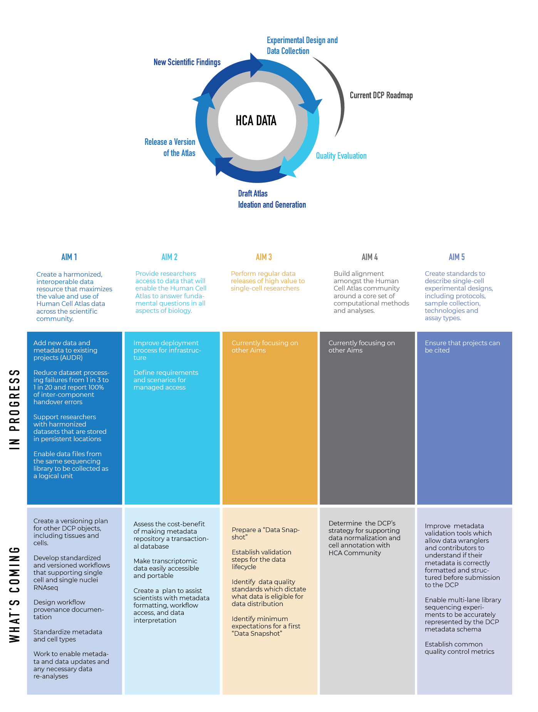

# Our Mission

The Data Coordination Platform’s (DCP) purpose is to support the creation of the Human Cell Atlas by providing a cloud-based platform for researchers to share, organize, analyze, and interrogate single-cell data, as described in five Strategic Aims. You can read more about these aims on the DCP Strategy page. 

# DCP Strategic Aims

Aim 1. Create a data resource that maximizes the value and use of Human Cell Atlas data across the scientific community.

Aim 2. Provide researchers access to data that will enable the Human Cell Atlas to answer fundamental questions in all aspects of biology. 

Aim 3. Perform regular data releases of high value to single-cell researchers 

Aim 4. Build alignment amongst the Human Cell Atlas community around a core set of computational methods and analyses.

Aim 5. Create standards for the community to use to describe single-cell experimental designs, including assay types, data and metadata.

# Current Role of the DCP in HCA Atlas Development

To support initial efforts in atlas development, the DCP team is focusing on describing experimental design, collecting and harmonizing data, and assuring data integrity, serving both the biologists generating single-cell data and the computational biologists needing to access it. 

# DCP Quarterly Roadmap

The DCP Quarterly Roadmap lists the in progress and upcoming activities for achieving the DCP Strategic Aims as they relate to our current role in atlas development.

