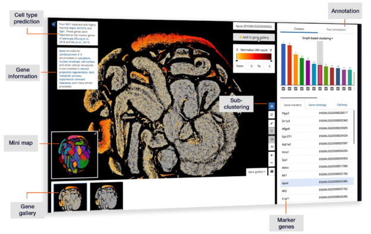

[BioTuring Single Cell Browser](https://bioturing.com/product/bbrowser) combines modern data visualization techniques, statistical machine learning toolboxes, and a rich knowledge base to create a unique platform for single cell data analytics.

## Contact
Son Pham ([sonpham@bioturing.com](mailto:sonpham@bioturing.com))
