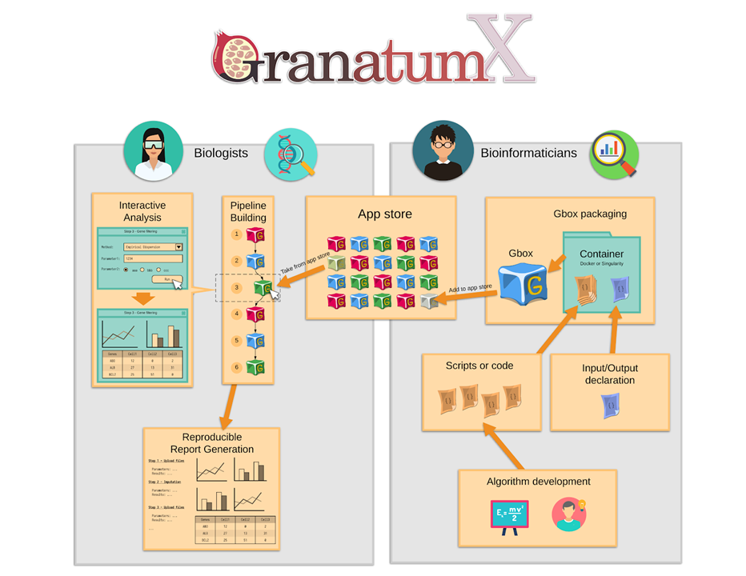

The objective of [GranatumX](http://garmiregroup.org/granatumx/app) is to provide scRNA-seq biologists better access to bioinformatics 
tools and the ability to conduct single-cell data analysis independently. Currently, other scRNA-seq platforms usually only provide a fixed set of methods implemented by the authors themselves. It is difficult to add new methods developed by the community due to programming language lock-in as well as monolithic code architectures. If a pipeline is assembled between heterogeneous tools, it is manually crafted and inhibits a repeatable execution of data analysis tools by other wet-lab scientists.

As a solution, GranatumX uses the plugin and virtualized framework that provides an easy and unified approach to add new methods in a data-analysis pipeline. The plugin system is agnostic to developer code and the choice of the original scripting language. It also eliminates inter-module incompatibilities, by isolating the dependencies of each module. As a data portal, GranatumX provides a graphical user interface (GUI) that requires no programming experience.

## Deployment of GranatumX
The web-based GUI can be accessed on various devices including desktop, tablets, and smartphones. In addition to the web-based format, GranatumX is also deployable on a broad variety of computational environments, such as private PCs, cloud services, and High-Performance Computing (HPC) platforms with minimal effort by system administrators. 

The deployment process is unified on all platforms because all components of GranatumX are containerized in Docker (also portable to Singularity). GranatumX can handle larger-scale scRNA-seq datasets coming online, with an adequate cloud configuration setup and appropriate Gboxes. For example, after uploading data, it took GranatumX 12 minutes to finish the recommended pipeline on an AMD 3950x with 16 cores and 128GB of DRAM memory running Ubuntu 20.04, using 10K cells downsampled from the dataset of “1.3 Million Brain Cells from E18 Mice'' on the 10x Genomics website. The most time-consuming step is imputation using DeepImpute (⅖ time).

## Unique Gbox Modules
Gbox is a unique concept of GrantumX. It represents a containerized version of a scientific package that handles its input and output by a format understood by the GranatumX core.

GranatumX has a set of pre-installable Gboxes that enable complete scRNA-seq analysis out of the box. Various Gboxes for data entry, preprocessing, and processing can be customized and organized together, to form a complete analysis pipeline.

One highlight feature of the Gbox is that it stands alone and the user can assume any Gbox without the need to restart the full pipeline, in case one implemented by the user fails. Another highlight of the Gbox feature is that the entire GranatumX platform is fully interactive, with addition or removal of some Gboxes or parameter changes on the go, while some other Gboxes are being executed.

A comprehensive set of over 50 Gboxes are implemented in GranatumX to perform tasks all the way from data entry and processing to downstream functional analysis. The data processing tasks help to minimize the biases in the data and increase the signal-to-noise ratio. For each of these quality improvement categories, GranatumX provides multiple popular methods from which users can pick.

To assist functional analysis, GranatumX provides a core list of methods for dimension reduction, visualization (including PCA, t-SNE, and UMAP), clustering, differential expression, marker gene identification, Gene Set Enrichment Analysis, network analysis and pseudo-time construction. Versioning for each of these Gboxes has been implemented so that users can use a specific tested version of a Gbox. Developers on the other hand can work on newer versions separately before the official upgrade. Gboxes can be stored on DockerHub for public use which maintains its own versioning system <https://hub.docker.com/u/granatumx>.

## Input Files
The input files of GranatumX include expression matrices and optional sample metadata tables, acceptable in a variety of formats such as CSV, TSV, or Excel format. GranatumX even accepts zip files and gz files (GNU zip), and the user can choose that format for large expression matrices. Expression matrices are raw read counts for all genes (rows) in all cells (columns).

The sample metadata tables annotate each cell with a pre-assigned cell type, state, or other quality information. The parsing step creates a sparse matrix using the coordinate list (COO) format, and this representation ensures swift upload onto the back end, even for large input datasets (>10K cells).

Such information will either be used to generate computational results (such as Gene Set Analysis) or be mapped onto the PCA, t-SNE, or UMAP plot for visualization. Once the user uploads the gene expression matrix, the data are read into a dataframe using Pandas and the step updates the user with a “preview”, consisting of the first few rows and columns of the gene expression matrix, along with the number of genes and samples present.

## User-centric Design
As a user-friendly tool, GranatumX allows multiple users to be affiliated with the same project for data and result sharing, while restricting one user to run the pipeline at a time to avoid data conflicts. It allows dynamically adding, removing, and reordering pipeline steps on the go. It also allows users to reset the current step. All relevant data in the analysis pipeline and all results generated by each module are stored in a database, allowing users to access and download them.

To ensure reproducibility, GranatumX can automatically generate a human-readable report detailing the inputs, running arguments, and the results of all steps. All of these features are designed with the mindset of “consumer reports'' to facilitate research in experimental labs or genomics cores.

## Source Code and Gbox Implementation
The source code and Gbox tutorial for GranatumX is available at <https://github.com/granatumx> under MIT license. All builds are deployed via Docker Hub at <https://hub.docker.com/u/granatumx>.

## Contact
GranatumX Development Team (<mailto:lana.garmire.group@gmail.com>)

