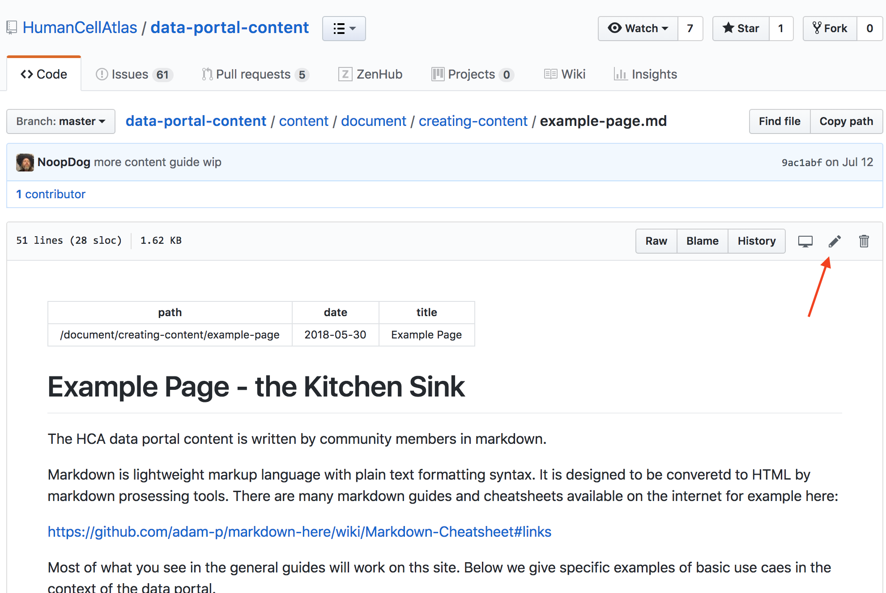
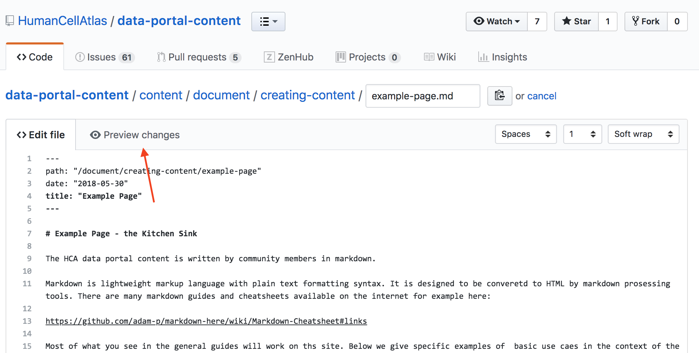

# Editing an Existing Page Directly in Github
The HCA Data Portal pages are written in [markdown](https://guides.github.com/features/mastering-markdown/) and stored in the [HumanCellAtlas/data-portal-content](https://github.com/HumanCellAtlas/data-portal-content) repository on github.

## Find the Page Source in Github
To edit an HCA Data Portal content page, first find the page in the content directory of the data-portal-content github repository, located here: https://github.com/HumanCellAtlas/data-portal-content/tree/master/content.
 
 Pages are generally in a folder structure that follows the site outline. It is possible, however, for a page to be anwhere in the conntent folder as the folder structure does not drive the site outline. 

## Enter Edit Mode on the Github Markdown Editor
Once you have found the page, you can edit and do a basic preview of the page in github. To do this, click on the edit icon on the right hand side of the github markdown page.

Selecting the  edit button will open the file in the github web editor and let you make changes to the page content.  The page content is in standard markdown.

 


## Edit/Preview the Markdown
Once in the editor, you can update content as you like and even preview the markdown by selecing the "Preview Changes" tab.

The preview will be styled for the github site, not for the HCA site, but you can see if your image links work and check general formatting of the document.

>Note that the github editor does not highlight spell check errors so be vigilant.




### Front Matter

At the top of the file you will see a "Front Matter" sections between the `---` markers. Here you can change the Title and Publication Date of the document or the URL to the document in the site.

```
   ---
   path: "/document/creating-content/example-page"
   date: "2018-05-30"
   title: "Example Page"
   ---
```

>####Tip
>Note that any changes to the `path:` section need a corresponding change to a `site-map.yaml` file in the data-data portal repository. Please create [Github/Zenhub](https://app.zenhub.com/workspace/o/humancellatlas/data-portal-content/boards?repos=130759918) ticket for updating the stiemap.

## Create a Pull Request

Once you are ready, request a review from a peer, by creating a pull request in github using the pull reqest UI at the bottom of the edit or preview mode editor.

Once your pull request is merged it will be deployed to the site.


 
 
