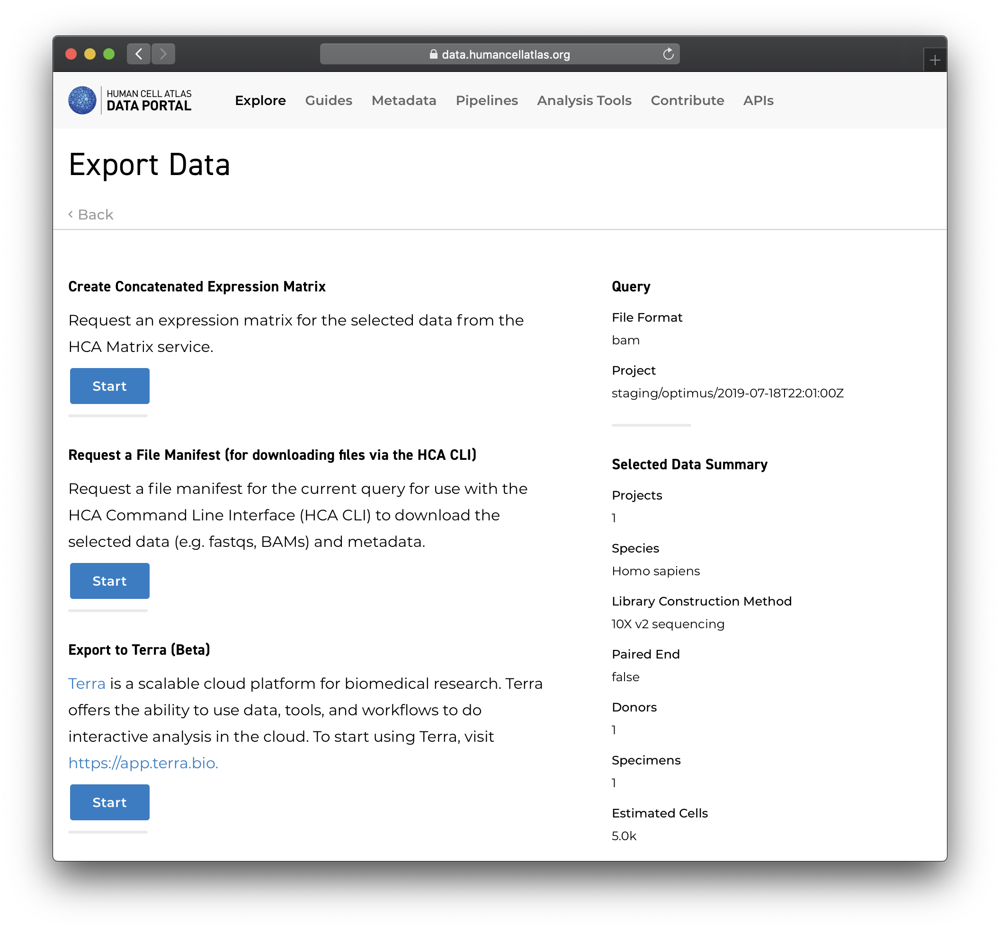
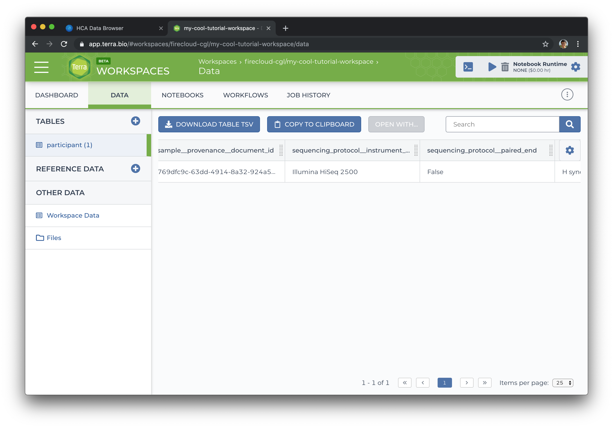
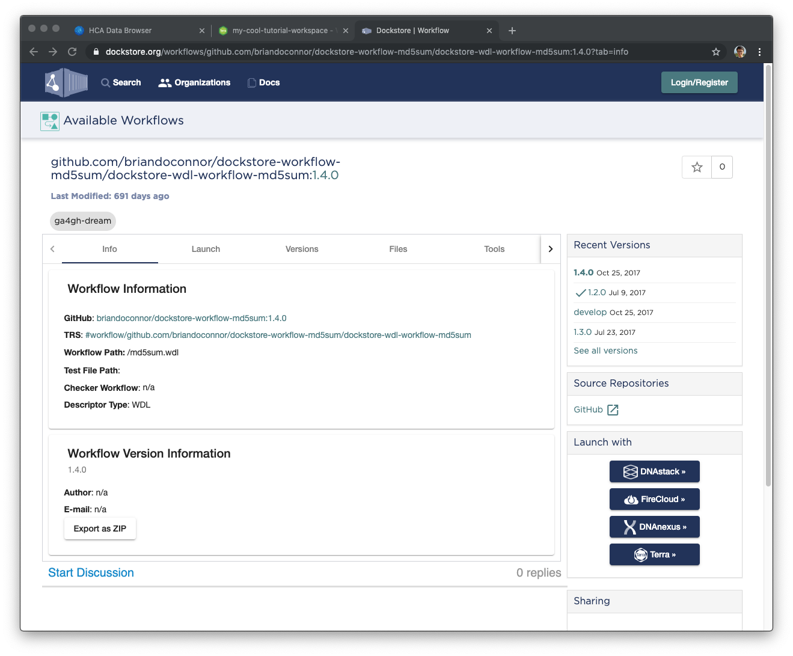
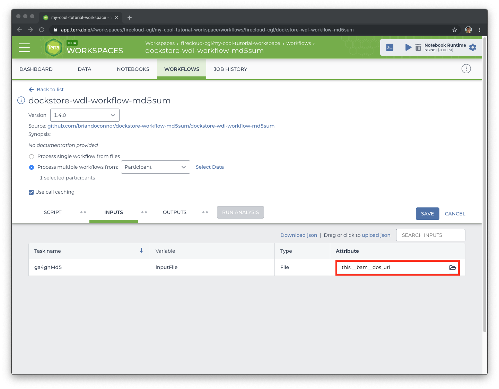

Exporting search results from the HCA Data Explorer to Terra
============================================================

In this tutorial, you will learn how to send search results from the HCA Data
Explorer to Terra and how to run a basic workflow with that data.

This tutorial assumes some familiarity with the aforementioned tools. If you are
not familiar with Terra, see the [Overview of Terra](#overview-of-terra) section
below.

You should also be acquainted with the content in this tutorial:

-   [Accessing HCA Data and Metadata][quick-start-guide]

Terra [recommends the Google Chrome browser][terra-register], which we
follow in this tutorial.

Overview of Terra
-----------------

[Terra][terra] is a scalable cloud platform for biomedical research. Terra offers the
ability to use data, tools, and workflows to do interactive analysis in the 
cloud. To start using Terra, visit <https://app.terra.bio>.

For more information about how to use Terra, visit the [Terra Support][terra-support] page.

To register for a Terra account, see [How to register for a Terra account][terra-register].

Overview of Dockstore
---------------------

[Dockstore][dockstore] is a platform for sharing bioscience tools by wrapping them in Docker
containers and describing their use with high-level workflow languages like the Common Workflow
Language (CWL) and the Workflow Description Language (WDL).

For more information about how to use the Dockstore, see the [Dockstore documentation][dockstore-doc].

Step one: finding BAM files with the HCA Data Explorer
------------------------------------------------------

You can use the <link-to-browser relativelink="/projects">HCA Data Explorer</link-to-browser> to find data to export to Terra.
The Data Explorer lists projects with data available for download from the Data
Store and lets you filter the data for a number of attributes.

Using the Data Explorer, select some data that you are interested in. Choose anything
that looks interesting - we will be running a really simple workflow that
generates MD5 checksums of files, so the type of data is not important.
When you have found a data set of interest, click on the big blue *Export
Selected Data* button at the top right of the page. You will see something like
this:

Click on the *Export to Terra* button. You will then see a page like this where
you can select what kind of data to export:

Again, choose anything that looks interesting.

When you click the *Request Export* button, the Data Explorer will process your
request, and you will be redirected to Terra.

Step two: importing data to Terra and finding a workflow in Dockstore
---------------------------------------------------------------------

Select a Terra workspace to import your selected data into. Once you have selected the
workspace, you will see a page like this, showing the data you just exported:

Next, we find a workflow to run with the data we've just exported. For this
tutorial, we are looking for *dockstore-wdl-workflow-md5sum*, which will
generate an MD5 checksum for a file (or files) that we provide. We will need 
to import this workflow from Dockstore. To do that, click on the *Workflows* 
tab at the top of the page, then on the big square *Find a Workflow* button.
It will look something like this:

Click on the *Dockstore* link at the bottom of the pop-up. Dockstore is a
workflow repository where we will find the workflow we want to run. Once
Dockstore has loaded, search for `md5sum`. The search box is on the left 
side of the page. Results should load instantly. Look for a workflow named
`briandoconnor/dockstore-workflow-md5sum/dockstore-wdl-workflow-md5sum`.
Once you find it, click on it. You will see this:

Note the blue *Terra* button at the bottom left which will let us load this
workflow in Terra. Click on the button and load the workflow into your
workspace. Once you have, Terra will ask you to select an input to this
workflow:

Step three: running the workflow in Terra
-----------------------------------------

On this screen, we want to select a single file from the data that we exported
and find the MD5 checksum of that file. Make sure that the *Process multiple
workflows* radio button is selected, then choose a single file to process by
navigating to *Select Data* > *Choose specific rows to process*.

Next, tell the workflow how to find the file you selected by setting the
*inputFile* variable. Click on the *Attribute* field (red box in the
screenshot above).

Select the DRS URL attribute (something like `this.__bam__.drs_url`). Once
you're done, click *Save*. You will see a blue *Run Analysis* button pop up.
Click that one, and confirm your input when prompted. Terra's running the
workflow now - walk away for a few minutes, grab a coffee, stretch. You
deserve it.

When you come back, refresh the page. Hopefully, your workflow will be done
running. If it is, you will seem something like this:

Note the green checkmark in the *Status* column.

Congrats! If you want to see the results of this workflow execution, click
on the workflow ID (the UUID on the right of the page), which will show the
data generated by this workflow execution.

