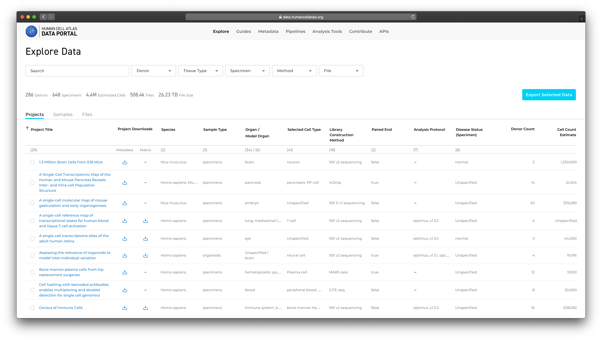
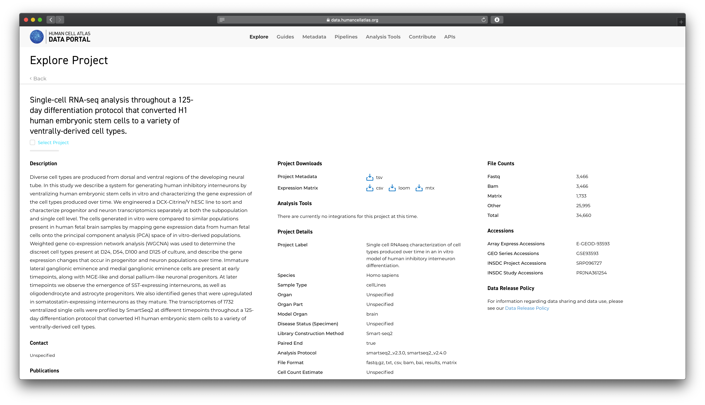
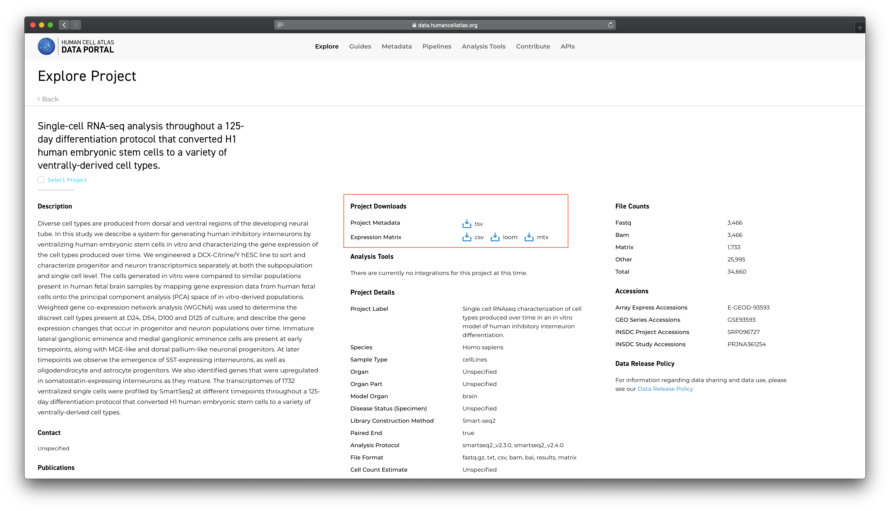
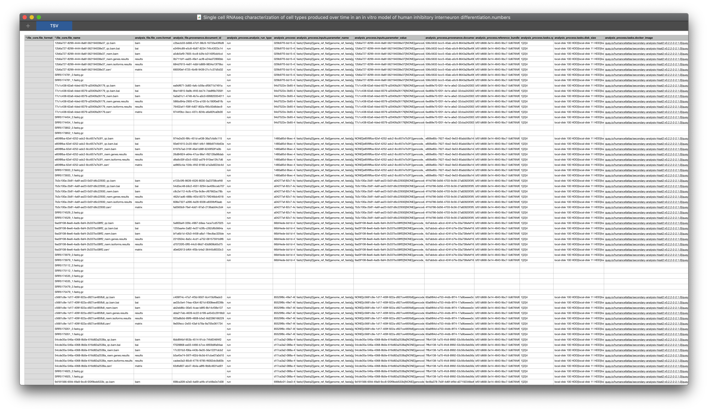

# Exploring Projects

Projects are a basic unit of data organization in the HCA Data Coordination Platform (HCA DCP). Project contributors contribute raw sequencing and associated [files](/metadata/dictionary/file/sequence_file) along with rich metadata describing:

  1. the  [origin and type of the cells](/metadata/dictionary/biomaterial/cell_line) used in the project
  1. the [processes](/metadata/dictionary/process/analysis/analysis_process) and [protocols](/metadata/dictionary/protocol/biomaterial_collection/aggregate_generation_protocol) used to collect and process the cells prior to sequencing
  1. the  [sequencing](/metadata/dictionary/protocol/sequencing/sequencing_protocol) methods used
  1. details about the [project](/metadata/dictionary/project/project) contributors and their institutions
 
This [Metadata](/metadata/dictionary/process/analysis/analysis_process) is included in the project's Metadata Manifest (TSV file). When the HCA DCP [processes](/pipelines) the contributor's raw data with standardized pipelines, this processing information is also added to the Metadata Manifest. 

## Finding a Project of Interest

The HCA Data Explorer lists all projects on its home page along with key project metadata. The project list is filterable by metadata values. 




## Viewing Project Details

Selecting a project title on the project list takes you to the project's detail page. 




The project detail page contains:

1. the project title and description

1. contributor information, collaborating organizations, and project contacts

1. any publications or accessions associated with the project 

1. project details such as species, organ and library construction method 

1. counts of input, analysis and matrix files

1. a project metadata download

1. a project DCP-generated count matrix download (if available)

1. a project contributor-generated matrix (if available)

## Downloading Project Metadata

For each project, the HCA DCP maintains a project specific TSV file containing the full project metadata. The TSV contains a row for each file in the project and columns for each metadata property. Meanings of the metadata properties are listed in the [HCA Metadata Dictionary](/metadata).

The metadata TSV file gives a flattenedjapan-science-meeting-tutorial.md representation of the projects metadata graph that can be sorted and filtered using standard spreadsheet or data manipulation tools.

The "Project Metadata" section of the project details page contains a link to download the project metadata file.



Metadata file sizes vary across projects but will generally be between 1 and 100 megabytes.

The TSV file is named after the project and includes the date and time the file was created. For example:

``` 
CD4+ cytotoxic T lymphocytes 2019-07-19 19.09.tsv
```

A partial example of a TSV file is listed below:




## Downloading Project DCP Generated Matrices

For projects with supported library construction methods, the project detail page will contain a link to download DCP-generated count matrices for the project.
 
 Count matrices are available in Loom format (see the [Loom documentation](http://loompy.org/) for details on loading and viewing Loom files) and also contain a subset of the available ingest metadata for the project. To learn more about the metadata available in the Loom, see the [DCP Matrix Overview](/guides/userguides/matrices)
 
 The columns in the count matrix represent cell-specific information while the rows represent gene-specific information. 

 The type of count (raw or TPM) available in the matrix depend on the pipeline used for data processing. Read more about Loom counts and metrics for [Optimus](https://broadinstitute.github.io/warp/documentation/Pipelines/Optimus_Pipeline/Loom_schema.html) or [SS2](https://broadinstitute.github.io/warp/documentation/Pipelines/Smart-seq2_Multi_Sample_Pipeline/Loom_schema.html). Note that these are the generic pipeline documentation and do not include details of the HCA-specific metadata, which you can find in the [DCP Matrix Overview](/guides/userguides/matrices.md).


## Downloading Project Contributor Generated Matrices
Contributor generated matrices are optionally provided by the data contributors. When available, you can download them from the individual Project page. The matrices will vary in file format and content. 
