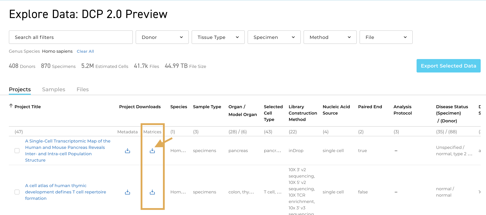

# HCA DCP 2.0 Data Matrix Overview 
Cell-by-gene matrices (commonly referred to as "count matrices" or "expression matrices") are files that contain a measure of gene expression for every gene in every cell in your single-cell sample(s). These matrices can be used for downstream analyses and cell type annotations. This overview describes the DCP 2.0 matrix types, how to download them, and how to link them back to the HCA metadata.

Overall, three types of matrices are currently available for HCA DCP 2.0 data: 
- DCP-generated matrices (Loom file format) for projects 
- DCP-generated matrices (Loom file format) for individual library preparations within a project
- Contributor-generated matrices (variable file format) provided by the project-contributor

## DCP Generated Matrices
Each DCP 2.0 project that is processed with [standardized DCP pipelines](/pipelines) has two types of DCP Generated Matrices available for download:

- [project-level matrices](#dcp-project-level-matrices) 
- [library-level matrices](#dcp-library-level-matrices)

Both matrix types are in Loom file format (see [Loom documentation](http://linnarssonlab.org/loompy/index.html#) for format details), and contain standard [metrics](/pipelines/hca-pipelines/data-processing-pipelines/qc-metrics) and counts that are specific to the data processing pipeline used to generate the file. 

> For the most up-to-date information on counts and metrics, see the Matrix Overviews for the **[Smart-seq2 Pipeline](https://broadinstitute.github.io/warp/documentation/Pipelines/Smart-seq2_Multi_Sample_Pipeline/Loom_schema.html)** and the **[Optimus Pipeline](https://broadinstitute.github.io/warp/documentation/Pipelines/Optimus_Pipeline/Loom_schema.html) (10x data)**.

DCP 2.0 matrices (Loom files) have three types of attributes containing metadata and metrics:
- **global**: information that applies to all data in the Loom (i.e. pipeline version, etc.)

- **row**: gene-specific information and metrics (one row = one gene)

- **column**: cell-specific information and metrics (one column = one cell)

Both project matrices and library-level matrices have unique filenames. Project matrices have filenames in the format `<project_description>-<species>-<tissue>-<sequencing_method>`. For example, a matrix for the project "Dissecting the human liver cellular landscape by single cell RNA-seq reveals novel intrahepatic monocyte/ macrophage populations" has the filename `sc-landscape-human-liver-10XV2.loom`. 

Library-level matrices have filenames matching the numerical ID in the HCA metadata field `sequencing_process.provenance.document_id`.

#### DCP Project-level Matrices
Project-level matrices are Loom files that contain standardized cell-by-gene measures and metrics for all the data in a project that are of the same species, organ, and sequencing method. This means each HCA project can have multiple project-level matrices if for example, the project contains both human and mouse or 10x and Smart-seq2 data. 

The gene measures in project matrices vary based on the pipeline used for analysis. Matrices produced with the Optimus Pipeline (10x data) will have UMI-aware counts whereas matrices produced with the Smart-seq2 pipeline will have TPMs and estimated counts. Additionally, 10x matrices have been minimally filtered based on the number of UMIs (only cells with 100 molecules or more are retained).

Each project matrix also has HCA metadata (see table below) stored in the Loom file's global and column attributes. This metadata may be useful when exploring the data and linking it back to the additional Project metadata in the Data Manifest. Read more about each metadata field in the [Metadata Dictionary](/metadata/). 

| Metadata Attribute Name in DCP Generated Matrix | Metadata Description | 
| --- | --- |
| `donor_organism.genus_species` | Species information; human or mouse |
| `library_preparation_protocol.library_construction_approach` | Technology used for library preparation, i.e 10x or Smart-seq2 |
| `specimen_from_organism.organ` | Organ |	
| `project.project_core.project_name` | Project name |
| `project.provenance.document_id` | Project id |
| `input_id` | Metadata values for  `sequencing_process.provenance.document_id` |
| `input_name` | Metadata values for `sequencing_input.biomaterial_core.biomaterial_id` |

More information about HCA post-processing for the project-level matrices can be found in the Matrix Overview for the [Optimus Pipeline](https://broadinstitute.github.io/warp/documentation/Pipelines/Optimus_Pipeline/Loom_schema.html#hca-data-coordination-platform-matrix-processing) and the [Smart-seq2 Pipeline](https://broadinstitute.github.io/warp/documentation/Pipelines/Smart-seq2_Multi_Sample_Pipeline/Loom_schema.html#table-2-column-attributes-cell-metrics) (in development). 

#### DCP Library-level Matrices 
Library-level matrices (also Loom files) are cell-by-gene matrices for each individual library preparation in a project. These matrices contain the same standardized gene (row) metrics, cell (column) metrics and counts as the project-level matrices, but are separated by the HCA metadata field for library preparation, `sequencing_process.provenance.document_id`, allowing you to only use a sub-sampling of all the project's data. 

While a library preparation for 10x datasets will likely include all the cells for a single donor, a library preparation for Smart-seq2 data will include the individual cell (i.e. if your Smart-seq2 data has 200 cells, it will have 200 library-level matrices). 

Unlike project matrices, **library-level matrices are not filtered** and they do not contain all the HCA metadata for species, organ, and sequencing method in the matrix global attributes. Instead, they only contain the metadata for `input_id` and `input_name` (described in table above). 

## Contributor Generated Matrices
Contributor Generated Matrices are optionally provided by the data contributors. These can be useful when trying to annotate cell types or when comparing results back to a contributors published results. When these matrices are available, you can download them from the individual Project page. Across projects, these matrices will vary in file format and content. For questions about the Contributor Generated Matrix, reach out to the contributors listed in the Project page Contact section.

## Downloading Matrices
DCP-generated project-level matrices and contributor-generated matrices may be downloaded from the "Matrices" column of the DCP Data Browser (see image below) or alternatively, from the individual Project page. Additionally, you can download all matrices (including library-level matrices) using a curl command as described in the [Accessing HCA Data and Metadata](../quick-start-guide) guide, or export matrices to [Terra](https://app.terra.bio/), a cloud-based platform for bioinformatic analysis (see the [Exporting to Terra](/export-to-terra) guide).

## Linking Project-level DCP Generated Matrices to the Data Manifest (Metadata)
DCP 2.0 project-level matrices only contain some of the available project metadata (species, organs, library methods, etc.). However, there are several metadata facets in the Metadata Manifest, such as disease state or donor information, that you might want to link back to the DCP-generated cell-by-gene matrix.

To link a metadata field in the Metadata Manifest back to an individual sample in a DCP Generated Matrix, use the matrix `input_id` field. This field includes all the values for the HCA metadata `sequencing_process.provenance.document_id`, the ID used to demarcate each library preparation. 

