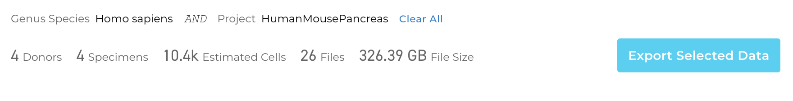

# Accessing HCA Data and Metadata
This section briefly reviews how to find and download cross-project data and associated metadata using the Data Browser and curl commands. 

### Finding Data
The **Explore** section of the Data Portal provides an interactive data browser. You can design a unique cohort, or data subset, by selecting various facets in the Browser's Organ, Method, Donor, Specimen sections. 

The Specimen's tab shows you how many specimens have been selected. It also gives an estimate of the size of the data set if the entire list were downloaded.

### Preparing Data for Export
After you identify a cohort of interest, you download the raw data, analysis files, and metadata by clicking the blue **Export Selected Data** icon on the right of the page.

This will open a new page giving you the option to:
 1) Download Selected Data Using "curl"
 2) Download a File Manifest with Metadata for the Selected Data
 3) Export to Terra 

#### Downloading Data with a Curl Command
To download the raw and processed data: 

1. Go to **Download Selected Data Using 'curl'** and select **Start** 
1. Select the files to include in the download- the download dialog box gives you the option to further refine the types of files 
1. Select **Request curl Command**

After a few seconds, a new window with a curl command will open. Paste this curl command in your local or cloud-based terminal to download the data. 

After downloading the data files, return to the **Export Selected Data** page using the back icon to download the metadata (see step-by-step instructions below).

#### Downloading Metadata in a Data Manifest
Once you have downloaded the selected data files, you can download all the metadata associated with the cross-project data files. 

This metadata, also called a "Data Manifest" is in TSV file format and lists all the details about your selected data such donor information and disease-state; however, the manifest is not the actual data file itself.

To download the metadata from the **Export Selected Data** page:

1. Go to **Download a File Manifest with Metadata for the Selected Data** and select **Start**.
1. Select the file types to include in the manifest; the default selection will be the same as what you selected for the data download
1. Select **Prepare Manifest**

When selecting file types for the metadata manifest, note that the listed **File Sizes** are for the actual data files and not for the manifest itself. 

The format of the manifest file (TSV) is a simple tab separated text file, with the first line representing the header title for each column. It is OK to remove rows for unwanted files but the header row must remain, and the columns should remain the same.

