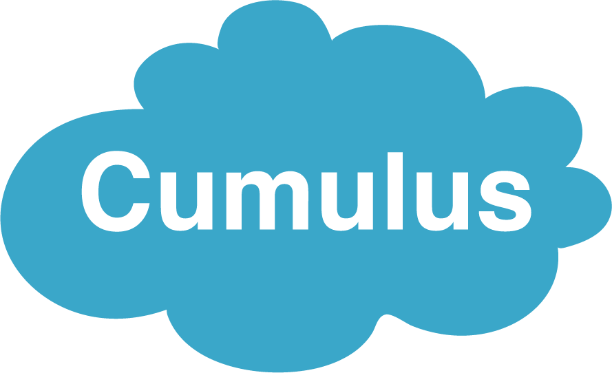

Building on the [Terra platform](https://terra.bio/), Cumulus is a cloud-native framework for analyzing single-cell and single-nucleus multi-omics data that scales up to millions of single cells. Cumulus framework leverages the Pegasus library and many other open-source software (e.g. cellranger/starsolo), and is publicly available in GitHub as well as pre-installed in [Terra](https://app.terra.bio/#workspaces/kco-tech/Cumulus). It supports analysis of single-cell RNA-seq, CITE-seq, Perturb-seq, single-cell ATAC-seq, single-cell immune repertoire and spatial transcriptomics data. The Cumulus framework is used in several big cell atlas projects, such as the Immune Cell Atlas (ICA) project and the Human Tumor Atlas Pilot Project (HTAPP), which is the pilot project leading to the Human Tumor Atlas Network (HTAN) efforts supported by National Cancer Institute.

<figure-styles shadowless=true>



</figure-styles>


## Usage

```cumulusprod/pegasus-terra:1.4.3```

### Language

WDL, Python

### Basic Command Line Usage

Run through Terra or altocumulus for submitting jobs in CLI mode

### Test Data

<https://app.terra.bio/#workspaces/kco-tech/Cumulus>

## Contact

Bo Li ([libo@broadinstitute.org](mailto:libo@broadinstitute.org))
