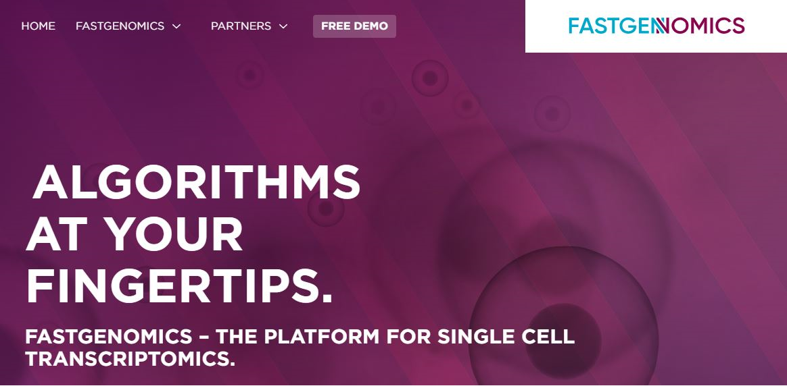
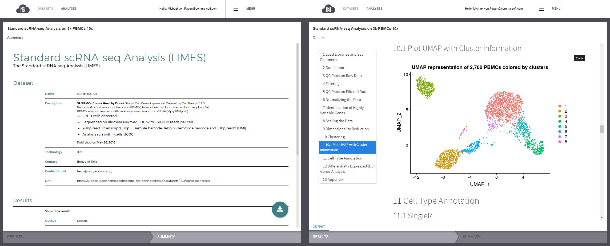

[FASTGenomics](https://www.fastgenomics.org/) - a platform to share single-cell RNA sequencing data and analyses using reproducible workflows.

Recent technological advances enable genomics of individual cells, the building blocks of all living organisms. Single cell data characteristics differ from those of bulk data, which led to a plethora of new analytical strategies. However, solutions are only useful for experts and currently, there are no widely accepted gold standards for single cell data analysis. To meet the requirements of analytical flexibility, reproducibility, ease of use and data security, we developed [FASTGenomics](https://www.fastgenomics.org) as a powerful, efficient, versatile, robust, safe and intuitive analytical ecosystem for single-cell transcriptomics [[Scholz et al., 2018](https://doi.org/10.1101/272476)]. This development has been carried out at [Comma Soft](https://www.comma-soft.com), Bonn, in collaboration with the [Schultze lab](https://www.limes-institut-bonn.de/en/research/research-departments/unit-2/schultze-lab/schultze-lab-home) at LIMES Institute in Bonn, Germany.

FASTGenomics is designed as a platform for single cell RNA-seq data open to the scientific community. A major feature is to provide highest reproducibility and transparency for single cell data analysis to the whole community. The platform provides publicly available datasets and analyses for exploration and visualization of gene expression data. Using docker containers provides full reproducibility and helps avoiding "works only on my machine" problems. Register now at <https://www.fastgenomics.org> and have a look at our collection of data sets and example analyses.

FASTGenomics serves as a platform, where you can share your data with the community and test novel algorithms on public data sets with known results. FASTGenomics scales already routinely to more than 300k cells per project and prototype apps suggest that scaling to 1M cells is also possible [[Scholz et al., 2018](https://doi.org/10.1101/272476)]. Moreover, its hybrid design also allows custom solutions such as FASTGenomics on premise for clinical and pharmaceutical research facilities.

For more information, you can find us on [Twitter](https://twitter.com/FastGenomics), [LinkedIn](https://www.linkedin.com/showcase/fastgenomics) or come talk to us on [Slack](https://join.slack.com/t/fastgenomics/signup). To register for the platform visit us at [www.fastgenomics.org](https://www.fastgenomics.org/).

**Note**: We will soon offer interactive analyses based on Jupyter notebooks. Stay tuned for the upcoming beta-test!

REFERENCES
Scholz et al. (2018) FASTGenomics: An analytical ecosystem for single-cell RNA sequencing data. BioRxiv, 272476.

## Contact
Michael von Papen (<mailto:michael.papen@comma-soft.com>)
