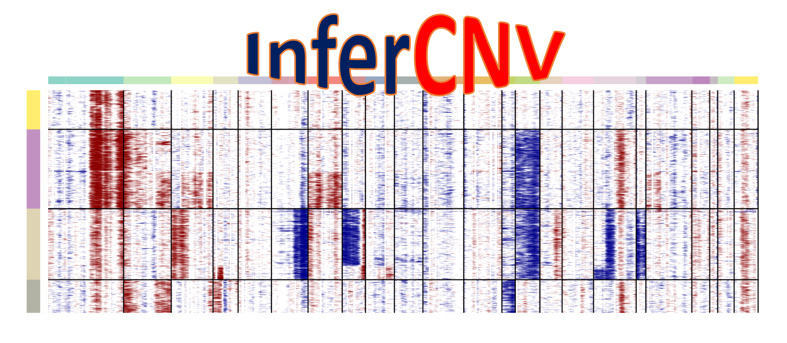

[](https://travis-ci.com/broadinstitute/infercnv)



[InferCNV](https://github.com/broadinstitute/infercnv) is used to explore tumor single cell RNA-Seq data to identify evidence for large-scale chromosomal copy number variations, such as gains or deletions of entire chromosomes or large segments of chromosomes. This is done by exploring expression intensity of genes across positions of the genome in comparison to a set of reference 'normal' cells. A heatmap is generated illustrating the relative expression intensities across each chromosome, and it often becomes readily apparent as to which regions of the genome are over-abundant or less-abundant as compared to normal cells.

InferCNV provides access to several residual expression filters to explore minimizing noise and further revealing the signal supporting CNV. Additionally, inferCNV includes methods to predict CNV regions and define cell clusters according to patterns of heterogeneity.

InferCNV is one component of the TrinityCTAT toolkit focused on leveraging the use of RNA-Seq to better understand cancer transcriptomes.


## Use

```
docker pull singlecellportal/infercnv:0-99-5
```

### How to perform inferCNV analysis 

The following command will run inferCNV on [test example data](https://github.com/broadinstitute/infercnv/tree/master/example) that contains normal microglia and oligodendrocytes for reference, and oligodendroglioma samples from 4 patients for the observations (subsetted from the benchmark dataset). The expected output is a figure (see screenshot) with heatmaps of the observations expression relative to the references, highlighting regions of chromosomal gain or loss.

```
docker run -v ${PWD}:/data -w /data --rm -it singlecellportal/infercnv:0-99-5 /inferCNV/scripts/inferCNV.R \
     --raw_counts_matrix="/inferCNV/example/oligodendroglioma_expression_downsampled.counts.matrix" \
     --annotations_file="/inferCNV/example/oligodendroglioma_annotations_downsampled.txt" \
     --gene_order_file="/inferCNV/example/gencode_downsampled.EXAMPLE_ONLY_DONT_REUSE.txt" \
     --ref_group_names="Microglia/Macrophage,Oligodendrocytes (non-malignant)" \
     --cutoff=1 \
     --out_dir="output_cli" \
     --cluster_by_groups \
     --denoise
```


## Validate
Run this command to confirm your container produces correct reference output: 

```
docker run -v ${PWD}:/data -w /data --rm -it singlecellportal/infercnv:0-99-5  Rscript /inferCNV/scripts/infercnv_validate.R
```

## Integrate
[Run inferCNV](https://github.com/broadinstitute/single_cell_portal/wiki/Running-inferCNV) in Single Cell Portal.

## Contact
Christophe Georgescu ([cgeorges@broadinsitute.org](mailto:cgeorges@broadinsitute.org))
