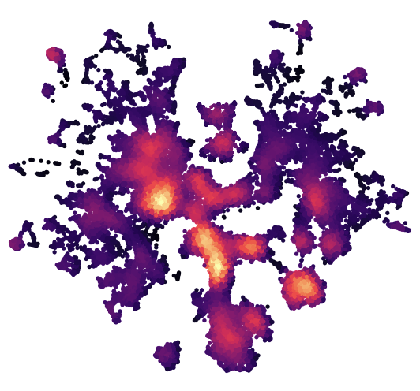

## Overview

[Spectre](https://immunedynamics.io/spectre/) is an R package and computational toolkit that enables comprehensive end-to-end integration, exploration, and analysis of high-dimensional cytometry or imaging data from different batches or experiments.

Spectre streamlines the analytical stages of raw data pre-processing, batch alignment, data integration, clustering, dimensionality reduction, visualization, and population labeling, as well as quantitative and statistical analysis; with a simple, clear, and modular design of analysis workflows, that can be utilized by data and laboratory scientists.

For users unfamiliar with using R, we also provide workflow instructions for replicating many of our analysis approaches in programs such as FlowJo.

## Docker URL

[Method-ready Docker image URL](https://hub.docker.com/r/immunedynamics/spectre)

## Use

Extensive command line usage in R or RStudio provided at https://immunedynamics.github.io/spectre/.

## Contact

Thomas Ashhurst (<mailto:thomas.ashhurst@sydney.edu.au>)
