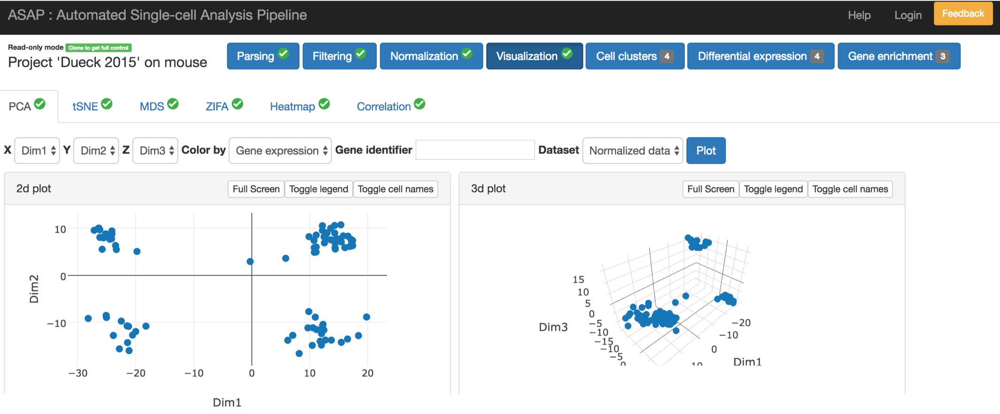

[ASAP](https://asap.epfl.ch/) allows the user to perform custom analyses and compare algorithms for each step of the single cell or bulk RNA-seq analysis pipeline post genome alignment via an intuitive web interface (Gardeux et al., Bioinformatics, 2017). These steps include parsing, filtering, and normalization of the input gene expression matrix, visual (2D and 3D) representation, differential expression, clustering, heatmaps, trajectory inference and functional enrichment analyses to characterize novel cell clusters, specific cell types, or differentiation processes. Thus, ASAP has been developed to lower the bioinformatic entry level to single cell experiments and to catalyze collaborations between computational biologists and experimentalists via an easy-to-use data interaction portal.

## Contact
Vincent Gardeux ([Vincent.Gardeux@epfl.ch](mailto:Vincent.Gardeux@epfl.ch))\
Fabrice David ([Fabrice.David@epfl.ch](mailto:Fabrice.David@epfl.ch))
