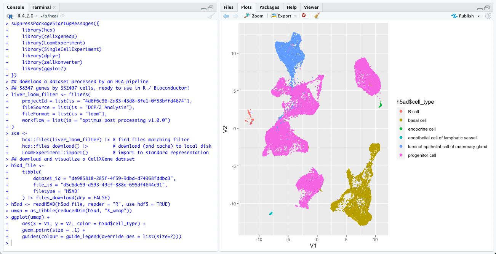

[Bioconductor](https://bioconductor.org) provides R packages for the statistical analysis, comprehension, and visualization of high-throughput genomic data; more than [250 packages](https://bioconductor.org/packages/release/BiocViews.html#___SingleCell) are tagged for use in single-cell analysis. Discover, visualize, and download data sets for further analysis using the [hca](https://bioconductor.org/packages/hca) and [cellxgenedp](https://bioconductor.org/packages/cellxgenedp) packages; details are outlined in package vignettes ([hca](https://bioconductor.org/packages/release/bioc/vignettes/hca/inst/doc/hca_vignette.html), [cellxgenedp](https://bioconductor.org/packages/release/bioc/vignettes/cellxgenedp/inst/doc/using_cellxgenedp.html)). Directly integrate Human Cell Atlas data into the Bioconductor ecosystem by following workflows for quality control, data integration, dimensionality reduction, clustering & visualization, cell annotation, and more as described in [Orchestrating Single-Cell Analysis with Bioconductor](https://bioconductor.org/books/OSCA/).

## Contact

Martin Morgan (<mtmorgan.bioc@gmail.com>)

