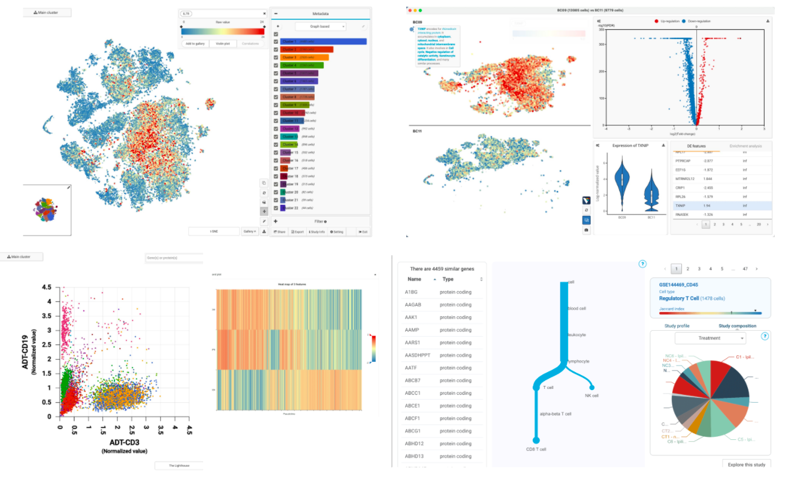

[BioTuring Browser](https://bioturing.com/product/bbrowser) (or BBrowser) combines modern data visualization techniques, statistical machine learning toolboxes, and a rich knowledge base to create a unique platform for single-cell data analytics.

BBrowser provides interactive access to a comprehensive and growing single-cell RNA-seq and CITE-seq database. Here scientists can instantly view the t-SNE or UMAP of the data, plot and compare the expression of multiple genes/proteins across cell groups, find markers and differentially expressed genes y populations, run enrichment analysis, study how cell composition changes across conditions, study subtypes, reconstruct cell trajectories and study genes transitioning along a biological process, etc.

This single-cell database is also supported with a wide range of cross-study analyses and data integration to facilitate target validation across millions of cells.

In addition to providing a portal for public single-cell data, BBrowser is also adaptable with Seurat and Scanpy objects, raw FASTQ files, and count matrices from single-cell RNA-seq, CITE-seq, and spatial transcriptomics technologies. Scientists can easily import and analyze their own data, and leverage BBrowser's single-cell omics database for cell type identification.

## Contact
BioTuring Team (<mailto:support@bioturing.com>)

