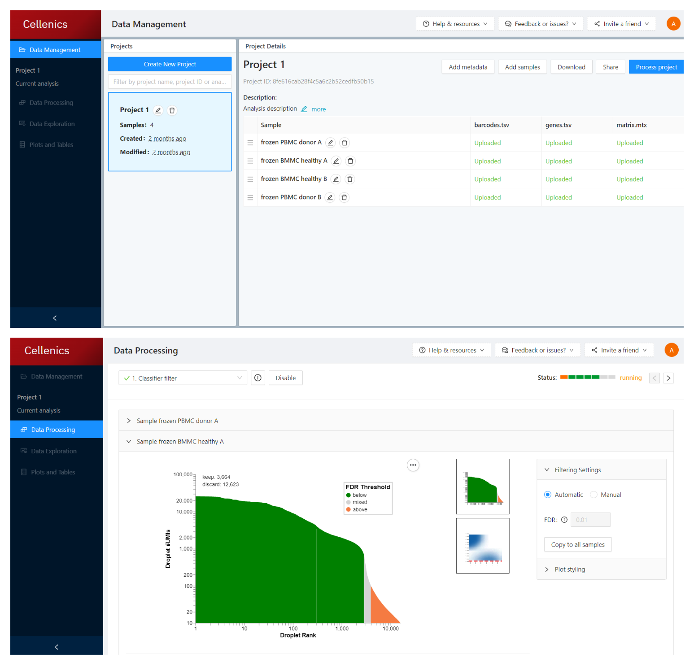
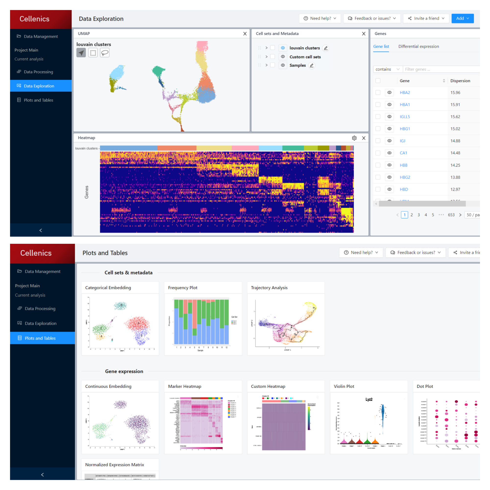

[Cellenics®](https://scp.biomage.net/) is an open-source scRNA-seq data analysis software developed by © 2020-2022 President and Fellows of Harvard College under the scientific supervision of prof. Peter Kharchenko and the administrative supervision of the Department of Biomedical Informatics at Harvard Medical School. Biomage is an open-source software company that hosts a community instance of Cellenics®.

Cellenics® is a cloud-based tool, which means users can analyze their dataset from anywhere in the world at any time. This tool is fast, versatile, and user-friendly, making it easy for biologists to analyze single-cell datasets without needing bioinformatics expertise. And it’s free of charge for academic researchers with datasets of up to 300 thousand cells.

Cellenics® offers an in-depth data processing and quality control workflow, as well as a variety of data exploration features. Users can create custom cell sets, calculate differential expression, find marker genes, perform pathway analysis and trajectory analysis. The software provides a range of pre-loaded plots so that users can customize and export publication-quality figures very quickly.

Researchers studying cancer, cardiovascular health, and developmental biology use Cellenics® analysis software to make discoveries about complex biological systems. Your field could be next!

You can learn more about Cellenics® here <https://www.biomage.net/resources>!

## Contact

[Biomage Team](mailto:hello@biomage.net)
