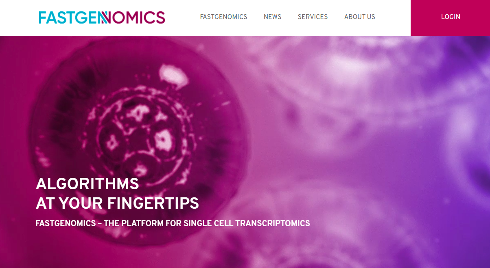

[FASTGenomics](https://www.fastgenomics.org/) - a cloud-based collaboration platform for data management and reproducible analyses of scRNA-seq and omics data.

Collaboration and data sharing is key in biomedical research. It involves experts from several fields of study such as Molecular Biology, Immunology, Data Science and Computer Science as well as storage and re-use of data in a reproducible environment.

Our Life and Data Science experts at [Comma Soft](https://comma-soft.com) have therefore developed the open platform [FASTGenomics](https://beta.fastgenomics.org), which provides a common infrastructure, smart data management, is easy to use and allows direct access to data and results. It thus acts as a single point of truth and brings together all collaborators of your project.

The aim of FASTGenomics is to provide the highest reproducibility and transparency for single-cell and omics data analysis to the whole community. The platform offers publicly available datasets, reproducible analyses, and interactive projects for the exploration and visualization of gene expression data. Docker containers provide full reproducibility and help to avoid  the "works only on my machine" problems.

FASTGenomics is an open-access platform and is used as the central data and analytics platform in various European research projects such as the Human Cell Atlas project [discovAIR](https://www.discovair.org) and the EU H2020 project [SYSCID](http://www.syscid.eu).

We are an experienced partner with a tight network of leading experts from Bioinformatics, Immunology, and Pharma. Also, we are an active member of several academic networks such as the Human Cell Atlas Lung Biological Network, Sparse2Big, and Single Cell Omics Germany.

Together, we can help you get started with your research project, assist in data management, and leverage the power of state-of-the-art AI-based techniques. Our hybrid design also allows custom solutions such as FASTGenomics on-premises for clinical and pharmaceutical research facilities.

## Where to find us:

**Homepage**: <https://fastgenomics.org/login>

**Twitter**: [@FASTGenomics](https://twitter.com/FASTGenomics) 

**Youtube**: [FASTGenomics channel](https://www.youtube.com/channel/UCuox5j5_QeW2mc4-gO2mncA)

**Slack**: [Slack support channel](https://join.slack.com/t/fastgenomics/shared_invite/enQtNjU2ODk0OTk5MTA3LTkwZTgxN2EzYzAyMmExZTJiYmYxMjRhYjM2ODBiMWIwYmQ3MzZhYmIzZDkxZTI4OGFhYjQ4ODIzMTU3OWQ2NTc)

**Github**: [https://github.com/FASTGenomics](https://github.com/FASTGenomics)

**Docker**: [https://hub.docker.com/u/fastgenomics](https://hub.docker.com/u/fastgenomics)

## Contact
Team FASTGenomics (contact@fastgenomics.org)

