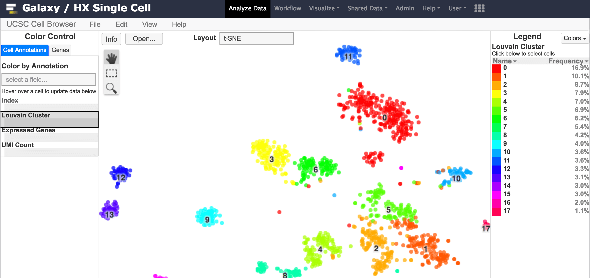

The [Human Cell Atlas Galaxy instance](https://humancellatlas.usegalaxy.eu) contains tools for Single Cell Clustering (Scanpy, Seurat, Scater/SC3), Trajectories analysis (Scanpy, Monocle) and interactive visualisation (UCSC CellBrowser), allowing simple data analysis through the proven Galaxy user interface.
It also includes facilities to import matrix data from the Human Cell Atlas and the EBI Single Cell Expression Atlas, for re-analysis.
The clustering workflow for the release 6 of EBI Single Cell Expression Atlas are reproducible through this portal.
The portal runs as part of the larger usegalaxy.eu infrastructure and has access to thousands of cores and terabytes of RAM and storage, kindly hosted by the U. of Freiburg, den.bi and Elixir.

## Contact

Website: [https://www.ebi.ac.uk/support/gxasc](https://www.ebi.ac.uk/support/gxasc)\
Twitter: [@ExpressionAtlas](https://twitter.com/ExpressionAtlas)

## Source code

<https://github.com/ebi-gene-expression-group/container-galaxy-sc-tertiary>
