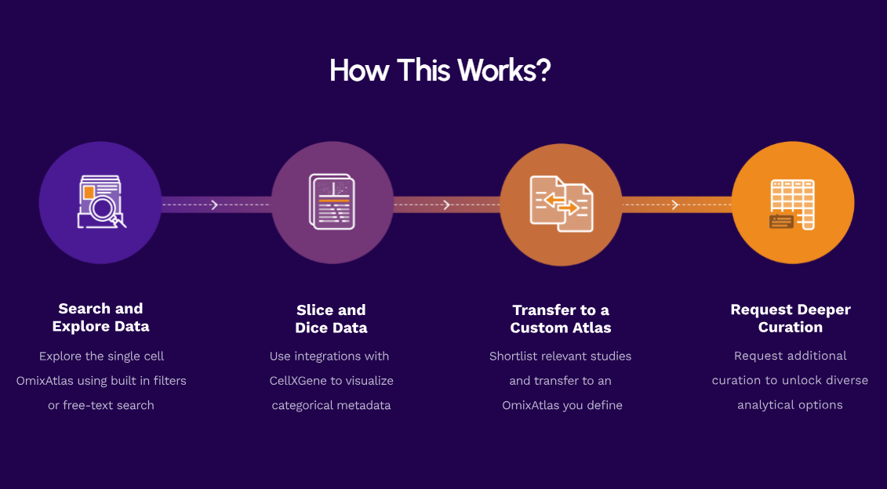
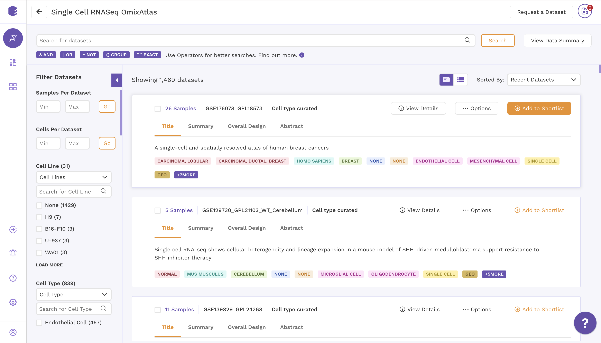
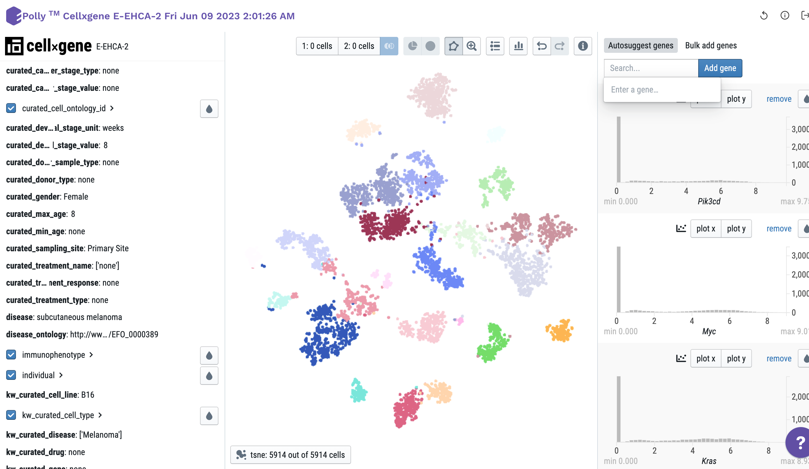

[Polly]([https://www.elucidata.io/platform/features](https://bit.ly/3WvgjqF)) is a biomedical data platform for life sciences R&D, primarily delivering bulk RNA-seq and single-cell data, along with 24 other data types. It delivers 125 TB of FAIR and ML-ready biomedical data from over 30 different (mainly public) sources to customers. 

**Data**

Polly's ~1500 curated single cell datasets are engineered to a consistent H5AD format that comprises  
- cell annotations,  
- expression values, and  
- associated metadata from publications.  

The data is sourced from the Gene Expression Omnibus, Expression Atlas, Human Cell Atlas, Single Cell Portal, Tabula Sapiens, HTAN, Covid-19 Cell Atlas and landmark publications. The curation process ensures that cell annotations are standardized with consistent ontologies across studies and that expression values are reproducible.

**Platform**

Polly takes care of data ingestion, transformation, and storage. Therefore, researchers can focus on insight derivation via data analysis and visualization instead of data wrangling and engineering. It is easy to incorporate Polly into your existing data infrastructure because we offer integrations to your existing data storage units as well as analyses, visualizations, and computational tools. 

**Solutions**

It has enabled the detection of multiple validated drug targets across immunology, oncology, and metabolic disorders using ML-ready data and a scalable data infrastructure that enables easy downstream analysis. Polly creates a unique, centralized ecosystem that enables a diverse team of biologists, bioinformaticians, and scientific leaders to share and collaborate on workspaces, data, and insights. 

<figure-styles shadowless=true>

</figure-styles>

## Contact

[Team El](mailto:team-elucidata@elucidata.io)
