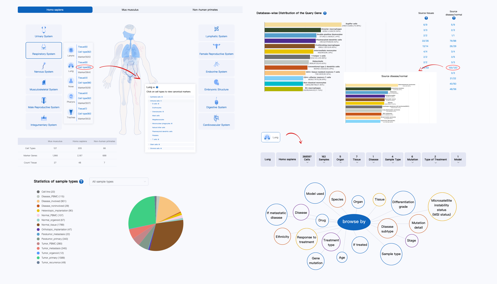
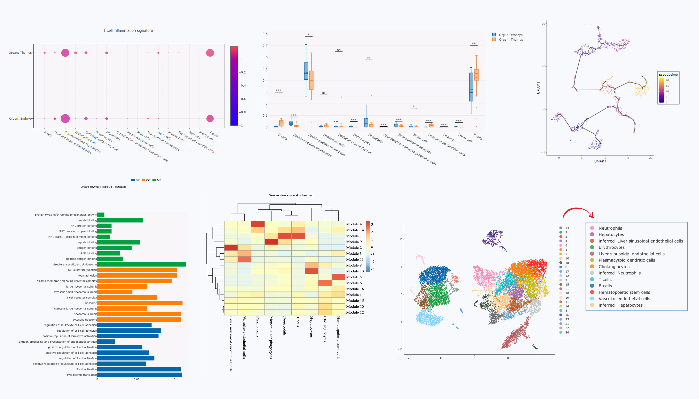

## Overview

[SynEcoSys](https://www.synecosys.cn) is an online database application providing an extensive collection of single-cell sequencing data from published studies including real-world clinical samples. All provided datasets are processed with uniform standards of data analysis and cell type annotation to guarantee precision and inter-comparability. For disease-related datasets, any available clinical information associated with the single-cell data including descriptions from the text of publications are collected and organized as sample metadata, such as patient disease stages, disease subtypes, mutations carried, treatment methods, and responses to treatment. These features highlight SynEcoSys as the first-in-the-field single-cell sequencing database capable of clinical translations, supporting data mining for pharmaceuticals, therapeutics, and researches.

SynEcoSys offers user-friendly data exploration platform for researchers with or without programming experience. CeleViz and CeleLens tools are embedded in SynEcoSys to offer elegant graphical interfaces for visualizing dimensionality reduction, gene expression, cellular composition, differentially expressed genes analysis, inter-group comparisons, trajectory analysis, cell-cell interaction analysis, and automatic cell type annotation with in-house references.

## Contact

SynEcoSys Team (<sesinfo@singleronbio.com>)
