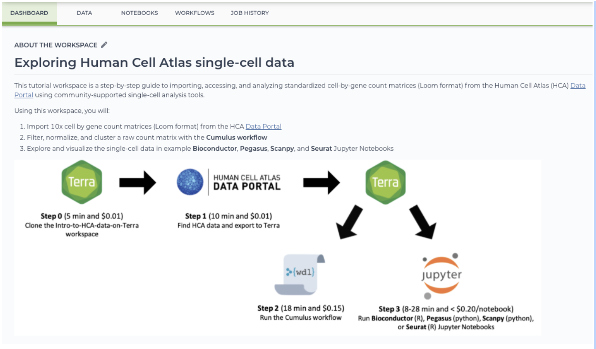

[Terra](https://app.terra.bio/) is a scalable, open-source platform for biomedical researchers to access data, run analysis tools, and collaborate securely in the cloud. It powers important scientific projects including NHGRI’s AnVIL, NHLBI’s BioData Catalyst, the Human Cell Atlas Data Coordination Platform, the BRAIN Initiative Cell Census Network, and many others.

Terra provides easy access to both open and access-controlled datasets hosted in cloud repositories. You can explore, analyze, and visualize data using Jupyter Notebooks, RStudio, RShinyApps, and Galaxy. You can also run your own bioinformatics workflows at scale or try community favorites. Secure workspaces allow you to easily share your work with collaborators.

You can access HCA data in the Data Coordination Platform’s (DCP) [Data Portal](/) and easily export this data to Terra for further analysis. Exporting HCA data to Terra is quick and it will not incur additional download costs:

- Browse the data in the Data Portal’s [Data browser](https://data.humancellatlas.org/explore/projects).
- [Export](/guides/consumer-vignettes/export-to-terra) the selected data to a Terra workspace.
- Analyze the data using popular single-cell bioinformatics workflows or community tools such as Bioconductor, Cumulus, Pegasus, Scanpy, and Seurat.

To register for a Terra account, follow these [instructions](https://support.terra.bio/hc/en-us/articles/360028235911). After registering, start exploring HCA data in Terra using this [guide](/guides/consumer-vignettes/export-to-terra) or the [Intro-to-HCA-data-on-Terra](https://app.terra.bio/#workspaces/featured-workspaces-hca/Intro-to-HCA-data-on-Terra) workspace [tutorial](https://support.terra.bio/hc/en-us/articles/360060041772).

To learn more about Terra, visit [terra.bio](https://terra.bio/).

## Contact

Terra team (<support@terra.bio>)
