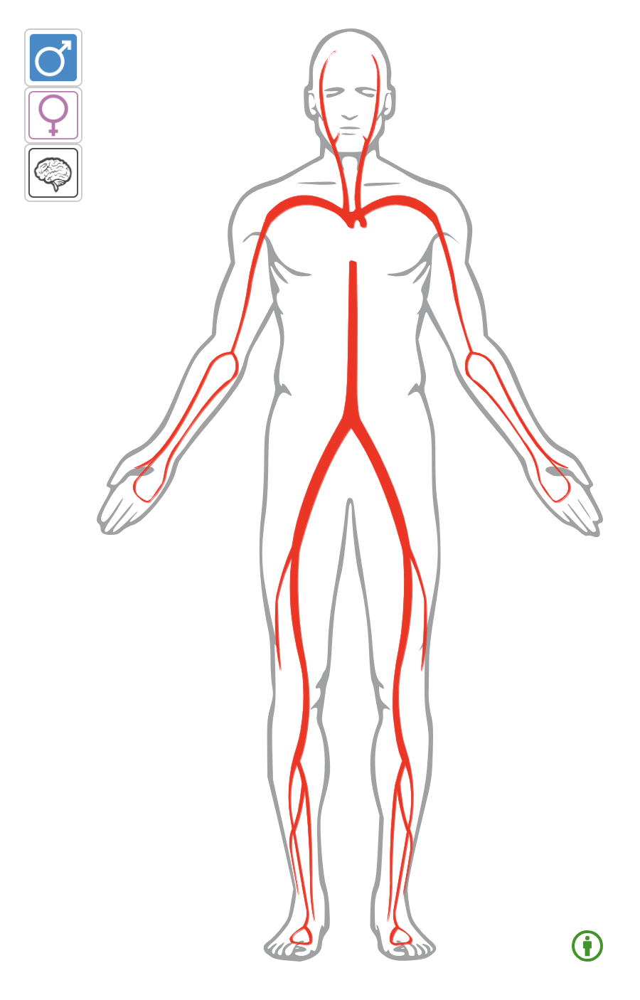

Anatomogram is an interactive component to display an anatomical view of an organism. Selected species support alternative views depending on their specific anatomical features (e.g. male, female and brain in mouse and human, flower and full plant in rice). It uses SVGs where shapes representing organism parts are annotated with ontology accessions that are the IDs the component uses to receive and send events through callbacks.

## Install
`npm install anatomogram`

## Contact
Irene Papatheodorou ([irenep@ebi.ac.uk](mailto:irenep@ebi.ac.uk))
