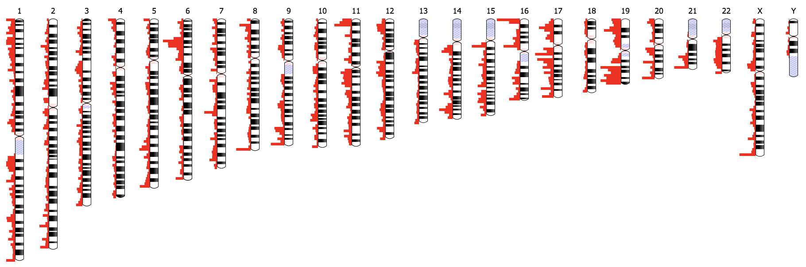

[Ideogram.js](https://eweitz.github.io/ideogram/) is a JavaScript library for chromosome visualization. 

Ideogram supports drawing and animating genome-wide datasets for [human](https://eweitz.github.io/ideogram/human), [mouse](https://eweitz.github.io/ideogram/mouse), and [many other eukaryotes](https://eweitz.github.io/ideogram/eukaryotes).  The [Ideogram API](https://github.com/eweitz/ideogram/blob/master/api.md) for annotations supports [histograms](https://eweitz.github.io/ideogram/annotations-histogram), [heatmaps](https://eweitz.github.io/ideogram/annotations-heatmap), [overlays](https://eweitz.github.io/ideogram/annotations-overlaid), and points of arbitrary shape and color layered in [tracks](https://eweitz.github.io/ideogram/annotations-tracks). Ideogram can depict haploid, [diploid](https://eweitz.github.io/ideogram/ploidy-basic) or higher ploidy genomes (e.g. plants), as well as aneuploidy, [genetic recombination](https://eweitz.github.io/ideogram/ploidy-recombination), and [homologous features](https://eweitz.github.io/ideogram/homology-basic) between chromosomes. 

Ideogram can be embedded as a [reusable component](https://github.com/eweitz/ideogram#usage) in any web page or application, and leverages D3.js and SVG to achieve fast, crisp client-side rendering. You can also integrate Ideogram with JavaScript frameworks like [Angular](https://github.com/eweitz/ideogram/tree/master/examples/angular), [React](https://github.com/eweitz/ideogram/tree/master/examples/react), and [Vue](https://github.com/eweitz/ideogram/tree/master/examples/vue), as well as data science platforms like [R](https://github.com/eweitz/ideogram/tree/master/examples/r) and [Jupyter Notebook](https://github.com/eweitz/ideogram/tree/master/examples/jupyter).

## Install
`npm install ideogram`

## Integrate
Learn how to use Ideogram.js in your portal by exploring a minimal example of [Ideogram.js in React](https://github.com/eweitz/ideogram/blob/master/examples/react/README.md#ideogram-in-react).

## Contact
Eric Weitz ([eric.m.weitz@gmail.com](mailto://eric.m.weitz@gmail.com))

