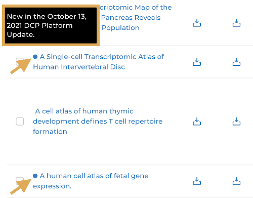
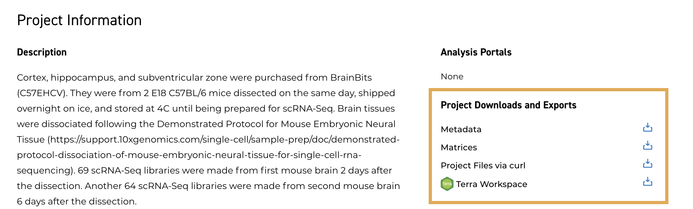
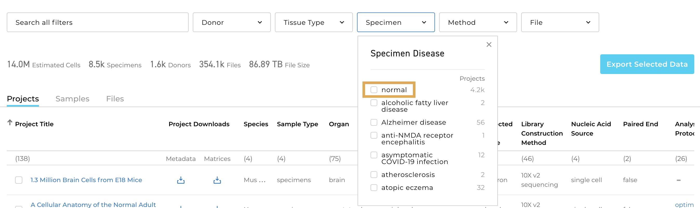
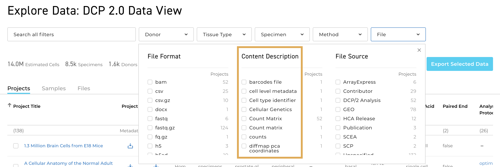
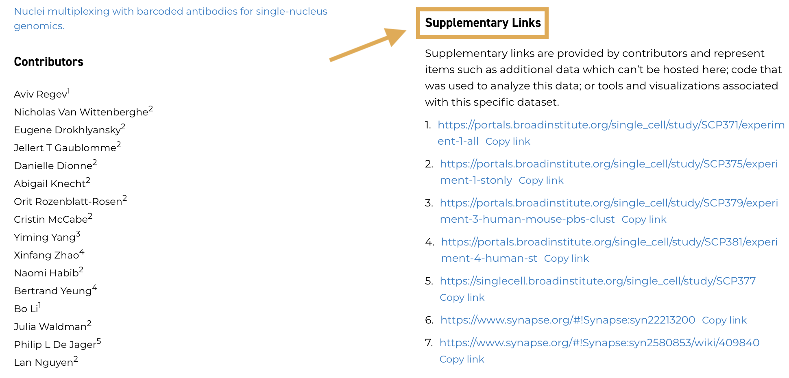
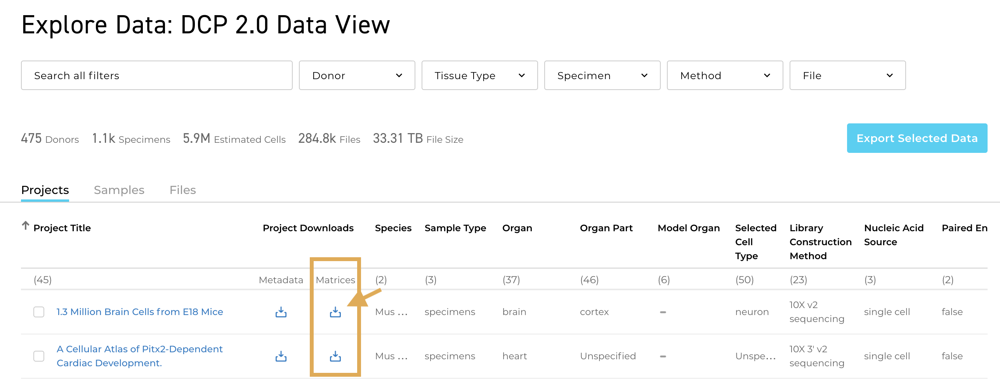

# DCP Platform Updates

#### September 26, 2022

### Release Highlights

* The Data Portal now hosts over 30 million cells! Thank you to the HCA community and all of the contributors that helped us reach this milestone!

### New Raw Data, Metadata, and Contributor-generated Matrices (12)

1. [A Single-Cell Characterization of Human Post-implantation Embryos Cultured In Vitro Delineates Morphogenesis in Primary Syncytialization](https://data.humancellatlas.org/explore/projects/9ac53858-606a-4b89-af49-804ccedaa660)
1. [A Single-Cell Transcriptomic Atlas of Human Skin Aging](https://data.humancellatlas.org/explore/projects/923d3231-7295-4184-b3f6-c3082766a8c7)
1. [A human breast atlas integrating single-cell proteomics and transcriptomics](https://data.humancellatlas.org/explore/projects/9b876d31-0739-4e96-9846-f76e6a427279)
1. [Defining Transcriptional Signatures of Human Hair Follicle Cell States](https://data.humancellatlas.org/explore/projects/8b9cb6ae-6a43-4e47-b9fb-3df7aeec941f)
1. [Expansion of Fcγ Receptor IIIa-Positive Macrophages, Ficolin 1-Positive Monocyte-Derived Dendritic Cells, and Plasmacytoid Dendritic Cells Associated With Severe Skin Disease in Systemic Sclerosis](https://data.humancellatlas.org/explore/projects/7f351a4c-d24c-4fcd-9040-f79071b097d0)
1. [Mapping the developing human immune system across organs](https://data.humancellatlas.org/explore/projects/fcaa53cd-ba57-4bfe-af9c-eaa958f95c1a)
1. [Robust temporal map of human in vitro myelopoiesis using single-cell genomics](https://data.humancellatlas.org/explore/projects/ac289b77-fb12-4a6b-ad43-c0721c698e70)
1. [Single cell transcriptomics of human epidermis identifies basal stem cell transition states](https://data.humancellatlas.org/explore/projects/66d7d92a-d6c5-492c-815b-f81c7c93c984)
1. [Single nucleus RNA-sequencing defines unexpected diversity of cholinergic neuron types in the adult mouse spinal cord](https://data.humancellatlas.org/explore/projects/a7c66eb1-4a4e-4f6c-9e30-ad2a485f8301)
1. [Single-Cell RNA Sequencing Maps Endothelial Metabolic Plasticity in Pathological Angiogenesis](https://data.humancellatlas.org/explore/projects/4c73d1e4-bad2-4a22-a0ba-55abbdbdcc3d)
1. [Single-cell transcriptomic and proteomic analysis of Parkinson’s disease brains](https://data.humancellatlas.org/explore/projects/9a23ac2d-93dd-4bac-9bb8-040e6426db9d)
1. [The myogenesis program drives clonal selection and drug resistance in rhabdomyosarcoma](https://data.humancellatlas.org/explore/projects/74e2ef9d-7c9f-418c-b281-7fb38f3b1571)

### Updated Metadata (5)

1. [Single-cell RNA-Seq reveals a developmental atlas of human prefrontal cortex](https://data.humancellatlas.org/explore/projects/a815c84b-8999-433f-958e-422c0720e00d)
1. [Profiling of transcribed cis-regulatory elements in single cells](https://data.humancellatlas.org/explore/projects/34da2c5f-8011-48af-a7fd-ad2f56ec10f4)
1. [Single-Cell Transcriptomic Analysis of Human Lung Provides Insights into the Pathobiology of Pulmonary Fibrosis](https://data.humancellatlas.org/explore/projects/daf9d982-7ce6-43f6-ab51-272577290606)
1. [Spatial multi-omic map of human myocardial infarction](https://data.humancellatlas.org/explore/projects/e9f36305-d857-44a3-93f0-df4e6007dc97)
1. [Spatial proteogenomics reveals distinct and evolutionarily-conserved hepatic macrophage niches](https://data.humancellatlas.org/explore/projects/425c2759-db66-4c93-a358-a562c069b1f1)

#### August 23, 2022

### Release Highlights

* There are two new managed access projects available in the Browser:
    * [The immune cell atlas of human neuroblastoma](https://data.humancellatlas.org/explore/projects/8f630e0f-6bf9-4a04-9754-02533152a954)
    * [Refining Colorectal Cancer Classification and Clinical Stratification Through a Single-Cell Atlas](https://data.humancellatlas.org/explore/projects/4d9d56e4-610d-4748-b57d-f8315e3f53a3)
   
* A new COVID-19 dataset has been added to the DCP as part of the project [Longitudinal Multi-omics Analyses Identify Responses of Megakaryocytes, Erythroid Cells, and Plasmablasts as Hallmarks of Severe COVID-19](https://data.humancellatlas.org/explore/projects/ec6476ee-2949-41f3-947b-8eef41d6d3ac).

* New raw data derived from populations in Asia and Australia are now available.

### New Raw Data, Metadata, and Contributor-generated Matrices (9)
1. [CD90 marks a mesenchymal program in human thymic epithelial cells in vitro and in vivo](https://data.humancellatlas.org/explore/projects/a1312f9a-01ef-40a7-89bf-9091ca76a03a)
1. [Cross-Species Single-Cell Analysis of Pancreatic Ductal Adenocarcinoma Reveals Antigen-Presenting Cancer-Associated Fibroblasts](https://data.humancellatlas.org/explore/projects/da9d6f24-3bdf-4eaa-9e3f-f47ce2a65b36)
1. [Highly Parallel Genome-wide Expression Profiling of Individual Cells Using Nanoliter Droplets](https://data.humancellatlas.org/explore/projects/3c9d586e-bd26-4b46-8690-3faaa18ccf38)
1. [Longitudinal Multi-omics Analyses Identify Responses of Megakaryocytes, Erythroid Cells, and Plasmablasts as Hallmarks of Severe COVID-19](https://data.humancellatlas.org/explore/projects/ec6476ee-2949-41f3-947b-8eef41d6d3ac)
1. [Reconstitution of a functional human thymus by postnatal stromal progenitor cells and natural whole-organ scaffolds](https://data.humancellatlas.org/explore/projects/3e92c74d-256c-40cd-9273-16f155da8342)
1. [Refining Colorectal Cancer Classification and Clinical Stratification Through a Single-Cell Atlas](https://data.humancellatlas.org/explore/projects/4d9d56e4-610d-4748-b57d-f8315e3f53a3)
1. [Single Cell Transcriptomics Reveals Cell Type Specific Diversification in Human Heart Failure](https://data.humancellatlas.org/explore/projects/135f7f5c-4a85-4bcf-9f7c-4f035ff1e428)
1. [Single-cell Transcriptome Atlas of the Human Corpus Cavernosum](https://data.humancellatlas.org/explore/projects/5b910a43-7fb5-4ea7-b9d6-43dbd1bf2776)
1. [The immune cell atlas of human neuroblastoma](https://data.humancellatlas.org/explore/projects/8f630e0f-6bf9-4a04-9754-02533152a954)

### Updated Metadata (39)
1. [A Human Liver Cell Atlas reveals Heterogeneity and Epithelial Progenitors](https://data.humancellatlas.org/explore/projects/94e4ee09-9b4b-410a-84dc-a751ad36d0df)
1. [A Single-Cell Transcriptomic Map of the Human and Mouse Pancreas Reveals Inter- and Intra-cell Population Structure](https://data.humancellatlas.org/explore/projects/f86f1ab4-1fbb-4510-ae35-3ffd752d4dfc)
1. [A cellular census of human lungs identifies novel cell states in health and in asthma](https://data.humancellatlas.org/explore/projects/c0518445-3b3b-49c6-b8fc-c41daa4eacba)
1. [A single cell atlas of human cornea that defines its development, limbal progenitor cells and their interactions with the immune cells](https://data.humancellatlas.org/explore/projects/6ac8e777-f9a0-4288-b5b0-446e8eba3078)
1. [A single-cell and single-nucleus RNA-seq toolbox for fresh and frozen human tumors](https://data.humancellatlas.org/explore/projects/a62dae2e-cd69-4d5c-b5f8-4f7e8abdbafa)
1. [A spatial multi-omics atlas of the human lung reveals a novel immune cell survival niche](https://data.humancellatlas.org/explore/projects/957261f7-2bd6-4358-a6ed-24ee080d5cfc)
1. [Assessing the relevance of organoids to model inter-individual variation](https://data.humancellatlas.org/explore/projects/005d611a-14d5-4fbf-846e-571a1f874f70)
1. [Blood and immune development in human fetal bone marrow and Down syndrome](https://data.humancellatlas.org/explore/projects/04ad400c-58cb-40a5-bc2b-2279e13a910b)
1. [Construction of a single-cell transcriptomic atlas of 58,243 liver cells from 4 donors and 4 recipient liver transplasnt patients to investigate early allograft dysfunction (EAD)](https://data.humancellatlas.org/explore/projects/c7c54245-548b-4d4f-b15e-0d7e238ae6c8)
1. [Decoding Human Megakaryocyte Development](https://data.humancellatlas.org/explore/projects/a9f5323a-ce71-471c-9caf-04cc118fd1d7)
1. [Developmental cell programs are co-opted in inflammatory skin disease](https://data.humancellatlas.org/explore/projects/c5f46615-68de-4cf4-bbc2-a0ae10f08243)
1. [Human cerebral organoids recapitulate gene expression programs of fetal neocortex development](https://data.humancellatlas.org/explore/projects/d2111fac-3fc4-4f42-9b6d-32cd6a828267)
1. [Improving fibroblast characterization using single-cell RNA sequencing: an optimized tissue disaggregation and data processing pipeline](https://data.humancellatlas.org/explore/projects/0562d2ae-0b8a-459e-bbc0-6357108e5da9)
1. [Integrated single cell analysis of blood and cerebrospinal fluid leukocytes in multiple sclerosis](https://data.humancellatlas.org/explore/projects/d3ac7c1b-5302-4804-b611-dad9f89c049d)
1. [Integrative analysis of cell state changes in lung fibrosis with peripheral protein biomarkers](https://data.humancellatlas.org/explore/projects/2f676143-80c2-4bc6-b7b4-2613fe0fadf0)
1. [Integrative computational analysis of the substantia nigra pars compacta and the locus coeruleus](https://data.humancellatlas.org/explore/projects/5b5f05b7-2482-468d-b76d-8f68c04a7a47)
1. [Low-coverage single-cell mRNA sequencing reveals cellular heterogeneity and activated signaling pathways in developing cerebral cortex](https://data.humancellatlas.org/explore/projects/45c2c853-d06f-4879-957e-f1366fb5d423)
1. [Modelling the impact of decidual senescence on embryo implantation in human endometrial assembloids](https://data.humancellatlas.org/explore/projects/91af6e2f-65f2-44ec-98e0-ba4e98db22c8)
1. [Molecular Architecture of the Mouse Nervous System](https://data.humancellatlas.org/explore/projects/2c041c26-f75a-495f-ab36-a076f89d422a)
1. [Molecular and functional heterogeneity of IL-10-producing CD4+ T cells](https://data.humancellatlas.org/explore/projects/df88f39f-01a8-4b5b-92f4-3177d6c0f242)
1. [Population-scale single-cell RNA-seq profiling across dopaminergic neuron differentiation](https://data.humancellatlas.org/explore/projects/20f37aaf-caa1-40e6-9123-be6ce8feb2d6)
1. [Profiling of transcribed cis-regulatory elements in single cells](https://data.humancellatlas.org/explore/projects/34da2c5f-8011-48af-a7fd-ad2f56ec10f4)
1. [SARS-CoV-2 receptor ACE2 is an interferon-stimulated gene in human airway epithelial cells and is detected in specific cell subsets across tissues](https://data.humancellatlas.org/explore/projects/0b299140-25b5-4861-a69f-7651ff3f46cf)
1. [Sampling time-dependent artifacts in single-cell genomics studies](https://data.humancellatlas.org/explore/projects/5b328561-4a97-40ac-b7ad-6a90fc59d374)
1. [Single Cell RNA-seq reveals ectopic and aberrant lung resident cell populations in Idiopathic Pulmonary Fibrosis](https://data.humancellatlas.org/explore/projects/c16a754f-5da3-46ed-8c1e-6426af2ef625)
1. [Single Cell RNAseq of primary pulmonary endothelial cells](https://data.humancellatlas.org/explore/projects/d7b7beae-652b-4fc0-9bf2-bcda7c7115af)
1. [Single-Cell Transcriptomic Analysis of Human Lung Provides Insights into the Pathobiology of Pulmonary Fibrosis](https://data.humancellatlas.org/explore/projects/daf9d982-7ce6-43f6-ab51-272577290606)
1. [Single-Cell Transcriptomics Uncovers Zonation of Function in the Mesenchyme during Liver Fibrosis](https://data.humancellatlas.org/explore/projects/d71c76d3-3670-4774-a9cf-034249d37c60)
1. [Single-cell RNA sequencing identifies cell type-specific cis-eQTLs and co-expression QTLs](https://data.humancellatlas.org/explore/projects/40272c3b-4697-4bd4-ba3f-82fa96b9bf71)
1. [Single-cell RNA-Seq of human hepatocyte-derived liver progenitor-like cells](https://data.humancellatlas.org/explore/projects/074a9f88-729a-455d-bca5-0ce80edf0cea)
1. [Single-cell RNA-sequencing reveals profibrotic roles of distinct epithelial and mesenchymal lineages in pulmonary fibrosis](https://data.humancellatlas.org/explore/projects/c1a9a93d-d9de-4e65-9619-a9cec1052eaa)
1. [Single-cell analysis of human B cell maturation predicts how antibody class switching shapes selection dynamics](https://data.humancellatlas.org/explore/projects/24d0dbbc-54eb-4904-8141-934d26f1c936)
1. [Single-cell transcriptomes of the aging human skin reveal loss of fibroblast priming](https://data.humancellatlas.org/explore/projects/51f02950-ee25-4f4b-8d07-59aa99bb3498)
1. [Single-nucleus RNA-seq in the post-mortem brain in major depressive disorder](https://data.humancellatlas.org/explore/projects/0777b9ef-91f3-468b-9dea-db477437aa1a)
1. [Spatial and single-cell transcriptional profiling identifies functionally distinct human dermal fibroblast subpopulations](https://data.humancellatlas.org/explore/projects/05657a59-9f9d-4bb9-b77b-24be13aa5cea)
1. [Spatial multi-omic map of human myocardial infarction](https://data.humancellatlas.org/explore/projects/e9f36305-d857-44a3-93f0-df4e6007dc97)
1. [Spatial proteogenomics reveals distinct and evolutionarily-conserved hepatic macrophage niches](https://data.humancellatlas.org/explore/projects/425c2759-db66-4c93-a358-a562c069b1f1)
1. [The Human and Mouse Enteric Nervous System at Single-Cell Resolution](https://data.humancellatlas.org/explore/projects/7be05025-9972-493a-856f-3342a8d1b183)
1. [Transcriptional analysis of cystic fibrosis airways at single-cell resolution reveals altered epithelial cell states and composition](https://data.humancellatlas.org/explore/projects/e526d91d-cf3a-44cb-80c5-fd7676b55a1d)

#### July 19, 2022

### Release Highlights
* New combined 10x Visium and single-cell RNA sequencing data derived from human ureter tissue are available in the project [Ureter single-cell and spatial mapping reveal cell types, architecture, and signaling networks](https://data.humancellatlas.org/explore/projects/9833669b-d694-4b93-a3d0-6b6f9dbcfc10). 

* Multiple new projects feature data related to SARS-CoV-2 infection:
   * [Single-cell meta-analysis of SARS-CoV-2 entry genes across tissues and demographics](https://data.humancellatlas.org/explore/projects/a27dd619-25ad-46a0-ae0c-5c4940a1139b)
   * [The local and systemic response to SARS-CoV-2 infection in children and adults](https://data.humancellatlas.org/explore/projects/1538d572-bcb7-426b-8d2c-84f3a7f87bb0)

### New Raw Data, Metadata, and Contributor-generated Matrices (6)
1. [Lineage recording in human cerebral organoids](https://data.humancellatlas.org/explore/projects/c4e11369-78d4-4d29-ba8e-b67907c4c65c)
1. [Single Cell, Single Nucleus and Spatial RNA Sequencing of the Human Liver Identifies Hepatic Stellate Cell and Cholangiocyte Heterogeneity](https://data.humancellatlas.org/explore/projects/8a666b76-daaf-4b1f-9414-e4807a1d1e8b)
1. [Single-cell RNA-seq reveals cell type-specific molecular and genetic associations to lupus](https://data.humancellatlas.org/explore/projects/9fc0064b-84ce-40a5-a768-e6eb3d364ee0)
1. [Single-cell meta-analysis of SARS-CoV-2 entry genes across tissues and demographics](https://data.humancellatlas.org/explore/projects/a27dd619-25ad-46a0-ae0c-5c4940a1139b)
1. [The local and systemic response to SARS-CoV-2 infection in children and adults](https://data.humancellatlas.org/explore/projects/1538d572-bcb7-426b-8d2c-84f3a7f87bb0)
1. [Ureter single-cell and spatial mapping reveal cell types, architecture, and signaling networks](https://data.humancellatlas.org/explore/projects/9833669b-d694-4b93-a3d0-6b6f9dbcfc10)

### Updated Metadata (4)
1. [A single-cell and single-nucleus RNA-seq toolbox for fresh and frozen human tumors](https://data.humancellatlas.org/explore/projects/a62dae2e-cd69-4d5c-b5f8-4f7e8abdbafa)
1. [Defining the Activated Fibroblast Population in Lung Fibrosis Using Single Cell Sequencing](https://data.humancellatlas.org/explore/projects/b4a7d12f-6c2f-40a3-9e35-9756997857e3)
1. [Single-cell RNA Sequencing of human microglia from post mortem Alzheimers Disease CNS tissue](https://data.humancellatlas.org/explore/projects/b51f49b4-0d2e-4cbd-bbd5-04cd171fc2fa)
1. [Spatial multi-omic map of human myocardial infarction](https://data.humancellatlas.org/explore/projects/e9f36305-d857-44a3-93f0-df4e6007dc97)

#### June 29, 2022

### Release Highlights
* New data is available from research groups in Japan, China, and South Korea:
    * [scRNA-seq experiments on human foreskin fibroblasts, foreskin fibroblasts induced directly to retina pigment epithelium, and induced pluripotent stem cell derived retina pigment epithelium](https://data.humancellatlas.org/explore/projects/4f17edf6-e9f0-42af-a54a-f02fdca76ade) 
    * [Single-cell RNA-seq of bone marrow cells from aplastic anemia patient and healthy donor](https://data.humancellatlas.org/explore/projects/e993adcd-d4ba-4f88-9a05-d1c05bdf0c45)
    * [Memory-like natural killer cells facilitate effector functions of daratumumab in multiple myeloma](https://data.humancellatlas.org/explore/projects/2eb4f5f8-42a5-4368-aa2d-337bacb96197)

* There are now seven 10x Visium spatial transcriptomic projects available in the Data Browser. See the most recent one: [A human fetal lung cell atlas uncovers proximal-distal gradients of differentiation and key regulators of epithelial fates](https://data.humancellatlas.org/explore/projects/2fe3c60b-ac1a-4c61-9b59-f6556c0fce63). 

### New Raw Data, Metadata, and Contributor-generated Matrices (11)
1. [A human fetal lung cell atlas uncovers proximal-distal gradients of differentiation and key regulators of epithelial fates](https://data.humancellatlas.org/explore/projects/2fe3c60b-ac1a-4c61-9b59-f6556c0fce63)
1. [A single-cell and single-nucleus RNA-seq toolbox for fresh and frozen human tumors](https://data.humancellatlas.org/explore/projects/a62dae2e-cd69-4d5c-b5f8-4f7e8abdbafa)
1. [Decoding Human Megakaryocyte Development](https://data.humancellatlas.org/explore/projects/a9f5323a-ce71-471c-9caf-04cc118fd1d7)
1. [Memory-like natural killer cells facilitate effector functions of daratumumab in multiple myeloma](https://data.humancellatlas.org/explore/projects/2eb4f5f8-42a5-4368-aa2d-337bacb96197)
1. [Profiling of transcribed cis-regulatory elements in single cells](https://data.humancellatlas.org/explore/projects/34da2c5f-8011-48af-a7fd-ad2f56ec10f4)
1. [Single-cell RNA-seq of bone marrow cells from aplastic anemia patient and healthy donor](https://data.humancellatlas.org/explore/projects/e993adcd-d4ba-4f88-9a05-d1c05bdf0c45)
1. [Single-cell RNA-seq to decipher the subpopulations of human decidual leukocytes in normal and RSA pregnancies](https://data.humancellatlas.org/explore/projects/c302fe54-d22d-451f-a130-e24df3d6afca)
1. [Single-cell deciphering of human fetal innate lymphoid cell development](https://data.humancellatlas.org/explore/projects/fccd3f50-cde2-47bf-8972-a293b5928aea)
1. [Single-cell sequencing unveils the heterogeneity of nonimmune cells in chronic apical periodontitis](https://data.humancellatlas.org/explore/projects/d138a114-7df5-4f7d-9ff1-f79dfd2d428f)
1. [The Human and Mouse Enteric Nervous System at Single-Cell Resolution](https://data.humancellatlas.org/explore/projects/7be05025-9972-493a-856f-3342a8d1b183)
1. [scRNA-seq experiments on human foreskin fibroblasts, foreskin fibroblasts induced directly to retina pigment epithelium, and induced pluripotent stem cell derived retina pigment epithelium](https://data.humancellatlas.org/explore/projects/4f17edf6-e9f0-42af-a54a-f02fdca76ade) 

### Updated Metadata (28)

1. [Assessing the relevance of organoids to model inter-individual variation](https://data.humancellatlas.org/explore/projects/005d611a-14d5-4fbf-846e-571a1f874f70) 
1. [A single cell atlas of human teeth](https://data.humancellatlas.org/explore/projects/d3446f0c-30f3-4a12-b7c3-6af877c7bb2d)
1. [Blood and immune development in human fetal bone marrow and Down syndrome](https://data.humancellatlas.org/explore/projects/04ad400c-58cb-40a5-bc2b-2279e13a910b)
1. [Capturing human trophoblast development with naive pluripotent stem cells in vitro](https://data.humancellatlas.org/explore/projects/da2747fa-2921-42e0-afd4-39ef57b2b88b)
1. [Dissecting the Global Dynamic Molecular Profiles of Human Fetal Kidney Development by Single-Cell RNA Sequencing](https://data.humancellatlas.org/explore/projects/8a40ff19-e614-4c50-b23b-5c9e1d546bab)
1. [Extreme heterogeneity of influenza virus infection in single cells](https://data.humancellatlas.org/explore/projects/5bb1f67e-2ff0-4848-bbcf-17d133f0fd2d)
1. [Human photoreceptor cells from different macular subregions have distinct transcriptional profiles](https://data.humancellatlas.org/explore/projects/8bd2e5f6-9453-4b9b-9c56-59e3a40dc87e)
1. [Integrative computational analysis of the substantia nigra pars compacta and the locus coeruleus](https://data.humancellatlas.org/explore/projects/5b5f05b7-2482-468d-b76d-8f68c04a7a47)
1. [Population-scale single-cell RNA-seq profiling across dopaminergic neuron differentiation](https://data.humancellatlas.org/explore/projects/20f37aaf-caa1-40e6-9123-be6ce8feb2d6)
1. [Single Cell RNA Sequencing of Human Milk-Derived Cells Reveals Sub-Populations of Mammary Epithelial Cells with Molecular Signatures of Progenitor and Mature States: a Novel, Non-invasive Framework for Investigating Human Lactation Physiology](https://data.humancellatlas.org/explore/projects/8999b456-6fa6-438b-ab17-b62b1d8ec0c3)
1. [Single Cell RNA-Seq profiling human embryonic kidney cortex cells](https://data.humancellatlas.org/explore/projects/71436067-ac41-4ace-be1b-2fbcc2cb02fa)
1. [Single cell RNA-seq of HeLa CCL2](https://data.humancellatlas.org/explore/projects/18d4aae2-8363-4e00-8eeb-b9e568402cf8)
1. [Single cell RNAseq of human nail unit defines RSPO4 onychofibroblasts and SPINK6 nail epithelium](https://data.humancellatlas.org/explore/projects/bd7104c9-a950-490e-9472-7d41c6b11c62)
1. [Single cell sequencing identifies novel sub-populations of breast cancer cells selected under hypoxia](https://data.humancellatlas.org/explore/projects/f6133d2a-9f3d-4ef9-9c19-c23d6c7e6cc0)
1. [Single cell transcriptional profiling of peripheral blood mononuclear cells (PBMCs) from mice flown on Rodent Research Reference Mission-2 (RRRM-2)](https://data.humancellatlas.org/explore/projects/a2a2f324-cf24-409e-a859-deaee871269c)
1. [Single cell transcriptional profiling of spleens from mice flown on Rodent Research Reference Mission-2](https://data.humancellatlas.org/explore/projects/aff9c3cd-6b84-4fc2-abf2-b9c0b3038277)
1. [Single-Cell RNA Sequencing Reveals Human iPS Cell-derived Alveolar Type 1 Cells in Alveolar Organoids](https://data.humancellatlas.org/explore/projects/dbcd4b1d-31bd-4eb5-94e1-50e8706fa192)
1. [Single-Cell Transcriptomic Profiling of Human Dental Pulp in Sound and Carious Teeth: A Pilot Study](https://data.humancellatlas.org/explore/projects/6f89a7f3-8d4a-4344-aa4f-eccfe7e91076)
1. [Single-cell Transcriptome Analysis Reveals an Anomalous Epithelial Variation and Ectopic Inflammatory Response in Chronic Obstructive Pulmonary Disease](https://data.humancellatlas.org/explore/projects/ad04c8e7-9b7d-4cce-b8e9-01e31da10b94)
1. [Single-cell transcriptome profiling of an adult human cell atlas of 15 major organs](https://data.humancellatlas.org/explore/projects/376a7f55-b876-4f60-9cf3-ed7bc83d5415)
1. [Single-cell transcriptomics of normal pancreas, intraductal papillary mucinous neoplasm, and pancreatic adenosquamous carcinoma reveals the heterogeneous progression of pancreatic ductal and stromal cells](https://data.humancellatlas.org/explore/projects/3c27d2dd-b180-4b2b-bf05-e2e418393fd1)
1. [Single-cell transcriptomics of the human retinal pigment epithelium and choroid in health and macular degeneration](https://data.humancellatlas.org/explore/projects/7880637a-35a1-4047-b422-b5eac2a2a358)
1. [Single-cell transcriptomics reveals unique features of human pancreatic islet cell subtypes](https://data.humancellatlas.org/explore/projects/78b2406d-bff2-46fc-8b61-20690e602227)
1. [Spatial multi-omic map of human myocardial infarction](https://data.humancellatlas.org/explore/projects/e9f36305-d857-44a3-93f0-df4e6007dc97)
1. [Spatial proteogenomics reveals distinct and evolutionarily-conserved hepatic macrophage niches](https://data.humancellatlas.org/explore/projects/425c2759-db66-4c93-a358-a562c069b1f1)
1. [Spatially distinct reprogramming of the tumor microenvironment based on tumor invasion in diffuse-type gastric cancers](https://data.humancellatlas.org/explore/projects/f29b124a-8597-4862-ae98-ff3a0fd9033e)
1. [The Immune Atlas of Human Deciduas With Unexplained Recurrent Pregnancy Loss](https://data.humancellatlas.org/explore/projects/3cfcdff5-dee1-4a7b-a591-c09c6e850b11)
1. [The effect of Mtb aggregation on monocyte-derived macrophage transcription profiles](https://data.humancellatlas.org/explore/projects/b9484e4e-dc40-4e38-9b85-4cecf5b8c068)

#### June 9, 2022

### Release Highlights
* Contributions of spatial transcriptomic data (like 10x Visium) continue to climb; for example, see the project [Transcriptome-scale spatial gene expression in the human dorsolateral prefrontal cortex](https://data.humancellatlas.org/explore/projects/7b393e4d-65bc-4c03-b402-aae769299329).

* New raw data and contributor matrices shed light on disease processes; see the project "[Single-Cell Transcriptomics of Human Substantia Nigra in Parkinson's Disease](https://data.humancellatlas.org/explore/projects/16cd6791-2adb-4d0f-8222-0184dada6456)" for a cellular atlas of the human substantia nigra in health and Parkinson’s Disease. 

* Multi-modal data provides a more complete understanding of cellular function. The new project [Spatial proteogenomics reveals distinct and evolutionarily-conserved hepatic macrophage niches](https://data.humancellatlas.org/explore/projects/425c2759-db66-4c93-a358-a562c069b1f1) combines the power of Visium and CITE-seq.

### New Raw Data, Metadata, and Contributor-generated Matrices (13)
1. [A Human Liver Cell Atlas reveals Heterogeneity and Epithelial Progenitors](https://data.humancellatlas.org/explore/projects/94e4ee09-9b4b-410a-84dc-a751ad36d0df)
1. [A single-cell atlas of breast cancer cell lines to study tumour heterogeneity and drug response](https://data.humancellatlas.org/explore/projects/6663070f-fd8b-41a9-a479-2d1e07afa201)
1. [CITE-seq of in vitro control and memory-like human NK cells](https://data.humancellatlas.org/explore/projects/2253ae59-4cc5-4bd2-b44e-ecb6d3fd7646)
1. [Combinatorial transcription factor profiles predict mature and functional human islet α and β cells](https://data.humancellatlas.org/explore/projects/daa371e8-1ec3-43ef-924f-896d901eab6f)
1. [RNA-Seq from human innate lymphoid cells (ILCs) transitional populations](https://data.humancellatlas.org/explore/projects/f4d011ce-d1f5-48a4-ab61-ae14176e3a6e)
1. [SARS-CoV-2 receptor ACE2 is an interferon-stimulated gene in human airway epithelial cells and is detected in specific cell subsets across tissues](https://data.humancellatlas.org/explore/projects/0b299140-25b5-4861-a69f-7651ff3f46cf)
1. [Single Cell RNA-seq reveals ectopic and aberrant lung resident cell populations in Idiopathic Pulmonary Fibrosis](https://data.humancellatlas.org/explore/projects/c16a754f-5da3-46ed-8c1e-6426af2ef625)
1. [Single-Cell Transcriptomics of Human Substantia Nigra in Parkinson's Disease](https://data.humancellatlas.org/explore/projects/16cd6791-2adb-4d0f-8222-0184dada6456)
1. [Single-cell analysis of gastric pre-cancerous and cancer lesions reveals cell lineage diversity and intratumoral heterogeneity](https://data.humancellatlas.org/explore/projects/18e58437-76b7-4021-8ede-3f0b443fa915)
1. [Skin single cell universe identifies IL-1B/IL23A co-producing CD14+ type 3 dendritic cells in psoriasis](https://data.humancellatlas.org/explore/projects/b733dc1b-1d55-45e3-8036-7eab0821742c)
1. [Spatial multi-omic map of human myocardial infarction](https://data.humancellatlas.org/explore/projects/e9f36305-d857-44a3-93f0-df4e6007dc97)
1. [Spatial proteogenomics reveals distinct and evolutionarily-conserved hepatic macrophage niches](https://data.humancellatlas.org/explore/projects/425c2759-db66-4c93-a358-a562c069b1f1)
1. [Transcriptome-scale spatial gene expression in the human dorsolateral prefrontal cortex](https://data.humancellatlas.org/explore/projects/7b393e4d-65bc-4c03-b402-aae769299329)

### Updated Raw Data, Metadata, Contributor-generated Matrices (4)
1. [Single-cell analysis of human B cell maturation predicts how antibody class switching shapes selection dynamics](https://data.humancellatlas.org/explore/projects/24d0dbbc-54eb-4904-8141-934d26f1c936)
1. [Improving fibroblast characterization using single-cell RNA sequencing: an optimized tissue disaggregation and data processing pipeline](https://data.humancellatlas.org/explore/projects/0562d2ae-0b8a-459e-bbc0-6357108e5da9)
1. [Single-cell RNA Sequencing of human microglia from post mortem Alzheimers Disease CNS tissue](https://data.humancellatlas.org/explore/projects/b51f49b4-0d2e-4cbd-bbd5-04cd171fc2fa)
1. [Single-cell profiling of human subventricular zone progenitors identifies SFRP1 as a target for stimulating progenitor activation](https://data.humancellatlas.org/explore/projects/3cdaf942-f8ad-42e8-a77b-4efedb9ea7b6)

#### April 20, 2022

### Release Highlights
* Multiple projects now include DOI information in the metadata and project page:
   * [Mapping the temporal and spatial dynamics of the human endometrium in vivo and in vitro](https://data.humancellatlas.org/explore/projects/2b38025d-a5ea-4c0f-b22e-367824bcaf4c)
   * [Single-cell analysis reveals the continuum of human lympho-myeloid progenitor cells](https://data.humancellatlas.org/explore/projects/1ce3b3dc-02f2-44a8-96da-d6d107b27a76)

* New raw imaging data is available for the projects:
   * [Spatiotemporal Analysis of Human Intestinal Development at Single Cell Resolution - scRNA-Seq](https://data.humancellatlas.org/explore/projects/fa3f460f-4fb9-4ced-b548-8ba6a8ecae3f)
   * [Cells of the human intestinal tract mapped across space and time](https://data.humancellatlas.org/explore/projects/fde199d2-a841-4ed1-aa65-b9e0af8969b1)

* Two new research projects include data from mice that traveled to the International Space Station:
   * [Single cell transcriptional profiling of spleens from mice flown on Rodent Research Reference Mission-2](https://data.humancellatlas.org/explore/projects/aff9c3cd-6b84-4fc2-abf2-b9c0b3038277)
   * [Single cell transcriptional profiling of peripheral blood mononuclear cells (PBMCs) from mice flown on Rodent Research Reference Mission-2 (RRRM-2)](https://data.humancellatlas.org/explore/projects/a2a2f324-cf24-409e-a859-deaee871269c)
   
* A new project that is part of an official HCA publication is now available: [A proximal-to-distal survey of healthy adult human small intestine and colon epithelium by single-cell transcriptomics](https://data.humancellatlas.org/explore/projects/73769e0a-5fcd-41f4-9083-41ae08bfa4c1)

### New Raw Data, Metadata, and Contributor-generated Matrices (19):
1. [A proximal-to-distal survey of healthy adult human small intestine and colon epithelium by single-cell transcriptomics](https://data.humancellatlas.org/explore/projects/73769e0a-5fcd-41f4-9083-41ae08bfa4c1)
1. [A single-cell transcriptome atlas of human early embryogenesis](https://data.humancellatlas.org/explore/projects/e255b1c6-1143-4fa6-83a8-528f15b41038)
1. [A spatial multi-omics atlas of the human lung reveals a novel immune cell survival niche](https://data.humancellatlas.org/explore/projects/957261f7-2bd6-4358-a6ed-24ee080d5cfc)
1. [Cells of the human intestinal tract mapped across space and time](https://data.humancellatlas.org/explore/projects/fde199d2-a841-4ed1-aa65-b9e0af8969b1)
1. [Construction of a single-cell transcriptomic atlas of 58,243 liver cells from 4 donors and 4 recipient liver transplasnt patients to investigate early allograft dysfunction (EAD)](https://data.humancellatlas.org/explore/projects/c7c54245-548b-4d4f-b15e-0d7e238ae6c8)
1. [Improving fibroblast characterization using single-cell RNA sequencing: an optimized tissue disaggregation and data processing pipeline](https://data.humancellatlas.org/explore/projects/0562d2ae-0b8a-459e-bbc0-6357108e5da9)
1. [Integrated single-cell transcriptomics and epigenomics reveals strong germinal center–associated etiology of autoimmune risk loci](https://data.humancellatlas.org/explore/projects/65d7a168-4d62-4bc0-8324-4e742aa62de6)
1. [Low-coverage single-cell mRNA sequencing reveals cellular heterogeneity and activated signaling pathways in developing cerebral cortex](https://data.humancellatlas.org/explore/projects/45c2c853-d06f-4879-957e-f1366fb5d423)
1. [Molecular signatures of inflammatory profile and B-cell function in SFTS patients](https://data.humancellatlas.org/explore/projects/40ca2a03-ec0f-471f-a834-948199495fe7)
1. [Retinal ganglion cell-specific genetic regulation in primary open angle glaucoma](https://data.humancellatlas.org/explore/projects/77780d56-03c0-481f-aade-2038490cef9f)
1. [Single cell RNA-seq of HeLa CCL2](https://data.humancellatlas.org/explore/projects/18d4aae2-8363-4e00-8eeb-b9e568402cf8)
1. [Single cell transcriptional profiling of peripheral blood mononuclear cells (PBMCs) from mice flown on Rodent Research Reference Mission-2 (RRRM-2)](https://data.humancellatlas.org/explore/projects/a2a2f324-cf24-409e-a859-deaee871269c)
1. [Single cell transcriptional profiling of spleens from mice flown on Rodent Research Reference Mission-2](https://data.humancellatlas.org/explore/projects/aff9c3cd-6b84-4fc2-abf2-b9c0b3038277)
1. [Single cell transcriptome atlases of the developing mouse and human spinal cord](https://data.humancellatlas.org/explore/projects/6621c827-b57a-4268-bc80-df4049140193)
1. [Single-cell RNA sequencing identifies cell type-specific cis-eQTLs and co-expression QTLs](https://data.humancellatlas.org/explore/projects/40272c3b-4697-4bd4-ba3f-82fa96b9bf71)
1. [Single-cell RNA-Seq reveals a developmental atlas of human prefrontal cortex](https://data.humancellatlas.org/explore/projects/a815c84b-8999-433f-958e-422c0720e00d)
1. [Single-nucleus RNA-seq in the post-mortem brain in major depressive disorder](https://data.humancellatlas.org/explore/projects/0777b9ef-91f3-468b-9dea-db477437aa1a)
1. [Single-nucleus transcriptomic profiles of glial cells in human dorsal root ganglion and spinal cord](https://data.humancellatlas.org/explore/projects/aefb9192-43fc-46d7-a4c1-29597f7ef61b)
1. [Spatiotemporal Analysis of Human Intestinal Development at Single Cell Resolution - scRNA-Seq](https://data.humancellatlas.org/explore/projects/fa3f460f-4fb9-4ced-b548-8ba6a8ecae3f)

### Updated Raw Data, Metadata, Contributor-generated Matrices (10):
1. [Blood and immune development in human fetal bone marrow and Down syndrome](https://data.humancellatlas.org/explore/projects/04ad400c-58cb-40a5-bc2b-2279e13a910b) 
1. [Nuclei multiplexing with barcoded antibodies for single-nucleus genomics](https://data.humancellatlas.org/explore/projects/dc1a41f6-9e09-42a6-959e-3be23db6da56)
1. [A cell atlas of human thymic development defines T cell repertoire formation](https://data.humancellatlas.org/explore/projects/c1810dbc-16d2-45c3-b45e-3e675f88d87b)
1. [A comprehensive single cell transcriptional landscape of human hematopoietic progenitors](https://data.humancellatlas.org/explore/projects/5116c081-8be7-49c5-8ce0-73b887328aa9)
1. [A single cell atlas of human cornea that defines its development, limbal progenitor cells and their interactions with the immune cells](https://data.humancellatlas.org/explore/projects/6ac8e777-f9a0-4288-b5b0-446e8eba3078)
1. [Decoding human fetal liver haematopoiesis](https://data.humancellatlas.org/explore/projects/f2fe82f0-4454-4d84-b416-a885f3121e59)
1. [Mapping the temporal and spatial dynamics of the human endometrium in vivo and in vitro](https://data.humancellatlas.org/explore/projects/2b38025d-a5ea-4c0f-b22e-367824bcaf4c)
1. [Modelling the impact of decidual senescence on embryo implantation in human endometrial assembloids](https://data.humancellatlas.org/explore/projects/91af6e2f-65f2-44ec-98e0-ba4e98db22c8)
1. [Single-Cell Transcriptomic Profiling of Human Dental Pulp in Sound and Carious Teeth: A Pilot Study](https://data.humancellatlas.org/explore/projects/6f89a7f3-8d4a-4344-aa4f-eccfe7e91076)
1. [Single-cell analysis reveals the continuum of human lympho-myeloid progenitor cells](https://data.humancellatlas.org/explore/projects/1ce3b3dc-02f2-44a8-96da-d6d107b27a76)

#### March 30, 2022

### Release Highlights

* A new managed access project, [A cellular census of human lungs identifies novel cell states in health and in asthma](https://data.humancellatlas.org/explore/projects/c0518445-3b3b-49c6-b8fc-c41daa4eacba), is available in the Browser.

* A new COVID-19 dataset has been added to the DCP as part of the project [Single-cell RNA sequencing of urinary cells reveals distinct cellular diversity in COVID-19-associated AKI](https://data.humancellatlas.org/explore/projects/c6a50b2a-3dfd-4ca8-9b48-3e682f568a25).

* New raw data derived from populations in Africa, Asia, and Europe are now available.

### New Raw Data, Metadata, and Contributor-generated Matrices (11):
1. [A cellular census of human lungs identifies novel cell states in health and in asthma](https://data.humancellatlas.org/explore/projects/c0518445-3b3b-49c6-b8fc-c41daa4eacba)
1. [A single cell atlas of human cornea that defines its development, limbal progenitor cells and their interactions with the immune cells](https://data.humancellatlas.org/explore/projects/6ac8e777-f9a0-4288-b5b0-446e8eba3078)
1. [Conserved cell types with divergent features in human versus mouse cortex](https://data.humancellatlas.org/explore/projects/165dea71-a95a-44e1-88cd-b2d9ad68bb1e)
1. [Modelling the impact of decidual senescence on embryo implantation in human endometrial assembloids](https://data.humancellatlas.org/explore/projects/91af6e2f-65f2-44ec-98e0-ba4e98db22c8)
1. [Molecular Architecture of the Mouse Nervous System](https://data.humancellatlas.org/explore/projects/2c041c26-f75a-495f-ab36-a076f89d422a)
1. [Single-cell RNA sequencing of urinary cells reveals distinct cellular diversity in COVID-19-associated AKI](https://data.humancellatlas.org/explore/projects/c6a50b2a-3dfd-4ca8-9b48-3e682f568a25)
1. [Single-cell RNA-sequencing reveals pervasive but highly cell type-specific genetic ancestry effects on the response to viral infection](https://data.humancellatlas.org/explore/projects/c211fd49-d980-4ba1-8c6a-c24254a3cb52)
1. [Single-cell analysis of human B cell maturation predicts how antibody class switching shapes selection dynamics](https://data.humancellatlas.org/explore/projects/24d0dbbc-54eb-4904-8141-934d26f1c936)
1. [Single-cell profiling of human subventricular zone progenitors identifies SFRP1 as a target for stimulating progenitor activation](https://data.humancellatlas.org/explore/projects/3cdaf942-f8ad-42e8-a77b-4efedb9ea7b6)
1. [Spatially distinct reprogramming of the tumor microenvironment based on tumor invasion in diffuse-type gastric cancers](https://data.humancellatlas.org/explore/projects/f29b124a-8597-4862-ae98-ff3a0fd9033e)
1. [Microglia Require CD4 T Cells to Complete the Fetal-to-Adult Transition](https://data.humancellatlas.org/explore/projects/e5d45579-1f5b-48c3-b568-320d93e7ca72) 

### Updated Raw Data, Metadata, Contributor-generated Matrices (6):
1. [Assessing the relevance of organoids to model inter-individual variation](https://data.humancellatlas.org/explore/projects/005d611a-14d5-4fbf-846e-571a1f874f70)
1. [Immunophenotyping of COVID-19 and influenza highlights the role of type I interferons in development of severe COVID-19](https://data.humancellatlas.org/explore/projects/95f07e6e-6a73-4e1b-a880-c83996b3aa5c)
1. [Integrative computational analysis of the substantia nigra pars compacta and the locus coeruleus](https://data.humancellatlas.org/explore/projects/5b5f05b7-2482-468d-b76d-8f68c04a7a47)
1. [Single-cell RNA-Seq of human hepatocyte-derived liver progenitor-like cells](https://data.humancellatlas.org/explore/projects/074a9f88-729a-455d-bca5-0ce80edf0cea)
1. [The Developmental Heterogeneity of Human Natural Killer Cells Defined by Single-cell Transcriptome](https://data.humancellatlas.org/explore/projects/403c3e76-6814-4a2d-a580-5dd5de38c7ff)
1. [The cellular immune response to COVID-19 deciphered by single cell multi-omics across three UK centres](https://data.humancellatlas.org/explore/projects/b963bd4b-4bc1-4404-8425-69d74bc636b8)

#### February 14, 2022

### Release Highlights
* We've created a new [slack channel](https://humancellatlas.slack.com/archives/C02TM2SDVM2) for the DCP community! Join the channel, say hello, and follow for the latest announcements, updates, and opportunities to connect with fellow DCP users.

* The Data Portal header has been updated to include new features:
   * A global search bar that allows users to search across Projects, Guides, Pipeline Docs, and Metadata Schema.
   * Direct links to the HCA Twitter, GitHub repository, and slack channel.

* There are three new managed access projects available in the Browser:
   * [Spatial and single-cell transcriptional landscape of human cerebellar development](https://data.humancellatlas.org/explore/projects/85a9263b-0887-48ed-ab1a-ddfa773727b6).
   * [Intra- and Inter-cellular Rewiring of the Human Colon during Ulcerative Colitis](https://data.humancellatlas.org/explore/projects/cd61771b-661a-4e19-b269-6e5d95350de6).
   * [The Tabula Sapiens: a single cell transcriptomic atlas of multiple organs from individual human donors](https://data.humancellatlas.org/explore/projects/10201832-7c73-4033-9b65-3ef13d81656a).
   
* The first dataset of iPSC-derived tenocytes has been added to the DCP as part of the project [Single cell RNAseq analysis of the developmental trajectory of iPSC-derived tenocytes](https://data.humancellatlas.org/explore/projects/78d7805b-fdc8-472b-8058-d92cf886f7a4).

* A new dataset generated using Fluidigm C1 sequencing has been added to the DCP as part of the project [Pseudo-temporal ordering of individual cells reveals regulators of differentiation](https://data.humancellatlas.org/explore/projects/1eb69a39-b5b2-41ec-afae-5fe37f272756).

* New data from across the globe has been added to the DCP, including datasets from Japan, China, and Thailand.

### New Raw Data, Metadata, and Contributor-generated Matrices (14):
1. [A multi-omics atlas of the human retina at single-cell resolution](https://data.humancellatlas.org/explore/projects/9c20a245-f2c0-43ae-82c9-2232ec6b594f)
1. [Cell Types of the Human Retina and Its Organoids at Single-Cell Resolution](https://data.humancellatlas.org/explore/projects/1dddae6e-3753-48af-b20e-fa22abad125d)
1. [Dissecting transcriptional and chromatin accessibility heterogeneity of proliferating cone precursors in human retinoblastoma tumours by single cell sequencing](https://data.humancellatlas.org/explore/projects/d6225aee-8f0e-4b20-a20c-682509a9ea14)
1. [Integrated scRNA-Seq Identifies Human Postnatal Thymus Seeding Progenitors and Regulatory Dynamics of Differentiating Immature Thymocytes](https://data.humancellatlas.org/explore/projects/dbd836cf-bfc2-41f0-9834-41cc6c0b235a)
1. [Intra- and Inter-cellular Rewiring of the Human Colon during Ulcerative Colitis](https://data.humancellatlas.org/explore/projects/cd61771b-661a-4e19-b269-6e5d95350de6)
1. [Pseudo-temporal ordering of individual cells reveals regulators of differentiation](https://data.humancellatlas.org/explore/projects/1eb69a39-b5b2-41ec-afae-5fe37f272756)
1. [Single cell RNA sequencing of human failing heart](https://data.humancellatlas.org/explore/projects/065e6c13-ad6b-46a3-8075-c3137eb03068)
1. [Single cell RNAseq analysis of the developmental trajectory of iPSC-derived tenocytes](https://data.humancellatlas.org/explore/projects/78d7805b-fdc8-472b-8058-d92cf886f7a4)
1. [Single-Cell Transcriptomic Profiling of Human Dental Pulp in Sound and Carious Teeth: A Pilot Study](https://data.humancellatlas.org/explore/projects/6f89a7f3-8d4a-4344-aa4f-eccfe7e91076)
1. [Single-Cell Transcriptomics Uncovers Zonation of Function in the Mesenchyme during Liver Fibrosis](https://data.humancellatlas.org/explore/projects/d71c76d3-3670-4774-a9cf-034249d37c60)
1. [Single-cell transcriptome analysis reveals the dynamics of human immune cells during early fetal skin development](https://data.humancellatlas.org/explore/projects/06c7dd8d-6cc6-4b79-b795-8805c47d36e1)
1. [Single-nucleus RNA-seq profiling of the human primary motor cortex in amyotrophic lateral sclerosis and frontotemporal lobar degeneration](https://data.humancellatlas.org/explore/projects/dd7ada84-3f14-4765-b7ce-9b64642bb3dc)
1. [Spatial and single-cell transcriptional landscape of human cerebellar development](https://data.humancellatlas.org/explore/projects/85a9263b-0887-48ed-ab1a-ddfa773727b6)
1. [The Tabula Sapiens: a single cell transcriptomic atlas of multiple organs from individual human donors](https://data.humancellatlas.org/explore/projects/10201832-7c73-4033-9b65-3ef13d81656a)

### New DCP Analysis (19):
1. [Cryopreservation and post-thaw characterization of dissociated human islet cells](https://data.humancellatlas.org/explore/projects/8559a8ed-5d8c-4fb6-bde8-ab639cebf03c) 
1. [Dissecting the clonal nature of allelic expression in somatic cells by single-cell RNA-seq](https://data.humancellatlas.org/explore/projects/ccef38d7-aa92-4010-9621-c4c7b1182647) 
1. [Melanoma infiltration of stromal and immune cells](https://data.humancellatlas.org/explore/projects/8c3c290d-dfff-4553-8868-54ce45f4ba7f) 
1. [Re-evaluation of human BDCA-2+ DC during acute sterile skin inflammation](https://data.humancellatlas.org/explore/projects/67a3de09-45b9-49c3-a068-ff4665daa50e) 
1. [Single cell RNA-seq of human pancreatic endocrine cells from Juvenile, adult control and type 2 diabetic donors](https://data.humancellatlas.org/explore/projects/99101928-d9b1-4aaf-b759-e97958ac7403) 
1. [Single cell RNA-sequencing of human tonsil Innate lymphoid cells (ILCs)](https://data.humancellatlas.org/explore/projects/520afa10-f9d2-4e93-ab7a-26c4c863ce18) 
1. [Single cell analysis of human fetal liver captures the transcriptional profile of hepatobiliary hybrid progenitors](https://data.humancellatlas.org/explore/projects/23587fb3-1a4a-4f58-ad74-cc9a4cb4c254) 
1. [Single cell sequencing identifies novel sub-populations of breast cancer cells selected under hypoxia](https://data.humancellatlas.org/explore/projects/f6133d2a-9f3d-4ef9-9c19-c23d6c7e6cc0) 
1. [Single-Cell RNAseq analysis of diffuse neoplastic infiltrating cells at the migrating front of human glioblastoma](https://data.humancellatlas.org/explore/projects/2d846095-8a33-4f3c-97d4-585bafac13b4) 
1. [Single-Cell Transcriptomics Reveals a Population of Dormant Neural Stem Cells that Become Activated upon Brain Injury](https://data.humancellatlas.org/explore/projects/e8808cc8-4ca0-4096-80f2-bba73600cba6)
1. [Single-cell RNA-seq reveals heterogeneity within human pre-cDCs](https://data.humancellatlas.org/explore/projects/05be4f37-4506-429b-b112-506444507d62) 
1. [Single-cell analysis reveals the continuum of human lympho-myeloid progenitor cells](https://data.humancellatlas.org/explore/projects/1ce3b3dc-02f2-44a8-96da-d6d107b27a76) 
1. [Single-cell omics reveal human mononuclear phagocyte heterogeneity and inflammatory DC in health and disease](https://data.humancellatlas.org/explore/projects/ccd1f1ba-74ce-469b-9fc9-f6faea623358)
1. [Single-cell transcriptomics reveals unique features of human pancreatic islet cell subtypes](https://data.humancellatlas.org/explore/projects/78b2406d-bff2-46fc-8b61-20690e602227)
1. [Single-cell transcriptomics uncovers distinct molecular signatures of stem cells in chronic myeloid leukemia](https://data.humancellatlas.org/explore/projects/2a72a4e5-66b2-405a-bb7c-1e463e8febb0)
1. [Spatial and single-cell transcriptional profiling identifies functionally distinct human dermal fibroblast subpopulations](https://data.humancellatlas.org/explore/projects/05657a59-9f9d-4bb9-b77b-24be13aa5cea) 
1. [Systematic comparative analysis of single cell RNA-sequencing methods](https://data.humancellatlas.org/explore/projects/88ec040b-8705-4f77-8f41-f81e57632f7d) 
1. [Tracing pluripotency of human early embryos and embryonic stem cells by single cell RNA-seq](https://data.humancellatlas.org/explore/projects/3a694703-3084-4ece-9abe-d935fd5f6748)
1. [Transcriptomes of 1,529 individual cells from 88 human preimplantation embryos](https://data.humancellatlas.org/explore/projects/03c6fce7-789e-4e78-a27a-664d562bb738) 

#### December 20, 2021

### Release Highlights
* The Data Portal links to new portals and tools:
   * The Analysis Portal's section now includes the Teichmann lab's [Cambridge Cell Atlas](https://data.humancellatlas.org/analyze/portals/cambridge-cell-atlas).
   * The Methods Packages section now lists the Li lab's [Cumulus](https://data.humancellatlas.org/analyze/methods/cumulus) software.

* The Data Portal header has been updated with a new link to the Updates page so that viewers can readily follow release notes and other community announcements.

* There are two new managed access projects available in the Browser: 
   * [Hypertension delays viral clearance and exacerbates airway hyperinflammation in patients with COVID-19](https://data.humancellatlas.org/explore/projects/769a08d1-b8a4-4f1e-95f7-6071a9827555).
   * [CD27hiCD38hi plasmablasts are activated B cells of mixed origin with distinct function](https://data.humancellatlas.org/explore/projects/74493e98-44fc-48b0-a58f-cc7e77268b59).

* Three projects have new uniform matrices generated with the updated Optimus pipeline that includes STARsolo software: 
   * [Single-cell transcriptomics uncovers human corneal limbal stem cells and their differentiation trajectory](https://data.humancellatlas.org/explore/projects/24c654a5-caa5-440a-8f02-582921f2db4a).
   * [A single-cell atlas of the healthy breast tissues reveals clinically relevant clusters of breast epithelial cells](https://data.humancellatlas.org/explore/projects/a004b150-1c36-4af6-9bbd-070c06dbc17d).
   * [Single cell RNA-Seq of E18.5 developing mouse kidney and human kidney organoids](https://data.humancellatlas.org/explore/projects/7b947aa2-43a7-4082-afff-222a3e3a4635).

* Several new projects also include data generated with multiple sequencing modalities (i.e. CITE-seq, 10x 3', and scATAC):
   * [Sampling time-dependent artifacts in single-cell genomics studies](https://data.humancellatlas.org/explore/projects/5b328561-4a97-40ac-b7ad-6a90fc59d374).
   * [Blood and immune cell development in human fetal bone marrow and in Down syndrome](https://data.humancellatlas.org/explore/projects/04ad400c-58cb-40a5-bc2b-2279e13a910b).
 
### New Raw Data, Metadata, and Contributor-generated Matrices (21):
1. [A Single-Cell Atlas of the Human Healthy Airways](https://data.humancellatlas.org/explore/projects/ef1e3497-515e-4bbe-8d4c-10161854b699)
1. [A comprehensive single cell transcriptional landscape of human hematopoietic progenitors](https://data.humancellatlas.org/explore/projects/5116c081-8be7-49c5-8ce0-73b887328aa9)
1. [A single-cell atlas of chromatin accessibility in the human genome](https://data.humancellatlas.org/explore/projects/c31fa434-c9ed-4263-a9b6-d9ffb9d44005)
1. [An organoid and multi-organ developmental cell atlas reveals multilineage fate specification in the human intestine](https://data.humancellatlas.org/explore/projects/8ab8726d-81b9-4bd2-acc2-4d50bee786b4)
1. [Blood and immune cell development in human fetal bone marrow and in Down syndrome](https://data.humancellatlas.org/explore/projects/04ad400c-58cb-40a5-bc2b-2279e13a910b)
1. [CD27hiCD38hi plasmablasts are activated B cells of mixed origin with distinct function](https://data.humancellatlas.org/explore/projects/74493e98-44fc-48b0-a58f-cc7e77268b59)
1. [Co-evolution of tumor and immune cells during progression of multiple myeloma](https://data.humancellatlas.org/explore/projects/2ad191cd-bd7a-409b-9bd1-e72b5e4cce81)
1. [Extreme heterogeneity of influenza virus infection in single cells](https://data.humancellatlas.org/explore/projects/5bb1f67e-2ff0-4848-bbcf-17d133f0fd2d)
1. [Hypertension delays viral clearance and exacerbates airway hyperinflammation in patients with COVID-19](https://data.humancellatlas.org/explore/projects/769a08d1-b8a4-4f1e-95f7-6071a9827555)
1. [Identification of distinct synovial fibroblast subsets associated with pain and progression of knee osteoarthritis using single-cell RNA sequencing](https://data.humancellatlas.org/explore/projects/54aaa409-dc28-48c5-be26-d368b4a5d5c6)
1. [Integrative analysis of cell state changes in lung fibrosis with peripheral protein biomarkers](https://data.humancellatlas.org/explore/projects/2f676143-80c2-4bc6-b7b4-2613fe0fadf0)
1. [Kidney organoid reproducibility across multiple human iPSC lines and diminished off target cells after transplantation revealed by single cell transcriptomics](https://data.humancellatlas.org/explore/projects/a60803bb-f7db-45cf-b529-95436152a801)
1. [Modeling Hepatoblastoma: Identification of Distinct Tumor Cell Populations and Key Genetic Mechanisms through Single Cell Sequencing (scRNA-seq)](https://data.humancellatlas.org/explore/projects/2084526b-a66f-4c40-bb89-6fd162f2eb38)
1. [SARS‐CoV‐2 receptor ACE2 and TMPRSS2 are primarily expressed in bronchial transient secretory cells](https://data.humancellatlas.org/explore/projects/58028aa8-0ed2-49ca-b60f-15e2ed5989d5)
1. [Sampling time-dependent artifacts in single-cell genomics studies](https://data.humancellatlas.org/explore/projects/5b328561-4a97-40ac-b7ad-6a90fc59d374)
1. [Single-Cell Transcriptomic Analysis of Human Lung Provides Insights into the Pathobiology of Pulmonary Fibrosis](https://data.humancellatlas.org/explore/projects/daf9d982-7ce6-43f6-ab51-272577290606)
1. [Single-cell ATAC sequencing reveals the mechanism of human breast cancer metastasis](https://data.humancellatlas.org/explore/projects/38e44dd0-c3df-418e-9256-d0824748901f)
1. [Single-cell RNA sequencing of human femoral head in vivo](https://data.humancellatlas.org/explore/projects/68df3629-d2d2-4eed-b0ab-a10e0f019b88)
1. [Single-cell RNA sequencing of peripheral blood reveals immune cell signatures in Alzheimer's disease](https://data.humancellatlas.org/explore/projects/591af954-cdcd-4839-96d3-a0d1b1e885ac)
1. [Single-cell sequencing unveils distinct immune microenvironment in human chronic pancreatitis](https://data.humancellatlas.org/explore/projects/c5ca43aa-3b2b-4216-8eb3-f57adcbc99a1)
1. [Using single-nucleus RNA-sequencing to interrogate transcriptomic profiles of archived human pancreatic islets](https://data.humancellatlas.org/explore/projects/a991ef15-4d4a-4b80-a93e-c538b4b54127)

### Updated Metadata, Raw Data, Contributor-generated Matrices, or DCP Analysis (7):
1. [A single-cell atlas of the healthy breast tissues reveals clinically relevant clusters of breast epithelial cells](https://data.humancellatlas.org/explore/projects/a004b150-1c36-4af6-9bbd-070c06dbc17d)
1. [AIDA pilot data](https://data.humancellatlas.org/explore/projects/f0f89c14-7460-4bab-9d42-22228a91f185)
1. [Distinct microbial and immune niches of the human colon](https://data.humancellatlas.org/explore/projects/83f5188e-3bf7-4956-9544-cea4f8997756) 
1. [Single cell RNA-Seq of E18.5 developing mouse kidney and human kidney organoids](https://data.humancellatlas.org/explore/projects/7b947aa2-43a7-4082-afff-222a3e3a4635)
1. [Single-cell RNA-seq analysis  throughout a 125-day differentiation protocol that converted H1 human embryonic stem cells to a variety of ventrally-derived cell types](https://data.humancellatlas.org/explore/projects/2043c65a-1cf8-4828-a656-9e247d4e64f1) 
1. [Single-cell transcriptomics uncovers human corneal limbal stem cells and their differentiation trajectory](https://data.humancellatlas.org/explore/projects/24c654a5-caa5-440a-8f02-582921f2db4a)
1. [Stress-induced RNA–chromatin interactions promote endothelial dysfunction](https://data.humancellatlas.org/explore/projects/87d52a86-bdc7-440c-b84d-170f7dc346d9) 

#### November 11, 2021

### Release Highlights
* The DCP team has reanalyzed the first of the DCP 1.0 Smart-seq2 projects (["Single cell RNA sequencing of multiple myeloma II](https://data.humancellatlas.org/explore/projects/0c3b7785-f74d-4091-8616-a68757e4c2a8)). Cell-by-gene matrices are available on the project page and were produced with the latest [Smart-seq Multi-Sample pipeline](https://data.humancellatlas.org/pipelines/smart-seq2-workflow) for uniform analysis.  
* Contributor-generated matrices are available for the project ["Single-nucleus cross-tissue molecular reference maps to decipher disease gene function."](https://data.humancellatlas.org/explore/projects/31887183-a72c-4308-9eac-c6140313f39c) which is associated with a Human Cell Atlas [preprint publication](https://www.biorxiv.org/content/10.1101/2021.07.19.452954v1).
* New raw data has been added for the project ["Defining human mesenchymal and epithelial heterogeneity in response to oral inflammatory disease."](https://data.humancellatlas.org/explore/projects/783c9952-a4ae-4106-a6ce-56f20ce27f88) as part of the [HCA Oral & Craniofacial Biological Network](https://www.humancellatlas.org/biological-networks/).
* The first onychofibroblasts dataset has been added to the DCP as part of the project ["Single cell RNAseq of human nail unit defines RSPO4 onychofibroblasts and SPINK6 nail epithelium"](https://data.humancellatlas.org/explore/projects/bd7104c9-a950-490e-9472-7d41c6b11c62).
* New patch-seq data is available in the project ["Cryopreservation and post-thaw characterization of dissociated human islet cells"](https://data.humancellatlas.org/explore/projects/8559a8ed-5d8c-4fb6-bde8-ab639cebf03c).
* A content description for contributor- and DCP-generated matrices is now available on each Data Portal project's matrix download page.
* The submitted and last updated dates are added to the projects list and Data Portal Explore page. We will make this sortable by this field in a future release.
* New and updated projects for the latest DCP Platform release are now indicated next to the project name on the Explore page (as shown below).

     

### New Raw Data, Metadata, and Contributor-generated Matrices (14)

1. [Cellular heterogeneity of human fallopian tubes in normal and hydrosalpinx disease states identified by scRNA-seq](https://data.humancellatlas.org/explore/projects/21ea8ddb-525f-4f1f-a820-31f0360399a2)
1. [Cryopreservation and post-thaw characterization of dissociated human islet cells](https://data.humancellatlas.org/explore/projects/8559a8ed-5d8c-4fb6-bde8-ab639cebf03c)
1. [Defining human mesenchymal and epithelial heterogeneity in response to oral inflammatory disease](https://data.humancellatlas.org/explore/projects/783c9952-a4ae-4106-a6ce-56f20ce27f88)
1. [Differentiation of Human Intestinal Organoids with Endogenous Vascular Endothelial Cells](https://data.humancellatlas.org/explore/projects/5eafb94b-02d8-423e-81b8-3673da319ca0)
1. [Healthy human kidney cell type single cell RNA-seq data](https://data.humancellatlas.org/explore/projects/94023a08-611d-4f22-a8c9-90956e091b2e)
1. [Human photoreceptor cells from different macular subregions have distinct transcriptional profiles](https://data.humancellatlas.org/explore/projects/8bd2e5f6-9453-4b9b-9c56-59e3a40dc87e)
1. [In Vitro and In Vivo Development of the Human Airway at Single-Cell Resolution](https://data.humancellatlas.org/explore/projects/b32a9915-c81b-4cbc-af53-3a66b5da3c9a)
1. [Mapping Development of the Human Intestinal Niche at Single-Cell Resolution](https://data.humancellatlas.org/explore/projects/75dbbce9-0cde-489c-88a7-93e8f92914a3)
1. [Mapping the temporal and spatial dynamics of the human endometrium in vivo and in vitro](https://data.humancellatlas.org/explore/projects/2b38025d-a5ea-4c0f-b22e-367824bcaf4c)
1. [Pro-inflammatory T helper 17 directly harms oligodendrocytes in neuroinflammation](https://data.humancellatlas.org/explore/projects/ede2e0b4-6652-464f-abbc-0b2d964a25a0)
1. [Single Cell RNAseq of primary pulmonary endothelial cells](https://data.humancellatlas.org/explore/projects/d7b7beae-652b-4fc0-9bf2-bcda7c7115af)
1. [Single cell RNAseq of human nail unit defines RSPO4 onychofibroblasts and SPINK6 nail epithelium](https://data.humancellatlas.org/explore/projects/bd7104c9-a950-490e-9472-7d41c6b11c62)
1. [Single cell sequencing identifies novel sub-populations of breast cancer cells selected under hypoxia](https://data.humancellatlas.org/explore/projects/f6133d2a-9f3d-4ef9-9c19-c23d6c7e6cc0)
1. [Single-nucleus cross-tissue molecular reference maps to decipher disease gene function](https://data.humancellatlas.org/explore/projects/31887183-a72c-4308-9eac-c6140313f39c)

### Updated Metadata, Raw Data, Contributor-generated Matrices, or DCP Analysis (2)

1. [AIDA pilot data](https://data.humancellatlas.org/explore/projects/f0f89c14-7460-4bab-9d42-22228a91f185)
1. [Single cell RNA sequencing of multiple myeloma II](https://data.humancellatlas.org/explore/projects/0c3b7785-f74d-4091-8616-a68757e4c2a8)

#### October 13, 2021

### Release Highlights

* Project downloads are now available from the project page. Download the files directly to your local machine via curl or export them to the cloud-based bioinformatics platform [Terra](https://app.terra.bio) by selecting the download next to the new "Terra Workspace" icon. 

* The projects "[A human cell atlas of fetal gene expression](https://data.humancellatlas.org/explore/projects/a9301beb-e9fa-42fe-b75c-84e8a460c733)", "[Single-cell atlas of early human brain development highlights heterogeneity of human neuroepithelial cells and early radial glia](https://data.humancellatlas.org/explore/projects/ef1d9888-fa86-47a4-bb72-0ab0f20f7004)", and "[COVID-19 severity correlates with airway epithelium-immune cell interactions identified by single-cell analysis](https://data.humancellatlas.org/explore/projects/7ac8822c-4ef0-4194-adf0-74290611b1c6)" contain new managed-access data.

* The Data Portal team has corrected linking issues associated with the project [A single cell atlas of human teeth](https://data.humancellatlas.org/explore/projects/d3446f0c-30f3-4a12-b7c3-6af877c7bb2d).

* A new HumanCellAtlas slack channel (#dcp-help) is available to help you troubleshoot Data Portal questions with both the Data Portal team and community and give you the latest updates on Data Portal events and data.

### New Raw Data, Metadata, and Contributor-generated Matrices (14)

1. [A Single-cell Transcriptomic Atlas of Human Intervertebral Disc](https://data.humancellatlas.org/explore/projects/602628d7-c038-48a8-aa97-ffbb2cb44c9d)
1. [A human cell atlas of fetal gene expression](https://data.humancellatlas.org/explore/projects/a9301beb-e9fa-42fe-b75c-84e8a460c733)
1. [COVID-19 severity correlates with airway epithelium-immune cell interactions identified by single-cell analysis](https://data.humancellatlas.org/explore/projects/7ac8822c-4ef0-4194-adf0-74290611b1c6)
1. [Kidney micro-organoids in suspension culture as a scalable source of human pluripotent stem cell-derived kidney cells](https://data.humancellatlas.org/explore/projects/e0c74c7a-20a4-4505-9cf1-38dcdd23011b)
1. [Lifespan charactarization of the nasal mucosa](https://data.humancellatlas.org/explore/projects/8d566d35-d8d3-4975-a351-be5e25e9b2ea)
1. [Population-scale single-cell RNA-seq profiling across dopaminergic neuron differentiation](https://data.humancellatlas.org/explore/projects/20f37aaf-caa1-40e6-9123-be6ce8feb2d6)
1. [Single cell RNA-seq of brain glioblastoma samples](https://data.humancellatlas.org/explore/projects/a80a63f2-e223-4890-81b0-415855b89abc)
1. [Single cell RNA-sequencing on healthy and IPF lung mesenchymal cells](https://data.humancellatlas.org/explore/projects/65858543-530d-48a6-a670-f972b34dfe10)
1. [Single cell atlas of the healthy breast](https://data.humancellatlas.org/explore/projects/9bab0f03-a725-4a13-9ab1-196e46cd80ed)
1. [Single-cell RNA-Seq of human hepatocyte-derived liver progenitor-like cells](https://data.humancellatlas.org/explore/projects/074a9f88-729a-455d-bca5-0ce80edf0cea)
1. [Single-cell analysis of Crohn's disease lesions identifies a pathogenic cellular module associated with resistance to anti-TNF therapy](https://data.humancellatlas.org/explore/projects/504e0cee-1688-40fa-b936-361c4a831f87)
1. [Single-cell atlas of early human brain development highlights heterogeneity of human neuroepithelial cells and early radial glia](https://data.humancellatlas.org/explore/projects/ef1d9888-fa86-47a4-bb72-0ab0f20f7004)
1. [Single-cell atlas of human oral mucosa reveals a stromal-neutrophil axis in tissue immunity regulation](https://data.humancellatlas.org/explore/projects/50151324-f3ed-4358-98af-ec352a940a61)
1. [Single-cell transcriptomics of normal pancreas, intraductal papillary mucinous neoplasm, and pancreatic adenosquamous carcinoma reveals the heterogeneous progression of pancreatic ductal and stromal cells](https://data.humancellatlas.org/explore/projects/3c27d2dd-b180-4b2b-bf05-e2e418393fd1)

### New DCP Analysis (2)

1. [Census of Immune Cells](https://data.humancellatlas.org/explore/projects/cc95ff89-2e68-4a08-a234-480eca21ce79) 
1. [Integrative computational analysis of the substantia nigra pars compacta and the locus coeruleus](https://data.humancellatlas.org/explore/projects/5b5f05b7-2482-468d-b76d-8f68c04a7a47)

### Updated Metadata, Contributor-generated Matrices, or DCP Analysis (20)

1. [A single cell atlas of human teeth](https://data.humancellatlas.org/explore/projects/d3446f0c-30f3-4a12-b7c3-6af877c7bb2d) 
1. [Capturing human trophoblast development with naive pluripotent stem cells in vitro](https://data.humancellatlas.org/explore/projects/da2747fa-2921-42e0-afd4-39ef57b2b88b) 
1. [Dissecting the Global Dynamic Molecular Profiles of Human Fetal Kidney Development by Single-Cell RNA Sequencing](https://data.humancellatlas.org/explore/projects/8a40ff19-e614-4c50-b23b-5c9e1d546bab) 
1. [Female human primordial germ cells display X-chromosome dosage compensation despite the absence of X-inactivation [Female]](https://data.humancellatlas.org/explore/projects/56e73ccb-7ae9-4fae-a738-acfb69936d7a) 
1. [Female human primordial germ cells display X-chromosome dosage compensation despite the absence of X-inactivation [Male]](https://data.humancellatlas.org/explore/projects/8dacb243-e918-4bd2-bb9a-aac6dc424161)
1. [Resolving cellular and molecular diversity along the hippocampal anterior-to-posterior axis in humans](https://data.humancellatlas.org/explore/projects/34cba5e9-ecb1-4d81-bf08-48987cd63073) 
1. [Single Cell RNA Sequencing of Human Milk-Derived Cells Reveals Sub-Populations of Mammary Epithelial Cells with Molecular Signatures of Progenitor and Mature States: a Novel, Non-invasive Framework for Investigating Human Lactation Physiology](https://data.humancellatlas.org/explore/projects/8999b456-6fa6-438b-ab17-b62b1d8ec0c3) 
1. [Single Cell RNA-Seq profiling human embryonic kidney cortex cells](https://data.humancellatlas.org/explore/projects/71436067-ac41-4ace-be1b-2fbcc2cb02fa) 
1. [Single Cell RNA-Seq profiling of human embryonic kidney outer and inner cortical cells and kidney organoid cells](https://data.humancellatlas.org/explore/projects/dd7f2436-0c56-4709-bd17-e526bba4cc15) 
1. [Single-Cell RNA Sequencing Reveals Human iPS Cell-derived Alveolar Type 1 Cells in Alveolar Organoids](https://data.humancellatlas.org/explore/projects/dbcd4b1d-31bd-4eb5-94e1-50e8706fa192) 
1. [Single-Cell RNA-Seq Analysis of cells from human urine](https://data.humancellatlas.org/explore/projects/4af795f7-3e1d-4341-b867-4ac0982b9efd)
1. [Single-cell RNA sequencing of human nasal swab from healthy donors](https://data.humancellatlas.org/explore/projects/414acced-eba0-440f-b721-befbc5642bef)
1. [Single-cell RNA-sequencing reveals the landscape of cervical cancer heterogeneity](https://data.humancellatlas.org/explore/projects/d012d476-8f8c-4ff3-89d6-ebbe22c1b5c1)
1. [Single-cell Transcriptome Analysis Reveals an Anomalous Epithelial Variation and Ectopic Inflammatory Response in Chronic Obstructive Pulmonary Disease](https://data.humancellatlas.org/explore/projects/ad04c8e7-9b7d-4cce-b8e9-01e31da10b94)
1. [Single-cell reconstruction of follicular remodeling in the human adult ovary](https://data.humancellatlas.org/explore/projects/faeedcb0-e046-4be7-b1ad-80a3eeabb066)
1. [Single-cell transcriptomics of the human retinal pigment epithelium and choroid in health and macular degeneration](https://data.humancellatlas.org/explore/projects/7880637a-35a1-4047-b422-b5eac2a2a358)
1. [Single-cell transcriptomics reveals unique features of human pancreatic islet cell subtypes](https://data.humancellatlas.org/explore/projects/78b2406d-bff2-46fc-8b61-20690e602227)
1. [The Developmental Heterogeneity of Human Natural Killer Cells Defined by Single-cell Transcriptome](https://data.humancellatlas.org/explore/projects/403c3e76-6814-4a2d-a580-5dd5de38c7ff)
1. [The Immune Atlas of Human Deciduas With Unexplained Recurrent Pregnancy Loss](https://data.humancellatlas.org/explore/projects/3cfcdff5-dee1-4a7b-a591-c09c6e850b11)
1. [The effect of Mtb aggregation on monocyte-derived macrophage transcription profiles](https://data.humancellatlas.org/explore/projects/b9484e4e-dc40-4e38-9b85-4cecf5b8c068)

#### September 17, 2021

### New Raw Data

The DCP has added raw data for the following 14 new projects:

1. [A molecular single-cell lung atlas of lethal COVID-19](https://data.humancellatlas.org/explore/projects/d7845650-f6b1-4b1c-b2fe-c0795416ba7b)
1. [Capturing human trophoblast development with naive pluripotent stem cells in vitro](https://data.humancellatlas.org/explore/projects/da2747fa-2921-42e0-afd4-39ef57b2b88b)
1. [Comprehensive single-cell transcriptome analysis reveals heterogeneity in endometrioid adenocarcinoma tissues](https://data.humancellatlas.org/explore/projects/79b13a2a-9ca1-42a4-97bd-70208a11bea6)
1. [Fate-mapping within human iPSC-derived kidney organoids reveals conserved mammalian nephron progenitor lineage relationships](https://data.humancellatlas.org/explore/projects/b7259878-436c-4274-bfff-ca76f4cb7892)
1. [Female human primordial germ cells display X-chromosome dosage compensation despite the absence of X-inactivation [Female]](https://data.humancellatlas.org/explore/projects/56e73ccb-7ae9-4fae-a738-acfb69936d7a)
1. [Female human primordial germ cells display X-chromosome dosage compensation despite the absence of X-inactivation [Male]](https://data.humancellatlas.org/explore/projects/8dacb243-e918-4bd2-bb9a-aac6dc424161)
1. [Plasticity of distal nephron epithelia from human kidney organoids enables the induction of ureteric tip and stalk](https://data.humancellatlas.org/explore/projects/e57dc176-ab98-446b-90c2-89e0842152fd)
1. [Resolving cellular and molecular diversity along the hippocampal anterior-to-posterior axis in humans](https://data.humancellatlas.org/explore/projects/34cba5e9-ecb1-4d81-bf08-48987cd63073)
1. [Single Cell RNA Sequencing of Human Milk-Derived Cells Reveals Sub-Populations of Mammary Epithelial Cells with Molecular Signatures of Progenitor and Mature States: a Novel, Non-invasive Framework for Investigating Human Lactation Physiology](https://data.humancellatlas.org/explore/projects/8999b456-6fa6-438b-ab17-b62b1d8ec0c3)
1. [Single Cell RNA-Seq profiling of human embryonic kidney outer and inner cortical cells and kidney organoid cells](https://data.humancellatlas.org/explore/projects/dd7f2436-0c56-4709-bd17-e526bba4cc15)
1. [Single-Cell Map of Diverse Immune Phenotypes in the Breast Tumor Microenvironment](https://data.humancellatlas.org/explore/projects/7c75f07c-608d-4c4a-a1b7-b13d11c0ad31)
1. [Single-Cell RNA-Seq Analysis of cells from human urine](https://data.humancellatlas.org/explore/projects/4af795f7-3e1d-4341-b867-4ac0982b9efd)
1. [Single-cell Transcriptome Analysis Reveals an Anomalous Epithelial Variation and Ectopic Inflammatory Response in Chronic Obstructive Pulmonary Disease](https://data.humancellatlas.org/explore/projects/ad04c8e7-9b7d-4cce-b8e9-01e31da10b94)
1. [The effect of Mtb aggregation on monocyte-derived macrophage transcription profiles](https://data.humancellatlas.org/explore/projects/b9484e4e-dc40-4e38-9b85-4cecf5b8c068)

### Updated Data

The following 3 projects have updated files:

1. [A single-cell atlas of the healthy breast tissues reveals clinically relevant clusters of breast epithelial cells](https://data.humancellatlas.org/explore/projects/a004b150-1c36-4af6-9bbd-070c06dbc17d) 
1. [Single cell RNA-Seq of E18.5 developing mouse kidney and human kidney organoids](https://data.humancellatlas.org/explore/projects/7b947aa2-43a7-4082-afff-222a3e3a4635) 
1. [Single-cell transcriptomics uncovers human corneal limbal stem cells and their differentiation trajectory](https://data.humancellatlas.org/explore/projects/24c654a5-caa5-440a-8f02-582921f2db4a)

## DCP now contains data for 14 million estimated cells

#### August 25, 2021

### New Raw Data

The DCP has added raw data for the following 12 new projects:

1. [AIDA pilot data](https://data.humancellatlas.org/explore/projects/f0f89c14-7460-4bab-9d42-22228a91f185)
1. [Comparison of manual and two types of bioprinted kidney organoids by single cell RNA-seq](https://data.humancellatlas.org/explore/projects/8787c238-89ef-4636-a57d-3167e8b54a80)
1. [Developmental cell programs are co-opted in inflammatory skin disease](https://data.humancellatlas.org/explore/projects/c5f46615-68de-4cf4-bbc2-a0ae10f08243)
1. [Lineage-dependent gene expression programs influence the immune landscape of colorectal cancer](https://data.humancellatlas.org/explore/projects/c715cd2f-dc7c-44a6-9cd5-b6a6d9f075ae)
1. [Single-Cell RNA Sequencing Reveals Human iPS Cell-derived Alveolar Type 1 Cells in Alveolar Organoids](https://data.humancellatlas.org/explore/projects/dbcd4b1d-31bd-4eb5-94e1-50e8706fa192)
1. [Single-cell RNA sequencing of human nasal swab from healthy donors](https://data.humancellatlas.org/explore/projects/414acced-eba0-440f-b721-befbc5642bef)
1. [Single-cell transcriptome profiling of an adult human cell atlas of 15 major organs](https://data.humancellatlas.org/explore/projects/376a7f55-b876-4f60-9cf3-ed7bc83d5415)
1. [Single-cell transcriptome profiling of the vaginal wall in women with severe anterior vaginal prolapse](https://data.humancellatlas.org/explore/projects/71eb5f6d-cee0-4297-b503-b1125909b8c7)
1. [Single-cell transcriptomics of East-Asian pancreatic islets cells](https://data.humancellatlas.org/explore/projects/e77fed30-959d-4fad-bc15-a0a5a85c21d2)
1. [The Developmental Heterogeneity of Human Natural Killer Cells Defined by Single-cell Transcriptome](https://data.humancellatlas.org/explore/projects/403c3e76-6814-4a2d-a580-5dd5de38c7ff)
1. [The Immune Atlas of Human Deciduas With Unexplained Recurrent Pregnancy Loss](https://data.humancellatlas.org/explore/projects/3cfcdff5-dee1-4a7b-a591-c09c6e850b11)
1. [Transcriptional analysis of cystic fibrosis airways at single-cell resolution reveals altered epithelial cell states and composition](https://data.humancellatlas.org/explore/projects/e526d91d-cf3a-44cb-80c5-fd7676b55a1d)

### New Contributor Data

The following projects have new contributor-generated matrix files:

1. [Integrated single cell analysis of blood and cerebrospinal fluid leukocytes in multiple sclerosis](https://data.humancellatlas.org/explore/projects/d3ac7c1b-5302-4804-b611-dad9f89c049d) 
1. [Single-cell transcriptomes of the aging human skin reveal loss of fibroblast priming](https://data.humancellatlas.org/explore/projects/51f02950-ee25-4f4b-8d07-59aa99bb3498)

### Browser Updates

#### Selecting "Normal" Samples

To enable easier discovery of normal tissues, we've modified the Specimen Disease search facet on the Explore page so that the "Normal" option is now at the top of the drop-down.

#### Selecting Files by "Content Description"

The File facet has a new Content Description column to enable searching for files by the type of data they contain.

## New Managed Access and Seed Network projects

#### July 23, 2021

The DCP has added its first managed access project.

Contributor-generated cell-by-gene count matrices and associated non-personally identifiable metadata are now available to the whole HCA community from within the DCP.

Additionally, DCP now has the first project data from the [HCA Seed Networks](https://chanzuckerberg.com/science/programs-resources/single-cell-biology/seednetworks/), which are further developing the Human Cell Atlas by combining the expertise of experimental scientists, software engineers, and physicians.

### Managed Access Projects

1. [Nuclei multiplexing with barcoded antibodies for single-nucleus genomics](https://data.humancellatlas.org/explore/projects/dc1a41f6-9e09-42a6-959e-3be23db6da56)

Managed access raw data is available from the [Synapse database](https://www.synapse.org/#!Synapse:syn22213200) upon successful completion of a data use certificate. To find supplementary links to the managed access datasets in Synapse, navigate to the [project detail page](https://data.humancellatlas.org/explore/projects/dc1a41f6-9e09-42a6-959e-3be23db6da56) in the Data Portal.

### HCA Seed Networks Projects

1. [Single cell transcriptional and chromatin accessibility profiling redefine cellular heterogeneity in the adult human kidney](https://data.humancellatlas.org/explore/projects/2af52a13-65cb-4973-b513-39be38f2df3f)
2. [Stress-induced RNA–chromatin interactions promote endothelial dysfunction](https://data.humancellatlas.org/explore/projects/87d52a86-bdc7-440c-b84d-170f7dc346d9)
3. [A single-cell atlas of the healthy breast tissues reveals clinically relevant clusters of breast epithelial cells](https://data.humancellatlas.org/explore/projects/a004b150-1c36-4af6-9bbd-070c06dbc17d)

### Additional New or Updated Projects

#### Projects with new raw data and/or contributor-generated matrices:

1. [Integrated scRNA-Seq Identifies Human Postnatal Thymus Seeding Progenitors and Regulatory Dynamics of Differentiating Immature Thymocytes](https://data.humancellatlas.org/explore/projects/dbd836cf-bfc2-41f0-9834-41cc6c0b235a)
1. [Single-cell transcriptomic atlas of the human endometrium during the menstrual cycle](https://data.humancellatlas.org/explore/projects/379ed69e-be05-48bc-af5e-a7fc589709bf)
1. [Single-cell reconstruction of follicular remodeling in the human adult ovary](https://data.humancellatlas.org/explore/projects/faeedcb0-e046-4be7-b1ad-80a3eeabb066)
1. [Single Cell RNA-Seq profiling human embryonic kidney cortex cells](https://data.humancellatlas.org/explore/projects/71436067-ac41-4ace-be1b-2fbcc2cb02fa)
1. [Dissecting the Global Dynamic Molecular Profiles of Human Fetal Kidney Development by Single-Cell RNA Sequencing](https://data.humancellatlas.org/explore/projects/8a40ff19-e614-4c50-b23b-5c9e1d546bab)
1. [Establishing Cerebral Organoids as Models of Human-Specific Brain Evolution](https://data.humancellatlas.org/explore/projects/3e329187-a9c4-48ec-90e3-cc45f7c2311c)
1. [Single-cell transcriptomics of the human retinal pigment epithelium and choroid in health and macular degeneration](https://data.humancellatlas.org/explore/projects/7880637a-35a1-4047-b422-b5eac2a2a358)
1. [A single cell atlas of human teeth](https://data.humancellatlas.org/explore/projects/d3446f0c-30f3-4a12-b7c3-6af877c7bb2d)
1. [Single cell RNA-Seq of E18.5 developing mouse kidney and human kidney organoids](https://data.humancellatlas.org/explore/projects/7b947aa2-43a7-4082-afff-222a3e3a4635)
1. [Single-cell RNA sequencing of normal human kidney](https://data.humancellatlas.org/explore/projects/2ef3655a-973d-4d69-9b41-21fa4041eed7)
1. [Single-cell RNA-sequencing reveals the landscape of cervical cancer heterogeneity](https://data.humancellatlas.org/explore/projects/d012d476-8f8c-4ff3-89d6-ebbe22c1b5c1)
1. [Single-cell transcriptomics reveals unique features of human pancreatic islet cell subtypes](https://data.humancellatlas.org/explore/projects/78b2406d-bff2-46fc-8b61-20690e602227)
1. [Re-evaluation of human BDCA-2+ DC during acute sterile skin inflammation](https://data.humancellatlas.org/explore/projects/67a3de09-45b9-49c3-a068-ff4665daa50e)
1. [Molecular and functional heterogeneity of IL-10-producing CD4+ T cells](https://data.humancellatlas.org/explore/projects/df88f39f-01a8-4b5b-92f4-3177d6c0f242)
1. [Single-cell transcriptomes of the aging human skin reveal loss of fibroblast priming](https://data.humancellatlas.org/explore/projects/51f02950-ee25-4f4b-8d07-59aa99bb3498)

#### Projects with new uniformly processed data:

1. [Single-cell analysis reveals congruence between kidney organoids and human fetal kidney](https://data.humancellatlas.org/explore/projects/962bd805-eb89-4c54-bad2-008e497d1307)
1. [A Cellular Anatomy of the Normal Adult Human Prostate and Prostatic Urethra](https://data.humancellatlas.org/explore/projects/53c53cd4-8127-4e12-bc7f-8fe1610a715c)
1. [The emergent landscape of the mouse gut endoderm at single-cell resolution](https://data.humancellatlas.org/explore/projects/4e6f083b-5b9a-4393-9890-2a83da8188f1)
1. [Microglia Require CD4 T Cells to Complete the Fetal-to-Adult Transition](https://data.humancellatlas.org/explore/projects/e5d45579-1f5b-48c3-b568-320d93e7ca72)
1. [High throughput error corrected Nanopore single cell transcriptome sequencing](https://data.humancellatlas.org/explore/projects/0d4b87ea-6e9e-4569-82e4-1343e0e3259f)
1. [Colonic single epithelial cell census reveals goblet cell drivers of barrier breakdown in inflammatory bowel disease](https://data.humancellatlas.org/explore/projects/c893cb57-5c9f-4f26-9312-21b85be84313)

## Data Portal now contains data for 13.5 million cells

#### June 16, 2021

* Raw data and contributor-generated matrices are available for 15 new projects. These single-cell data are derived from:
* Single-cell and single-nucleus
* 10x 3' v2 and v3 3' and 10x 5' chemistry, Fluidigm C1, Smart-seq2, and sci-CAR ATAC sequencing technologies
* Adipose tissue, blood, bone marrow, CSF, heart, kidney, lung, oral cavity, ovary, pancreas, prostate, skeletal muscle, testis, and umbilical vein
* Disease states including COVID-19 infection, intracranial hypertension, multiple sclerosis, and renal cell carcinoma
* Developmental stages including fetal, child, adolescent, and adult
* Standardized data, including aligned BAMs and cell-by-gene count matrices (Loom format), are available for 8 additional projects with data derived from:
* 10x v2 and v3 3' sequencing technologies
* Brain (superior parietal cortex, middle temporal gyrus, and temporal cortex), epididymis, immune tissue, cortex of the kidney organoid, lymph nodes, placenta (chorionic villus and decidua), spine, testis, and thymus
* Disease states including Alzheimer disease and cognitive impairment with or without cerebellar ataxia
* New Jupyter Notebook tutorials for analyzing standardized DCP matrix files are available in an [Intro-to-HCA-data-on-Terra](https://app.terra.bio/#workspaces/featured-workspaces-hca/Intro-to-HCA-data-on-Terra) workspace on the cloud-based platform Terra.
* After registering, you can try the step-by-step instructions for importing HCA data and analyzing in common community tools such as Bioconductor, Cumulus, Pegasus, Scanpy, and Seurat.

## Raw sequencing data and contributor-generated matrices for 23 new projects available for download

#### May 10, 2021

* Data Portal now has data for 12.2 million cells, including new standardized analyses for 13 projects as well as raw sequencing data and contributor-generated matrices for 23 new projects.
* The standardized data, including aligned BAMs and cell-by-gene count matrices (Loom format), are derived from:
* Human and mouse
* Single-cell and single-nucleus
* 10x V2 and V3 3' chemistry
* Blood, brain (including substantia nigra, developing hippocampus, cortex, retina), liver, lung, mouth, skeletal muscle, skin, spleen, and developing thymus
* Disease states including HIV, drug hypersensitivity syndrome, multiple sclerosis, and thoracic aortic aneurysm
* The 23 new projects and contributor-generated matrices include data derived from:
* Human and mouse
* Smart-seq2, 10x V2 and V3 3' chemistry, Drop-seq, and Fluidigm C1 sequencing methods
* Blood, bone marrow, brain, cord blood, epididymis, fetal gonads, immune organ, kidney organoid, lymph nodes, pancreas, skin, and trachea
* Disease states including Alzheimer's Disease, multiple sclerosis, autoimmune encephalitis, and type 2 diabetes
* The Matrix Overview guide has been updated to include additional information on matrix [batch correction and normalization](/guides/consumer-vignettes/matrices#matrix-normalization-and-batch-correction).

## Raw data for 16 new projects now available

#### April 12, 2021

Raw sequencing data for 16 new projects are now available in the DCP [Data Browser](https://data.humancellatlas.org/explore/projects). These projects include single-cell data derived from:

- Human and mouse
- 10x 3’, 10x 5’, Smart-seq2 technologies
- Small intestine, aorta, brain, skeletal muscle, blood, pancreas, tonsil, lung, skin, immune system, kidney, and eye
- Airway basal stem cells exposed to SARS-CoV-2
- Disease states, including Crohn's Disease, aneurysm, Multiple Sclerosis, HIV, Type 2 Diabetes, and glioblastoma

## Processed data now available for 26 HCA 10x datasets

#### April 02, 2021

The [DCP 2.0 Preview](https://data.humancellatlas.org/explore/projects) now has standardized BAMs and count matrices (Loom file format) available for 26 HCA projects, including 15 new projects. These projects contain both human and mouse single-cell and single-nucleus data generated with 3' 10x V2 and V3 sequencing technology. This data was processed using the latest version of the Optimus pipeline (see the [Optimus Overview](https://data.humancellatlas.org/pipelines/optimus-workflow)).

In addition to individual sample count matrices, each newly processed project also has standardized, project-level DCP-generated matrices that are stratified by organ, species, and library construction method. These matrices are minimally filtered to include only cells with more than 100 UMIs. You can download the project-level DCP-generated Matrices from the Data Browser (see image below) or from the individual Project page (see the [Exploring Projects](https://data.humancellatlas.org/guides) guide)

### New raw data and Contributor-Generated Matrices

Raw sequence files and contributor-generated matrices (CGMs) for an additional 11 new projects are available for download from the [DCP 2.0 Preview](https://data.humancellatlas.org/explore/projects). These projects include human adult, embryonic, and fetal data derived from 10 organs - brain, blood, bone marrow, colon, thymus, pancreas, placenta, mouth, liver, and spleen. Most projects employed 10x sequencing technology, but some additionally used cite-seq and drop-seq.

With the addition of these new data, the DCP now has 55 total projects with over 7 million cells derived from 40 organs and 580 donors. We are grateful for the contributions and continued support of the 179 global labs who made this data available.

### Download new data using updated guides

All files (raw data, CGMs, and DCP-generated BAMs and matrices) can be downloaded following the instructions in the [Accessing HCA Data and Metadata](/guides/quick-start-guide) guide.
Additionally, you can access matrix files programmatically using the new [Programmatic Download](https://colab.research.google.com/drive/1h14mbunsepfogcnG9VEF4FIGpuyGLA-P#scrollTo=jxk27LZk4373) guide.

## DCP 2.0 launches; new projects, contributor generated matrices and DCP 2.0 infrastructure

#### December 11, 2020

In the spirit of bringing HCA data to the community as quickly as possible, we are releasing the new DCP 2.0 data and infrastructure incrementally.

This initial launch -- the first of several planned to roll out new functionality, pipelines, and data -- includes:

* Raw data and standardized metadata for 5.8 million cells
* Contributor-generated matrices, embeddings, and annotations for existing and **16 new DCP projects**
* New DCP 2.0 infrastructure (details below)

### What's included in the new projects?

The new projects include a mix of human and mouse data from a variety of organs including adipose tissue, heart, hindlimb, spleen skin, yolk sac, diaphragm, tongue, trachea, and more. These data encompass:

* 143 donors
* 248 specimens
* estimated 1.3M additional cells

> View the new projects using the **[DCP 2.0 Data Preview](/what-is-the-dcp-20-data-preview)**

### What's included in the DCP 2.0 infrastructure updates?

Along with the new data view, we have updated DCP infrastructure by **retiring and replacing** the following features:

* HCA Command Line Interface (CLI); data are now downloaded using curl commands (see the [Accessing HCA Data and Metadata guide](/guides/quick-start-guide))
* HCA Matrix Service; DCP 1.0 project matrices remain available on the individual Project Matrices page (see the [Exploring Projects guide](/guides))
* HCA Data Storage Service (DSS) and API; data is now stored in the Terra Data Repo (TDR), an alternative storage and metadata management service that supports managed access

### What's Coming Next?

Between now and the end of February look for:

* Standardized analysis results (BAM and index files) made by the latest HCA 10x and SmartSeq-2 pipelines for all projects
* DCP-generated count matrices stratified by species, library construction method, and organ for each project

After these standardized analyses are complete, we will begin releasing new projects and analyses on a monthly basis. We are also working towards incorporating controlled-access projects.

Once processing is complete, we will retire DCP 1.0 View.

---

## Coming Soon - DCP 2.0

#### October 9, 2020

We are excited to announce the launch of the DCP 2.0 this fall. This has been a collaborative effort over the past 6 months to take on board the HCA community feedback and understand the unmet needs in order to align the goals of the DCP with the wider HCA community goals.

We have made significant changes, including GA4GH-compliance, more data—50% more than previously—and, where available, contributor-generated count matrices, embeddings, and cell type annotations.

## Changes Coming to Key Components

To accomplish this, we will be making the following changes and migrations:

* The current Data Storage Service (DSS) will be retired and we will migrate to the Terra Data Repo, which supports managed access, for storage and metadata management. Both Ingest and the Data Browser will access the Terra Data Repo via self-service APIs, making for minimal disruption to the HCA scientific community.
* The matrix service API will be retired. The per-project matrices that are most commonly used will be available in static form directly from the data browser.
* As a higher-level replacement for the DSS API, the Data Browser API is being prepared for use by the wider developer community and will be officially documented and supported by the HCA DCP team.
* The HCA-CLI will be retired and the Data Browser will provide a bulk download capability via curl (or similar) commands. Because the internal organization of the data store is subject to change with upcoming work on the metadata, direct calls against it are discouraged in favor of the new Data Browser API.

## Transition Path to DCP 2.0

More information about the transition to DCP 2.0 will be announced in the coming weeks and we will endeavor to make this transition as seamless as possible to the HCA research and developer communities.

> To enable a smooth transition, the DCP 1 data browser, APIs and data will remain available until January 1, 2021.

We will continue to integrate third-party portals and applications into the HCA ecosystem by linking from and integrating directly into the HCA Data Browser.

Regards,

The HCA DCP Team

