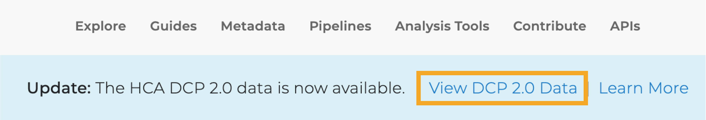

# What is the DCP 2.0 Data?

For the Data Coordination Platform (DCP) 2.0, we are adding contributor-generated matrices, reprocessing DCP 1.0 projects, and adding additional new projects. Read the full details of the changes in [DCP Updates](/dcp-updates).

The DCP 2.0 is a separate data view enabling you to explore and access the new contributor-generated matrices as well as the new and reprocessed DCP data as soon as they become available.

## How are the DCP 1.0 and DCP 2.0 Views Different?

### DCP 1.0 View

The [DCP 1.0 View](https://data.humancellatlas.org/explore/projects?catalog=dcp1) lists all the original DCP (DCP 1.0) projects.
From this view, you can:
- Access raw data for DCP 1.0 projects
- Access DCP 1.0 processed data generated with standardized pipelines (BAMs, etc.)
- Download DCP 1.0 project matrices (in CSV, MTX, and Loom formats)

### DCP 2.0 View

The [DCP 2.0 View](https://data.humancellatlas.org/explore/projects) lists all DCP projects, including the 16 new DCP 2.0 projects.
From this view, you can:
- Download the new contributor-generated matrices for each project*
- Access the raw data for all DCP projects; for DCP 1.0 projects, this raw data is the same as that in the DCP 1.0 view
- Access data generated with updated DCP standardized pipelines**
- Download the newly processed DCP-generated matrices (Loom format only)**

Contributor-generated matrices are provided by the project contributors.
Standardized data and matrices will be added to the DCP 2.0 incrementally as they become available.

### Switching Between DCP 1.0 Data and DCP 2.0 Data Views

Use the banner at the top of the Data Portal to switch between the two views:

As we continue to (re)process old and new DCP projects, we will incrementally add the newly processed data and DCP-generated matrices to the DCP 2.0.

Once processing is complete, we will retire the DCP 1.0 view.

> To start exploring DCP data, see the [Exploring Projects guide](/guides).

