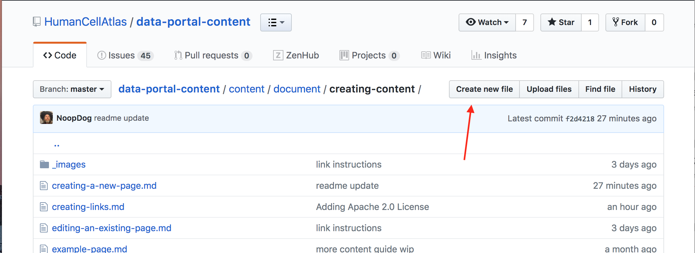

# Creating a New Page

To create a new page, we need to:

1. Add a `.md` file for the new page.
1. Add `front matter` to the page.
1. Add the page content.
1. Add the page to the site-map.yaml file in the Data Portal Repository.


## Adding the new .md File.

You can create the new .md file  using the github interface.
Fist navigate to the parent directory and then use the `Create New File` button as shown below.

Typically the folder structure mirrors the structure or the the site. This is not strictly necessary as the URL to a page is defined by the site map and not the folder structures. However, it does make pages much easier to find when they need to be updated.



>####TIP
>Note that you can not create an empty directory using the Github interface. However you can create a directory while adding a file by adding the new directory name before the file name then hitting the "/" character


## Create the "Front Matter"

Metadata describing the page and indicating its publication date, title ane URL are held in the pages "Front Matter". Front matter is a yaml section that lists key values pairs of configuration for the page.


 ```
    ---
    path: "/document/creating-content/example-page"
    date: "2018-05-30"
    title: "Example Page"
    ---
 ```
 
 >####TIP
 >The front matter goes at the very top or each new page.
 
 ## Add the Page Content
 
 With the front matter created its time to add the page content in mardown. 
 See on of the many [markdown guides](https://github.com/adam-p/markdown-here/wiki/Markdown-Cheatsheet) on the internet
 
 ## Add the page URL to the site-map.yaml
 To get your page added to the site-map and deployed, please open a pull request for for your new page in the [Github Project](https://github.com/HumanCellAtlas/data-portal-content/pulls) for the data portal repository.
 
