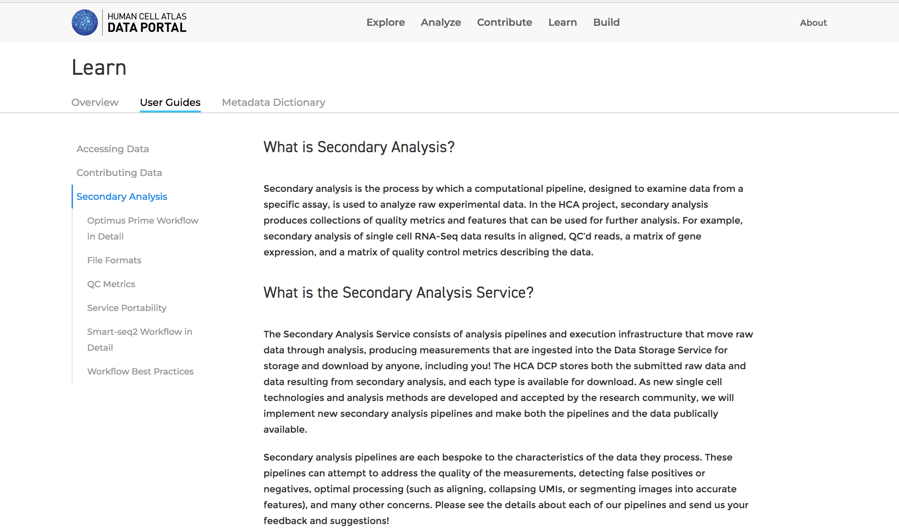

# Example Page - the Kitchen Sink
 
The HCA data portal content is written by community members in markdown.

Markdown is a lightweight markup language with plain text formatting syntax. It is designed to be converted to HTML by markdown processing tools. There are many markdown guides and cheatsheets available on the internet for example here: 

https://github.com/adam-p/markdown-here/wiki/Markdown-Cheatsheet#links

Most of what you see in the general guides will work on ths site. Below we give specific examples of basic use cases in the context of the data portal.

Here for example is a demo of adding an image to a page:



First upload the image to the _images folder at the same level as your source document.
Then, link to the image using something like:

``````

## Viewing the Source Markdown for this page on GitHub

The raw source for this page is located at:

https://raw.githubusercontent.com/HumanCellAtlas/data-portal-content/master/content/document/creating-content/example-page.md

## Viewing a Preview of this page on GitHub

The preview source for this page is located at:

https://github.com/HumanCellAtlas/data-portal-content/blob/master/content/document/creating-content/example-page.md

>#### TIP
>I am a blockquote with only one paragraph

>I am a blockquote with no tip heading
>But I have a second paragraph

>#### TIP
>Here is a blockquote with two paragraphs and
>This is the second one
