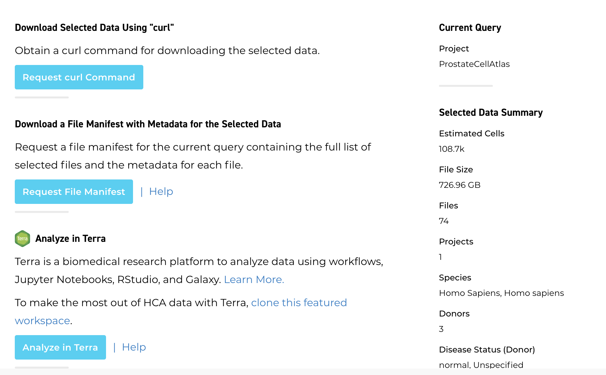
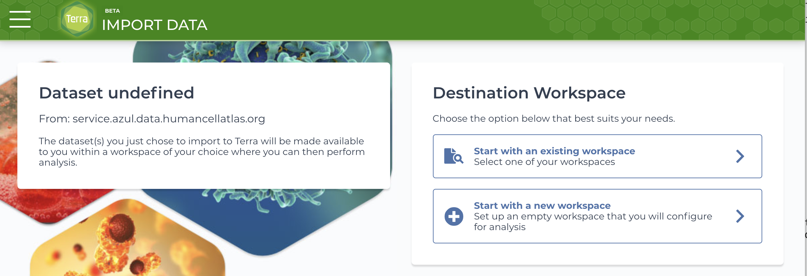
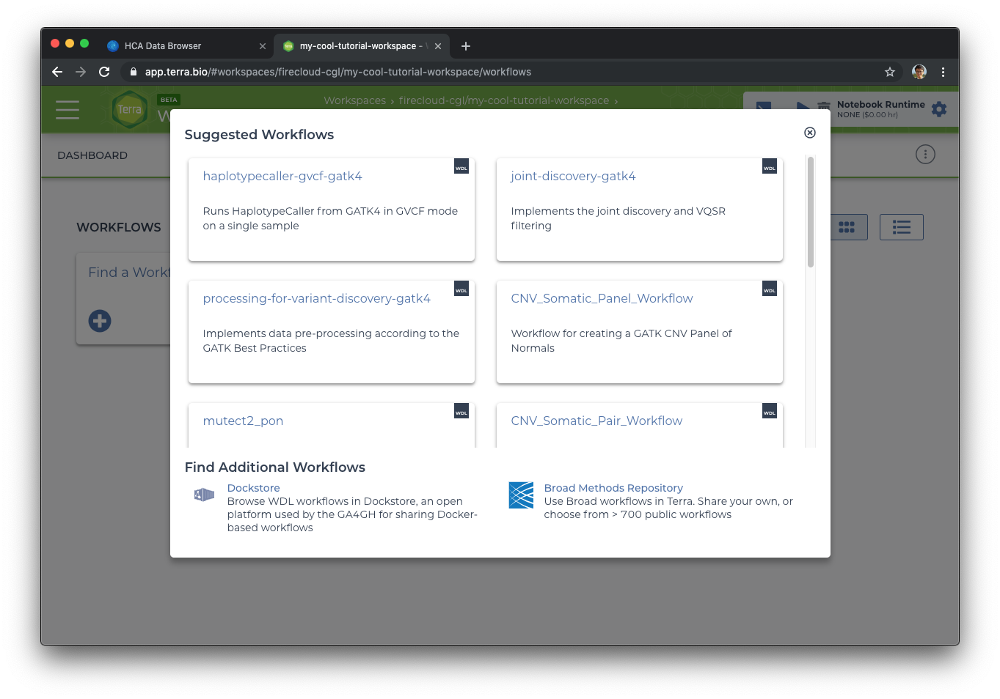
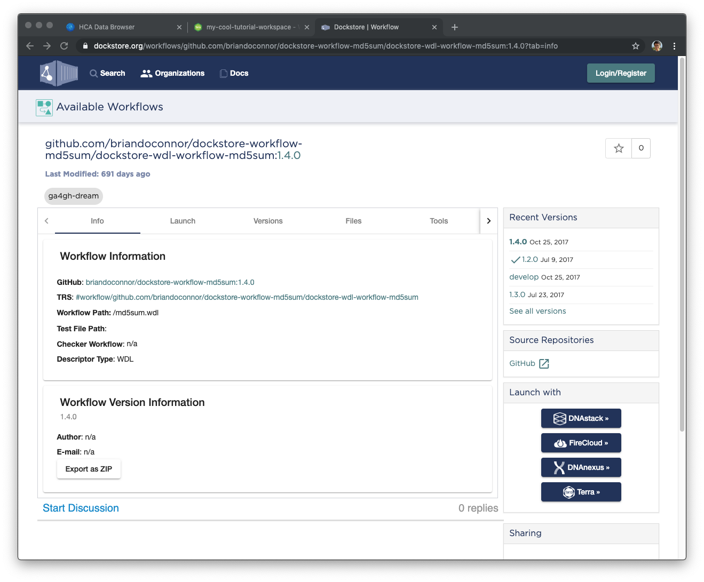
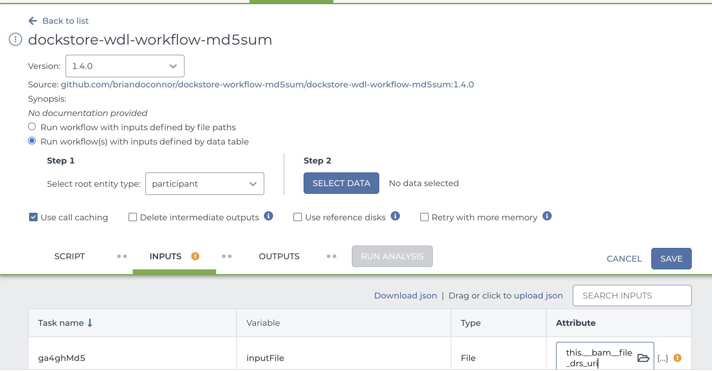
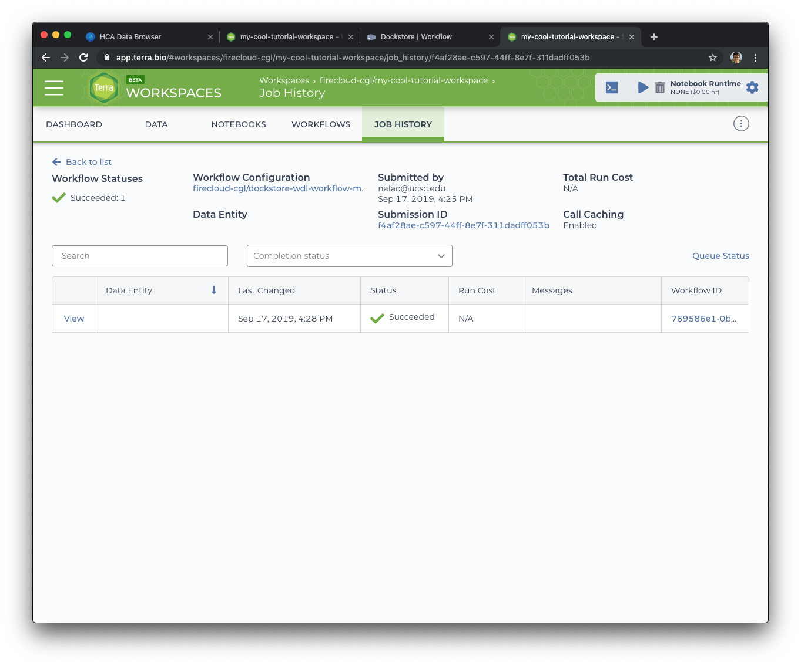

# Analyzing HCA Data in Terra

[Terra](https://app.terra.bio/) is a scalable cloud platform for biomedical research that offers the ability to use
data, tools, and workflows to perform interactive analysis in the cloud.

In this tutorial, you will learn how to send search results from the HCA Data Explorer to Terra and how to run a basic
workflow with that data.

## Before starting

Before trying this tutorial, complete the steps below:

1. Read the [Accessing HCA Data and Metadata](../quick-start-guide) guide to learn how to find HCA data in the Data
   Explorer.
1. Visit [Terra Support](https://support.terra.bio/hc/en-us) to learn how
   to [register for a Terra account](https://support.terra.bio/hc/en-us/articles/360028235911).
1. Download the [Google Chrome browser](https://www.google.com/chrome/) which is recommended when using Terra.

For additional details about analyzing data in the cloud with Terra, see
the [Terra Support guides](https://support.terra.bio/hc/en-us/sections/360006866192).

### HCA data-related tutorial workspaces

In addition to running the tutorial below, registering for Terra allows you to accesss multiple tutorial workspaces
dedicated to using HCA data as described below:

* [Optimus workspace](https://app.terra.bio/#workspaces/featured-workspaces-hca/HCA_Optimus_Pipeline) for processing 10x
  data with the Optimus Pipeline.
* [Smart-seq2 workspace](https://app.terra.bio/#workspaces/featured-workspaces-hca/HCA%20Smart-seq2%20Multi%20Sample%20Pipeline)
  for processing Smart-seq2 data with the Smart-seq2 Multi-Sample Pipeline.
* [Intro-to-HCA-data-on-Terra workspace](https://app.terra.bio/#workspaces/featured-workspaces-hca/Intro-to-HCA-data-on-Terra)
  for exporting HCA data and analyzing it with community tools
  like [Seurat](https://satijalab.org/seurat/index.html), [Scanpy](https://scanpy-tutorials.readthedocs.io/en/latest/index.html), [Cumulus](https://cumulus.readthedocs.io/en/latest/index.html),
  and [Pegasus](https://pegasus.readthedocs.io/en/stable/#).

### Video demonstration of importing HCA data to a Terra workspace

Prior to trying the tutorial, you might want to watch this very
brief [video demonstration](https://www.youtube.com/watch?v=G3N2i3NjsfY) of importing HCA data into Terra and using the
Intro-to-HCA-data-on-Terra workspace. This video is additionally available in
this [Terra blog post](https://terra.bio/discover-how-to-use-human-cell-atlas-data-in-terra/) about the workspace.

## Tutorial — Automated processing of HCA BAM files in Terra

This tutorial guides you through finding and setting up a simple example workflow in Terra that you can use to process
BAM files exported from the HCA Data Explorer.

For an additional Terra tutorial on using community tools with HCA data, see
the [Intro-to-HCA-data-on-Terra workspace](https://app.terra.bio/#workspaces/featured-workspaces-hca/Intro-to-HCA-data-on-Terra).

### Step one: finding BAM files with the HCA Data Explorer and exporting to Terra

You can use the <link-to-browser relativelink="/projects">HCA Data Explorer</link-to-browser> to find data to export to
Terra. The Data Explorer lists projects with data available for download and lets you filter the data for a number of
attributes.

Using the Data Explorer, select some data that you are interested in. Choose anything that looks interesting - we will
be running a really simple workflow that generates MD5 checksums of files, so the type of data is not important.

When you have found a data set of interest, use the following steps:

1. Click on the big blue *Export Selected Data* icon at the top right of the page.
2. Click on the *Analyze in Terra* icon at the bottom.

   

3. Click on the species you want to analyze.
4. Select the files you want to export by clicking the checkbox next to the file type.
5. Select the download format (the terra.pfb option is in development).
6. Click the *Request Link* icon.

   You'll be redirected to a Data Portal page containing an export link.

7. Click the workspace URL link.

   You'll be redirected to the Terra import page.

8. If you've already created a Terra workspace, select workspace by choosing an existing workspace or choose "Start with
   a new workspace."

   

### Step two: finding a workflow in Dockstore

A workflow is simply a set of steps you want to use to transform or analyze your data, often written as a script in a
language like Python or R. Terra integrates with scripts written in a particular workflow language called
the [Workflow Description Language (WDL)](https://openwdl.org/).

We can find WDL workflows that use our analysis tools of interest from public repositories
like [Dockstore](https://dockstore.org/), a platform for bioscience tools and workflows that use Docker containers. For
more information about how to use the Dockstore, see
the [Dockstore documentation](https://docs.dockstore.org/en/develop/).

We'll use Dockstore in this tutorial to find a workflow to run on the data we've just exported. Specifically, we'll look
for the *dockstore-wdl-workflow-md5sum* workflow, which generates an MD5 checksum for a given file (or files).

We will need to import this workflow from Dockstore using the following steps:

1. Select the *Workflows* page at the top of the workspace.
1. Click the *Find a Workflow* card.
   <figure-styles shadowless=true>
   
   </figure-styles>

1. Click on the *Dockstore* link at the bottom of the pop-up.
1. Search for `md5sum`.

   The search box is on the left side of the page. Results should load instantly. Look for a workflow named
   `briandoconnor/dockstore-workflow-md5sum/dockstore-wdl-workflow-md5sum`.

1. Click on the workflow.

   <figure-styles shadowless=true>
   </figure-styles>

1. Click on the *Terra* option in the "Launch with" box on the lower left of the page.

1. Select the destination workspace (the same workspace to which you exported the HCA data).

   You'll be redirected to the workflow setup page in Terra. Continue on to Step 3.

### Step three: setting up and running the workflow in Terra

To analyze the data we exported to Terra, we need to set up the workflow so that it reads from the workspace data table
on the Data page.

Specifically, we want the MD5 checksum workflow to run a single BAM file from the data table.

To set up the workflow, do the following:

1. Select the *Run workflow(s) with inputs defined by data table* radio button.
1. In Step 1, select the participant data table as the root entity.
1. In Step 2, click the *Select Data* icon.
1. Select *Choose specific rows to process*.
1. Check the box left of the participant ID for the BAM file you want to analyze.
1. Select "Ok."
1. From the Inputs section at the bottom of the workflow setup page, click on the attribute field for the *inputFile*
   variable.
   <figure-styles shadowless=true>
   
   </figure-styles>

1. Select the DRS URL attribute (something like `this.__bam__file_drs_uri`).
1. Click *Save*.

   You will see the blue *Run Analysis* icon pop up.

1. Click *Run Analysis*
1. Confirm your input when prompted.

Terra's running the workflow now - walk away for a few minutes, grab a coffee, stretch. You deserve it.

When you come back, refresh the page. Hopefully, your workflow will be done running.

After the workflow successfully runs, you'll see the green check next to workflow submission.

<figure-styles shadowless=true>

</figure-styles>

Congrats! If you want to see the results of this workflow execution, click on the Submission ID which will show the data
generated by this workflow execution.

## Next steps

Try one of the tutorial workspaces dedicated to HCA data and pipelines:

* [Optimus workspace](https://app.terra.bio/#workspaces/featured-workspaces-hca/HCA_Optimus_Pipeline) for processing 10x
  data with the Optimus Pipeline.
* [Smart-seq2 workspace](https://app.terra.bio/#workspaces/featured-workspaces-hca/HCA%20Smart-seq2%20Multi%20Sample%20Pipeline)
  for processing Smart-seq2 data with the Smart-seq2 Multi-Sample Pipeline.
* [Intro-to-HCA-data-on-Terra workspace](https://app.terra.bio/#workspaces/featured-workspaces-hca/Intro-to-HCA-data-on-Terra)
  for exporting HCA data and analyzing it with community tools
  like [Seurat](https://satijalab.org/seurat/index.html), [Scanpy](https://scanpy-tutorials.readthedocs.io/en/latest/index.html), [Cumulus](https://cumulus.readthedocs.io/en/latest/index.html),
  and [Pegasus](https://pegasus.readthedocs.io/en/stable/#). 

