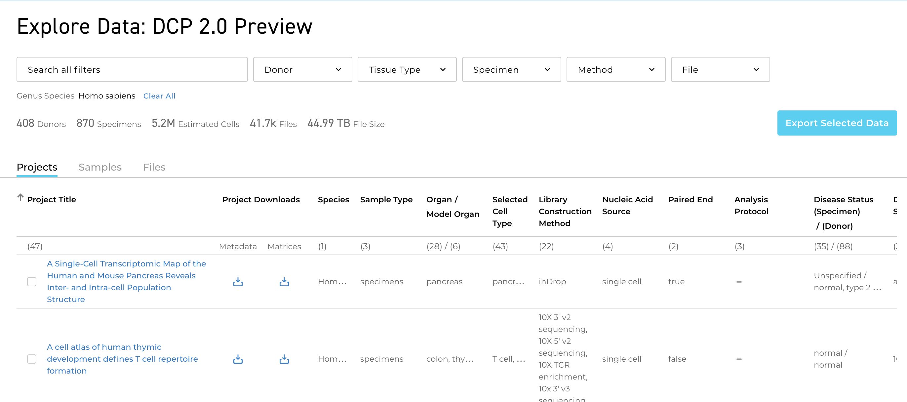
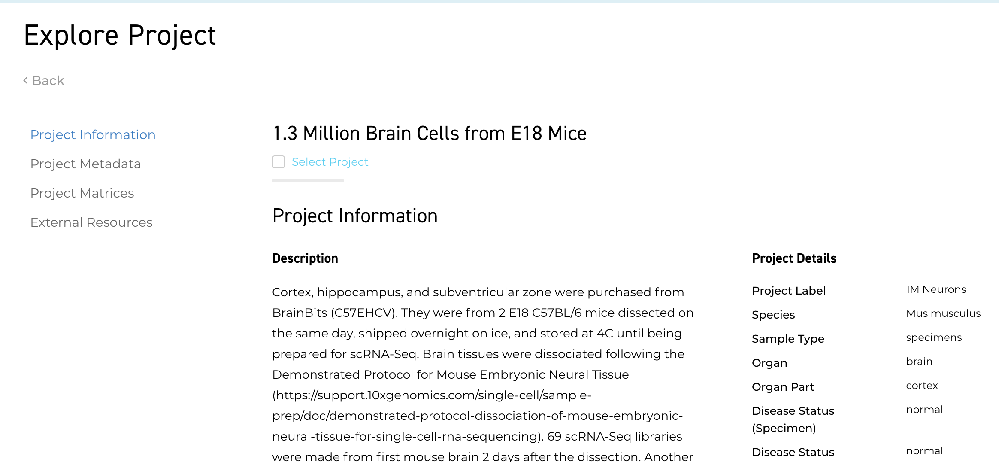
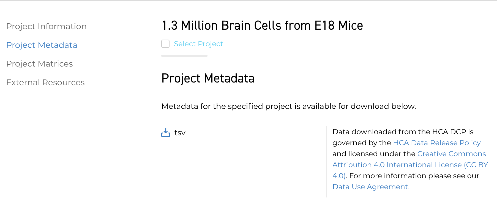
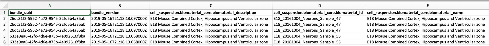
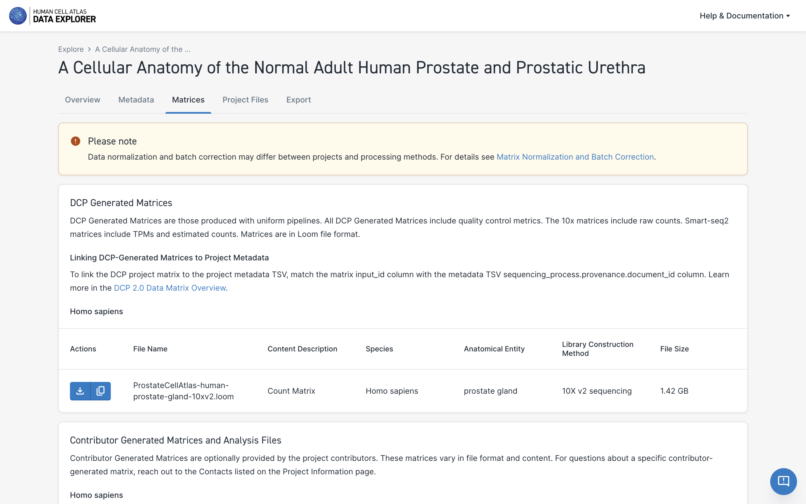
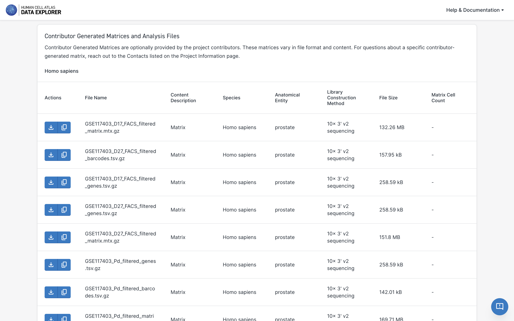

# Exploring Projects

Projects are a basic unit of data organization in the Data Coordination Platform (DCP). Project contributors contribute raw sequencing and associated [files](/metadata/dictionary/file/sequence_file) along with rich metadata describing:

1. the [origin and type of the cells](/metadata/dictionary/biomaterial/cell_line) used in the project
1. the [processes](/metadata/dictionary/process/analysis_process) and [protocols](/metadata/dictionary/protocol/aggregate_generation_protocol) used to collect and process the cells prior to sequencing
1. the [sequencing](/metadata/dictionary/protocol/sequencing_protocol) methods used
1. details about the [project](/metadata/dictionary/project/project) contributors and their institutions
 
This [Metadata](/metadata/dictionary/process/analysis_process) is included in the project's Metadata Manifest (TSV file). When the DCP [processes](/pipelines) the contributor's raw data with standardized pipelines, this processing information is also added to the Metadata Manifest.


## Finding a Project of Interest

The Data Portal Explore page lists all projects by title along with key project metadata. The project list is filterable by metadata values. 




### Choosing the DCP 2.0 Preview or the DCP 1.0 Data View

We are incrementally adding new projects and data for the DCP 2.0 (see the DCP [Updates](/dcp-updates) for details). 

The new projects are available on the [DCP 2.0 Data Preview](/what-is-the-dcp-20-data-preview), which is now the default view on the Explore page. You may toggle between the DPC 2.0 Preview and the DCP 1.0 View using the banner at the top of the Data Portal.


Learn more about the differences between the DCP 2.0 Data Preview and the DCP 1.0 View [here](/what-is-the-dcp-20-data-preview).

## Viewing Project Details

Selecting a project title on the project list takes you to the project's information page. 



The project information page contains:

1. the project title and description
1. contributor information, collaborating organizations, and project contacts
1. any publications or accessions associated with the project
1. project details such as species, organ, and library construction method
1. counts of input
1. a link to the project metadata download
1. a link to the project DCP-generated count matrix download (if available)
1. a link to the project contributor-generated matrix (if available; only on the [DCP 2.0 Data Preview](/what-is-the-dcp-20-data-preview))

## Downloading Project Metadata

For each project, the DCP maintains a project-specific TSV file containing the full project metadata. The TSV contains a row for each file in the project and columns for each metadata property. Meanings of the metadata properties are listed in the [Metadata Dictionary](/metadata).

The metadata TSV file gives a representation of the project's metadata graph that can be sorted and filtered using a standard spreadsheet or data manipulation tools.

The **Project Metadata"** tab left of the Project Information page contains a link to download the project's metadata file.



Metadata file sizes vary across projects but will generally be between 1 and 100 megabytes.

The TSV file is named after the project and includes the date and time the file was created. For example:

``` 
CD4+ cytotoxic T lymphocytes 2019-07-19 19.09.tsv
```

A partial example of a TSV file is listed below:



## Downloading Project DCP-Generated Matrices

Each project processed with DCP pipelines has DCP-generated matrices. To download Project matrices, navigate to the Project Information page and select the **"Project Matrices"** tab to the left. 

Scroll to identify the relevant matrix and then select the download icon. 



DCP-generated matrices in the DCP 2.0 Preview are available in Loom format only (see the [Loom documentation](http://loompy.org/) for details on loading and viewing Loom files), whereas matrices in the DCP 1.0 View are available in MTX, CSV, Loom formats. 

> **DCP 1.0 Matrix Deprecation Notice:** 
The DCP is reprocessing DCP 1.0 data and will deprecate all DCP 1.0 matrices (MTX, CSV, and Loom files) once reprocessing is complete. All reprocessed and newly processed projects in the DCP 2.0 will have matrices in Loom format only. 

The type of count available in the DCP-generated matrix depends on the pipeline used for data processing. DCP 2.0 matrices generated with Optimus (10x data) include raw counts whereas matrices generated with Smart-seq2 include TPMs and estimated counts. 

## Downloading Project Contributor-Generated Matrices

Contributor-generated matrices are optionally provided by the project contributors and are available in the **[DCP 2.0 Preview](/what-is-the-dcp-20-data-preview) only**. 

These matrices vary in file format and content. For questions about a specific contributor-generated matrix, reach out to the Project Contacts listed on the Project Information page.

To download the contributor-generated matrix, select the **"Project Matrices"** tab to the left of the Project page. 

Scroll to the **Contributor-Generated Matrices** section and select the download icon.




