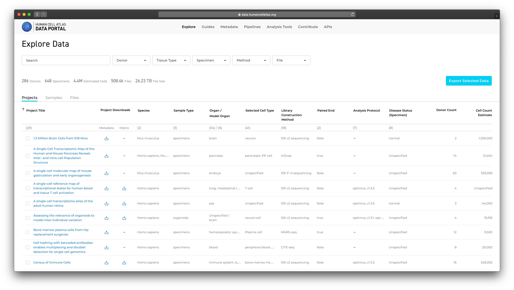
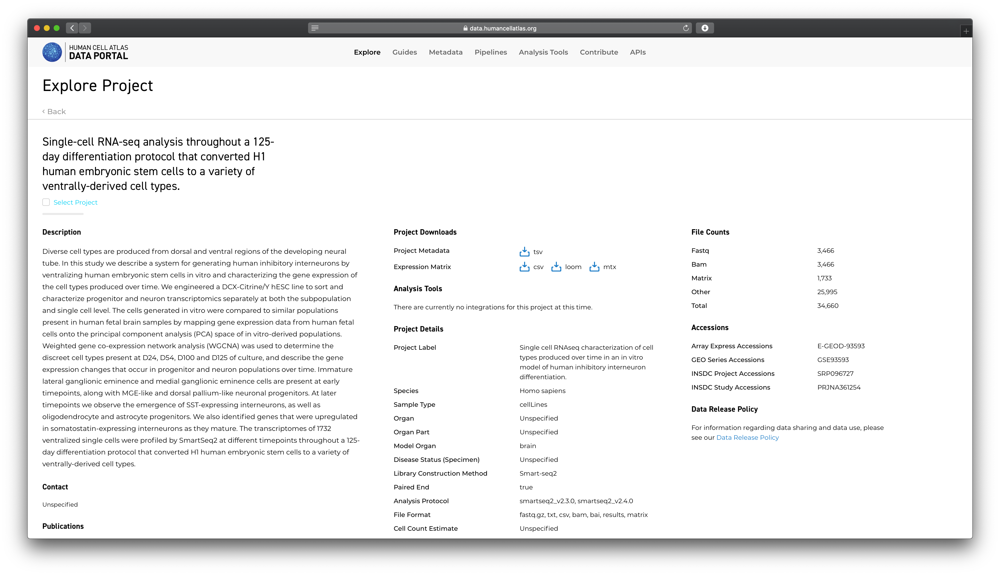

# Exploring Projects


Projects are a basic unit of data organization in the HCA Data Coordination Platform (HCA DCP). Project contributors contribute raw sequencing and associated [files](/metadata/dictionary/file/sequence_file) along with rich metadata describing:

  1. the  [origin and type of the cells](/metadata/dictionary/biomaterial/cell_line) used in the project
  1. the [processes](/metadata/dictionary/process/analysis/analysis_process) and [protocols](/metadata/dictionary/protocol/biomaterial_collection/aggregate_generation_protocol) used to collect and process the cells prior to sequencing
  1. the  [sequencing](/metadata/dictionary/protocol/sequencing/sequencing_protocol)  methods used
  1. details about the [project](/metadata/dictionary/project/project) contributors and their institutions
 
[Metadata](/metadata/dictionary/process/analysis/analysis_process)  about [analyses](/pipelines) performed by the HCA DCP are also added to the project during project ingest.

## Finding a Project of Interest

The HCA Data Explorer lists all projects on its home page along with key project metadata. The project list is filterable by the metadata values. 


**Figure 1**: The Data Explorer's projects tab lists the projects making up the DCP. 

## Viewing Project Details

Selecting a project title on the project list takes you to the project's detail page. 


**Figure 2**: A project detail page showing the various information and downloads available for the project.


The project detail page contains:

1. the project title and description

1. contributor information, collaborating organizations, and project contacts

1. any publications or accessions associated with the project 

1. project details such as species, organ and library construction method 

1. counts of input, analysis and matrix files

1. a project metadata download

1. a project expression matrix download (if available)

## Downloading Project Metadata

For each project, the HCA DCP maintains a project specific tsv file containing the full project metadata. The tsv contains a row for each file in the project and columns for each metadata property. Meanings of the metadata properties are listed in the [HCA Metadata Dictionary](/metadata).

 The metadata tsv file gives a flattened representation of the projects metadata graph that can be sorted and filtered using standard spreadsheet or data manipulation tools.
 
 The "Project Downloads" section of the project details page contains a link to download the project metadata file. 
  


**Figure 3**: The "Project Downloads" section of the project details page.

Metadata file sizes vary across projects but will generally be between 1 and 100 megabytes.

The tsv file is named after the project and includes the date and time the file was created. For example:

``` 
CD4+ cytotoxic T lymphocytes 2019-07-19 19.09.tsv
```

A partial example of a tsv file is listed below:
 
  
  **Figure 4**: A partial view of a project's metadata tsv file. 

## Downloading Project Expression Matrices

For projects with supported library construction approaches, the project detail page will also contain a link to download expression matrices pre-generated for the project by the HCA Matrix Service.
 
 Expression matrices are available in [.loom](http://loompy.org/), [.csv](https://en.wikipedia.org/wiki/Comma-separated_values) and [.mtx](https://math.nist.gov/MatrixMarket/formats.html) formats and also contain a subset of the available ingest metadata for the project. 
 
 The rows in the expression matrix represent cells, columns give the expression value for the column's gene.


**Figure 5**: A partial view of a project's expression matrix in csv format. 

