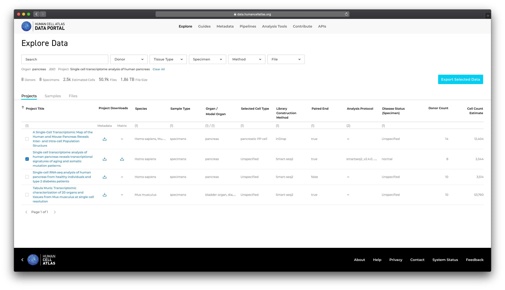
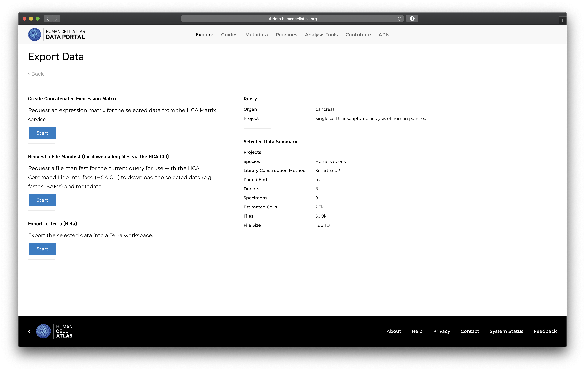
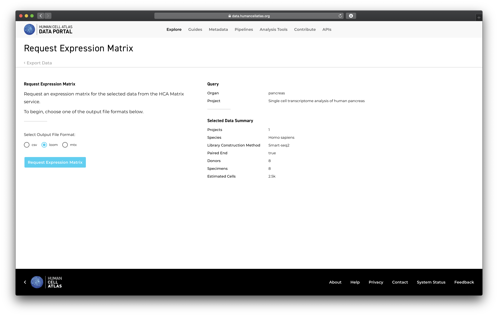
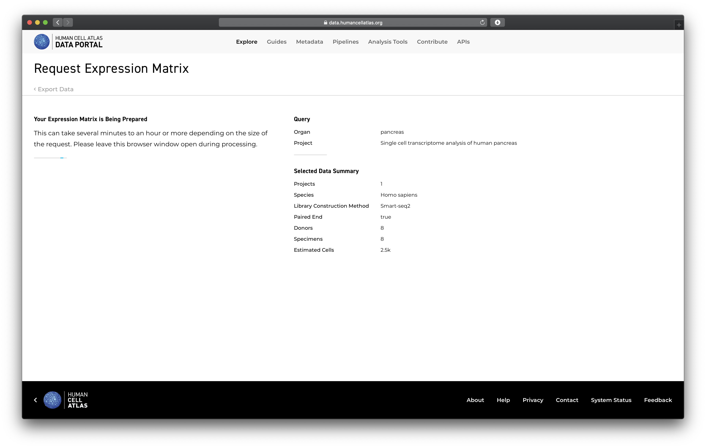
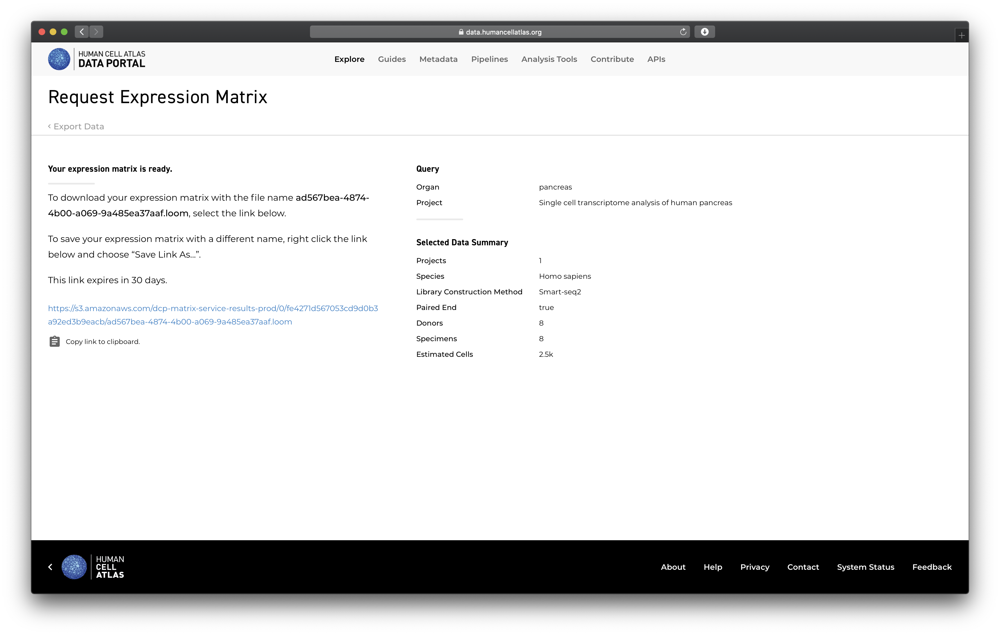
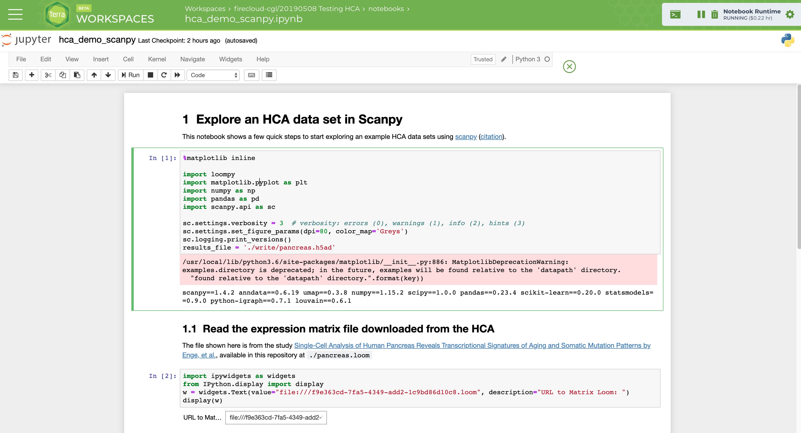
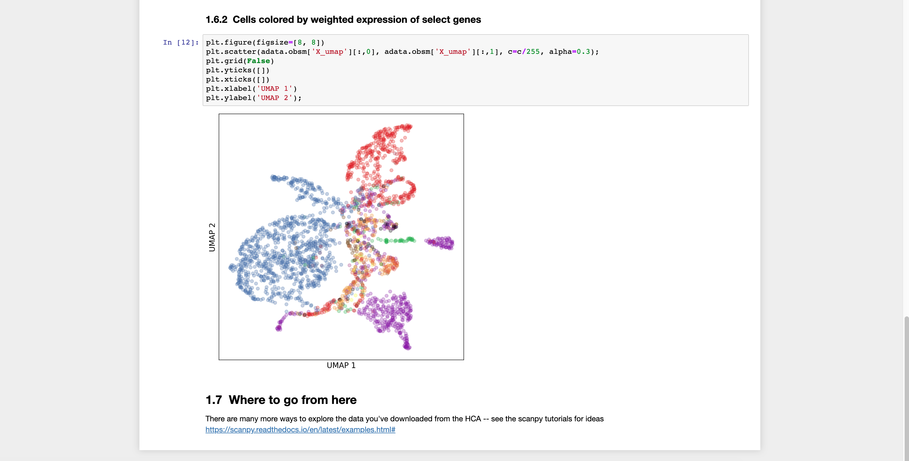

# Accessing HCA Data in a Jupyter Notebook

This tutorial will walk you through the process of finding data in the HCA Data
Explorer, generating an expression matrix in loom format, and then loading these data
into Scanpy via a Jupyter notebook for exploration.

This work leverages data from the study [Single-Cell Analysis of Human Pancreas Reveals Transcriptional Signatures of Aging and Somatic Mutation Patterns by Enge, et al.](https://www.ncbi.nlm.nih.gov/pmc/articles/PMC6047899/) and attempts to provide examples of the type of analysis found in this paper.  
While the techniques shown in this Jupyter notebook can be used generally when analyzing single cell data
there are a few caveats.  First, this notebook is not an attempt to perfectly recreate the results
of this paper, there are additional analysis and filtering steps that are omitted here.  Second,
this notebook leverages key gene lists for coloring clusters and these lists will change depending on a
given study's experimental design.  To work with projects other than the Enge et al. study, you
will need to modify this notebook. This notebook it is designed to be a starting point for your own research not a general use tool.

The notebook presented here is based on a [Data Consumer Vignette](https://github.com/HumanCellAtlas/data-consumer-vignettes)
created by Genevieve Haliburton and other members of the HCA DCP team.  You can find other vignettes in
this GitHub repo and more will be adapted into tutorials over time.

## Step 1 - Performing a Search in the Data Explorer

Since you're reading this tutorial on our DCP Data Portal site we are going to assume you are at least
generally familiar with the portal.  To find data, use the Data Explorer which can be reached by
clicking "Explore" at the top of the page.

This is the faceted browser that let's you explore the data available in the HCA.  Take a look at the
facets (which are represented as pull downs) at the top of the page.  These let you perform a
text search or select any number of Donor, Tissue Type, Specimen, Method, or File attributes
through drop down search fields.  When you select multiple values within a given facet your choices
are OR'd together.  When you select values across facets the query is AND'd together. While this
may sound confusing, once you practice and try a few queries you will understand better how this works.

Below the search facets, you will see tabs for Project, Samples, and Files.  When performing your query,
you can switch between these tabs to see the Projects, Samples, and Files that match your search
criteria.

Let's get started by searching for all the data from the Enge et al. study.  First choose the
Tissue Type facet and then choose the Organ to be pancreas.  You'll see the project list
automatically filter down to just the 3 projects that contain samples from pancreas.  Next, limit the results down to just the Enge et al. study, the easiest way to do this is
to select the study with the checkbox to the left of the project name.  You can see a few things when
you do this.  First, the number of projects, donors, specimens, estimated cell count, files, and file
size all automatically update.  Second, you see you can request either a File Manifest or an
Expression Matrix.  We'll use the latter in the next step and you can use the former if you want to
download files to your system and/or want to see metadata on these files that correspond to the
facets you can search on in the Data Explorer.  Another important feature in this page is the Metadata
link in the table.  This allows you to download an easy-to-parse TSV file that contains all of
the metadata available for each project.


**Figure 1**: The Data Explorer offers a faceted-browser that allows you to quickly search for projects,
samples, and files. Here we are searching for all projects that have data from pancreas cells and
further refining our search to focus on the Enge et al. study.

## Step 2 - Create the Expression Matrix

Now that you've done the very simple query in the previous step to find all data from the Enge et al.
study let's go ahead and generate a cell by gene matrix of expression values for all ~2.5K cells
available for this project.  With your search entered, all you now have to do is click the
"Request Expression Matrix" button, you should see a dialog asking what format you'd like.  We'll
use "loom" format for this tutorial.


**Figure 2**: Insert caption


**Figure 3**: The request matrix option gives a summary of the number of files processed to return the
gene by cell matrix you requested along with other statistics.  You have the option of 3 different formats,
we'll use the loom format for this tutorial.

The matrix generation can take some time to complete, recent tests show this project takes approximately
1.5 minutes to complete.  In that time do not click away or close your browser window since that will
prevent you from getting your matrix URL that we need for the next step.  You can, of course, continue
to explore the portal in another tab while waiting for your matrix.


**Figure 4**: Insert caption

Eventually, you will be presented with a result dialog that allows you to download or copy the URL
for your matrix result.


**Figure 5**: The download options for the resulting matrix.

Make sure you copy the URL starting with https://s3... for the next step.

## Step 3 - Launching the Notebook

There are many different ways to launch Jupyter Notebooks including:

* Running [Jupyter Notebook](https://jupyter.org/) or [JupyterLab](https://blog.jupyter.org/jupyterlab-is-ready-for-users-5a6f039b8906) locally on your own system
* Running on the cloud for free via [Binder](https://mybinder.org/)
* Running on the cloud via [Terra](https://terra.bio/)

Since there are many different ways to get a functioning Juptyer Notebook server up and running
this tutorial is going to focus on using Jupyter Notebook rather than how to set it up in different
ways.  Instead, see the much more detailed [README](https://github.com/HumanCellAtlas/data-consumer-vignettes/may2019_demo) in our Data Consumer Vignettes GitHub repository for a quick rundown of how
to setup Jupyter locally.  That should provide enough guidance to get started locally and also
how you might run the notebook in other systems as well.  The environment we used for this tutorial
was Terra but Juptyer Notebooks will look the same running locally, on Binder, or on Terra regardless.

Here's a quick rundown of the steps you might use to launch this notebook locally, please see the README
above for more details:

```bash
$ git clone https://github.com/HumanCellAtlas/data-consumer-vignettes.git
$ cd may2019_demo
$ pip install -r requirements.txt
$ jupyter notebook --notebook-dir=`pwd`
```

Once you have the notebook server running you can navigate to:

http://localhost:8888

To interact with the Jupter Notebook environment.  You can then
select the `notebooks_hca_demo_scanpy.ipynb` notebook from the `Files` section.
Go ahead and open it up, you should something like Figure 6, which includes results
from a previous run of the notebook.


**Figure 6**: The Jupyter notebook opened and running in Terra.  Running a Jupyter Notebook locally will look almost identical to the Terra interface presented here.

## Step 4 - Examining the Result

Now that you have 1) a URL for the matrix from the Data Explorer for the Enge et al. study and 2)
the `notebooks_hca_demo_scanpy.ipynb` notebook opened in a Jupyter notebook environment,
the next step is to actually re-run the notebook on this matrix.  

Since this is likely the first time you've executed the notebook you need to begin
from the first code cell and execute one by one to reproduce the analysis in the notebook.
Start by clicking on the first two code cells and running one after the other.  At the end, you should
now see a field that currently contains the value `file:///f9e363cd-7fa5-4349-add2-1c9bd86d10c8.loom`.
Replace that with the URL you got from the matrix on the Data Explorer.  For example,
`https://s3.amazonaws.com/dcp-matrix-service-results-prod/3938cf5a-3159-4eb7-aef5-59589795c268.loom`.
Your address will be different of course.  You don't need (or want) to rerun this cell again after
you paste in your URL to the text field, the variable will be updated for other cells as soon as you paste your URL in the field.


**Figure 7**: Fill in the URL you got from the data explorer.

Now that you have your matrix URL pasted into the field run the 3rd, 4th, etc code blocks one by one
until you reach the end.  Notice, a running code cell will show as `In [*]` as it's running.
**Make sure you let each code cell finish running before you move onto the next cell**.

In the end, you should get a figure in the final code cell that looks almost identical to Figure 8.


**Figure 8**: The final cell clusters.

## Next Steps

If you followed this tutorial this far and got a result similar to the final figure above then
you are in a great position!  You have successfully searched for data in the DCP using the
Data Explorer, generated a cell by gene matrix for use by Scanpy, and you replicated (in a very
basic way) the results of the Enge et al. study.  The next step is really up to you, adapt this Jupyter
notebook for your own use and explore the data in the HCA DCP in new and interesting ways.
For some inspiration, you can check out the [Scanpy examples gallery](https://scanpy.readthedocs.io/en/latest/examples.html).
