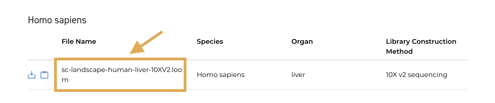

# DCP 2.0 Data Matrix Overview

Cell-by-gene matrices (commonly referred to as "count matrices" or "expression matrices") are files that contain a measure of gene expression for every gene in every cell in your single-cell sample(s). These matrices can be used for downstream analyses like filtering, clustering, differential expression testing, and annotating cell types. 

This overview describes the Data Coordination Platform (DCP) 2.0 matrix types, how to download them, and how to link them back to the HCA metadata.

Overall, three types of matrices are currently available for DCP 2.0 data: 

- DCP-generated matrices (Loom file format) for projects 
- DCP-generated matrices (Loom file format) for individual library preparations within a project
- Contributor-generated matrices (variable file format) provided by the project-contributor

## DCP-Generated Matrices

Each DCP 2.0 project that is processed with [uniform pipelines](/pipelines) has two types of DCP-generated matrices available for download:

- [project-level matrices](#dcp-project-level-matrix-overview) 
- [library-level matrices](#dcp-library-level-matrix-overview)

Both matrix types are in Loom file format, and contain standard [metrics](/pipelines/qc-metrics) and counts that are specific to the data processing pipeline used to generate the file. 

> For the most up-to-date information on counts and metrics, see the Matrix Overviews for the **[Smart-seq2 Pipeline](https://broadinstitute.github.io/warp/docs/Pipelines/Smart-seq2_Multi_Sample_Pipeline/Loom_schema)** and the **[Optimus Pipeline](https://broadinstitute.github.io/warp/docs/Pipelines/Optimus_Pipeline/Loom_schema) (10x data)**.

DCP-generated Loom matrices have three types of attributes containing metadata and metrics:

- **global**: information that applies to all data in the Loom (i.e. pipeline version, etc.)
- **row**: gene-specific information and metrics (one row = one gene)
- **column**: cell-specific information and metrics (one column = one cell)

For more information on working with Loom attributes and format, see the [Loom documentation](http://linnarssonlab.org/loompy/index.html#).

Loom files are compatible with multiple downstream community tools, including [Seurat](https://satijalab.org/seurat/index.html), [Scanpy](https://scanpy-tutorials.readthedocs.io/en/latest/index.html), [Cumulus](https://cumulus.readthedocs.io/en/latest/index.html), and [Pegasus](https://pegasus.readthedocs.io/en/stable/#). 

> Step-by-step Jupyter Notebook tutorials for analyzing Loom matrices with community tools are available in the cloud-based platform [Terra](https://app.terra.bio/). After registering, get started by navigating to the [Intro-to-HCA-data-on-Terra workspace](https://app.terra.bio/#workspaces/featured-workspaces-hca/Intro-to-HCA-data-on-Terra).

#### DCP-Generated Matrix Filenames

Both project matrices and library-level matrices have unique filenames. 

* Project matrices have filenames in the format `<project_description>-<species>-<tissue>-<sequencing_method>`.
    * Example: the project-level matrix for "Dissecting the human liver cellular landscape by single cell RNA-seq reveals novel intrahepatic monocyte/ macrophage populations" has the filename `sc-landscape-human-liver-10XV2.loom`. 

     

* Library-level matrices have filenames matching the numerical ID in the HCA metadata field `sequencing_process.provenance.document_id`.

#### DCP Project-Level Matrix Overview

Project-level matrices are Loom files that contain standardized cell-by-gene measures and metrics for all the data in a project that are of the same species, organ, and sequencing method. 

* Example: If a project contains both human and mouse data, it will have one project matrix for human and one for mouse.

The gene measures in project matrices vary based on the pipeline used for analysis. 

* Matrices produced with the Optimus Pipeline (10x data) will have UMI-aware counts. 
* Matrices produced with the Smart-seq2 pipeline will have TPMs and estimated counts. 
* 10x matrices are minimally filtered by UMIs (only cells with 100 molecules or more are retained).

Each project matrix also has metadata stored in the Loom file's global attributes, described in the table below. In contrast to the other metadata, the input_id is stored in both the global and column attributes, as this is the ID used to link individual library preparations back to the Data Manifest. 

Read more about each metadata field in the [Metadata Dictionary](/metadata/). 

| Metadata Attribute Name in DCP-Generated Matrix | Metadata Description | 
| --- | --- |
| `donor_organism.genus_species` | Species information; human or mouse |
| `library_preparation_protocol.library_construction_approach` | Technology used for library preparation, i.e 10x or Smart-seq2 |
| `specimen_from_organism.organ` | Organ |
| `project.project_core.project_name` | Project name |
| `project.provenance.document_id` | Project id |
| `input_id` | Metadata values for  `sequencing_process.provenance.document_id` |
| `input_name` | Metadata values for `sequencing_input.biomaterial_core.biomaterial_id` |

More information about DCP post-processing for the project-level matrices can be found in the Matrix Overview for the [Optimus Pipeline](https://broadinstitute.github.io/warp/docs/Pipelines/Optimus_Pipeline/Loom_schema#hca-data-coordination-platform-matrix-processing) and the [Smart-seq2 Pipeline](https://broadinstitute.github.io/warp/docs/Pipelines/Smart-seq2_Multi_Sample_Pipeline/Loom_schema#table-2-column-attributes-cell-metrics) (in development). 

#### DCP Library-Level Matrix Overview

Library-level matrices (also Loom files) are cell-by-gene matrices for each individual library preparation in a project. Overall, library-level matrices:

* Contain the same standardized gene (row) metrics, cell (column) metrics, and counts as the project-level matrices.
* Are separated by the metadata field for library preparation, `sequencing_process.provenance.document_id`, allowing you to only use a sub-sampling of all the project's data. 
* Are **not filtered** by UMIs to remove cells with low numbers of molecules. 
* Only contain the metadata for `input_id` and `input_name` (described in the table above).
    * They do not contain all the metadata for species, organ, and sequencing method in the matrix global attributes.

## Contributor-Generated Matrix Overview

Contributor-generated matrices are optionally provided by the data contributors and can be useful when trying to annotate cell types or when comparing results back to a contributor’s published results. 

When these contributor-generated matrices are available, you can download them from the individual Project page. They will vary in file format and content across projects. For questions about the Contributor-generated matrix, reach out to the contributors listed in the Project page Contact section.

## Downloading Matrices

DCP-generated project-level matrices and contributor-generated matrices may be downloaded from the "Matrices" column of the DCP Data Browser (see image below) or alternatively, from the individual Project page. 

You can also download all matrices (including library-level matrices) using a curl command as described in the [Accessing HCA Data and Metadata](../quick-start-guide) guide, or export matrices to [Terra](https://app.terra.bio/), a cloud-based platform for bioinformatic analysis (see the [Exporting to Terra](/guides/consumer-vignettes/export-to-terra) guide).

## Linking DCP-Generated Matrices to the Data Manifest (Metadata)

DCP 2.0 project-level matrices only contain some of the available project metadata (species, organs, library methods, etc.). However, there are several metadata facets in the Metadata Manifest, such as disease state or donor information, that you might want to link back to the DCP-generated cell-by-gene matrix.

To link a metadata field in the Metadata Manifest back to an individual sample in a DCP- generated matrix, use the matrix `input_id` field. This field includes all the values for the metadata `sequencing_process.provenance.document_id`, the ID used to demarcate each library preparation. 

## Matrix Normalization and Batch Correction

Data normalization and batch correction account for technical noise introduced during sample processing, as well as differences between datasets generated from different contributors or at different times. Both techniques are crucial for identifying differentially expressed genes. 

Normalization and batch correction techniques vary between processing methods and individual data contributors, and may not be consistent across the matrices available from the Data Portal.

### Normalization and Batch Correction for DCP-Generated Matrices

- Data processed with the [uniform pipelines](/pipelines) are **not** normalized across nor within projects. 
- 10x matrices produced with the [Optimus Pipeline](/pipelines/optimus-workflow) only contain raw counts whereas [Smart-seq2 Pipeline](/pipelines/smart-seq2-workflow) matrices contain raw counts as well as normalized TPMs. These TPMs are calculated per individual cell (library preparation) and not across all cells within a project. 
- No batch correction is performed for DCP-generated matrices.

### Normalization and Batch Correction for Contributor-Generated Matrices

- For contributor-generated matrices, normalization and/or batch correction techniques are used at the discretion of the project contributor and vary between projects. 
- To learn more about the techniques used for a particular matrix, please reach out to the Contact listed on the Project's Information page. 
