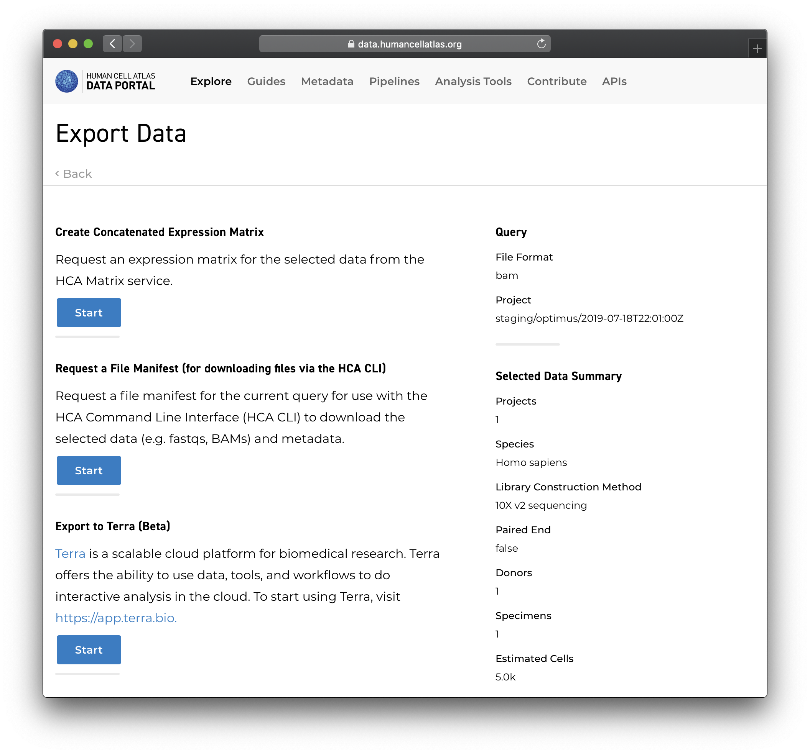
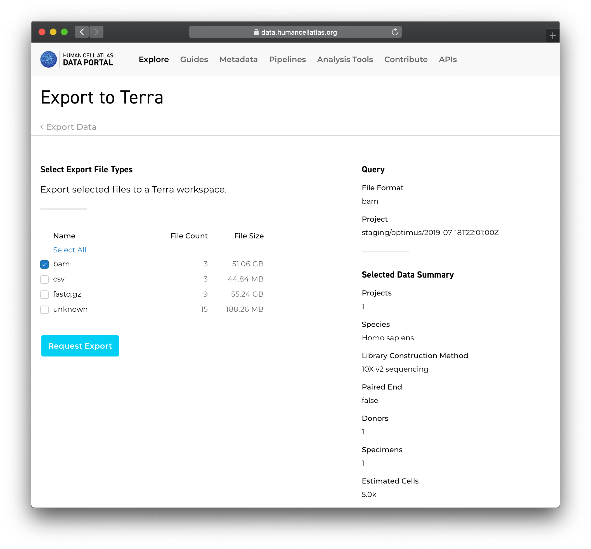
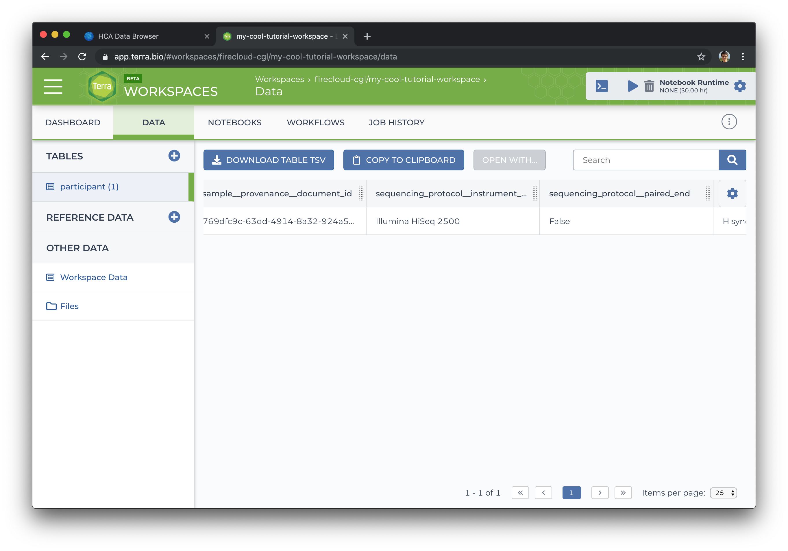
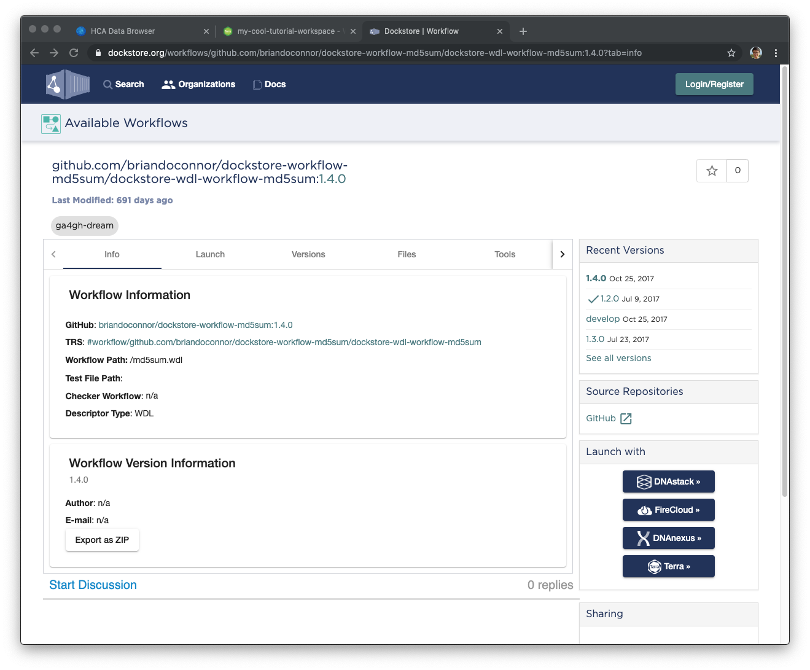
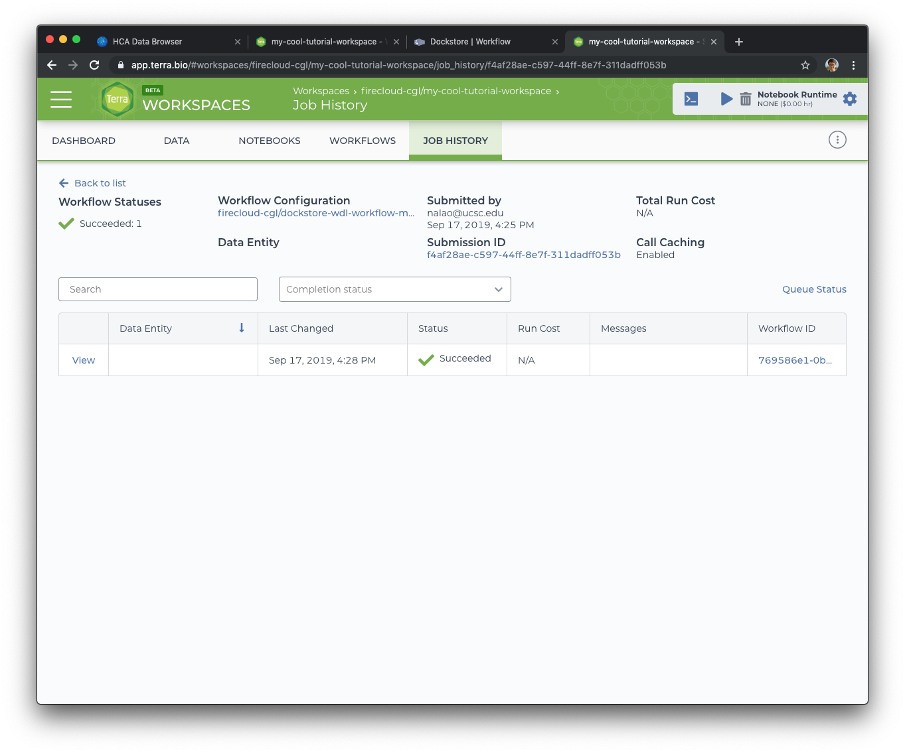

Exporting search results from the HCA Data Explorer to Terra
============================================================

In this tutorial, you'll learn how to send search results from the HCA Data
Explorer to Terra and how to run a basic workflow with that data.

We'll assume that you have some familiarity with the tools aforementioned.
In particular, you'll want to be acquainted with the content in these
tutorials:

-   [Accessing HCA Data and Metadata][quick-start-guide]

You'll want to use Google Chrome for this tutorial; Terra has poorer support
for other browsers.

Step one: finding BAM files with the HCA Data Explorer
------------------------------------------------------

You can use the [HCA Data Explorer][explorer] to find data to export to Terra.
The Data Explorer lists projects with data available for download from the Data
Store and lets you filter the data for a number of attributes.

Using the Data Explorer, select some data you're interested in. Choose anything
that looks interesting - we'll be running a really simple workflow that
generates MD5 checksums of files, so the type of data doesn't matter too much.
When you've found what you're looking for, click on the big blue *Export
Selected Data* button at the top right of the page. You'll see something like
this:

Click on the *Export to Terra* button. You'll then see a page like this where
you can select what kind of data to export:

Again, choose whatever looks interesting.

When you click the *Request Export* button, the Data Explorer will process your
request, and you'll be redirected to Terra.

Step two: importing data to Terra and finding a workflow in Dockstore
---------------------------------------------------------------------

Select a workspace to import your selected data into. Once you have, you'll see
a page like this, showing the data you just exported:

Next, let's find a workflow to run with the data we've just exported. For this
tutorial, we're looking for *dockstore-wdl-workflow-md5sum*, which will
generate an MD5 checksum for a file (or files) that we provide. We'll need to
import it from Dockstore. To do that, click on the *Workflows* tab at the top
of the page, then on the big square *Find a Workflow* button. It'll look
something like this:

Click on the *Dockstore* link at the bottom of the pop-up. Dockstore is a
workflow repository where we'll find the workflow we want to run. Once
Dockstore has loaded, search for "md5sum". The search box is on the left of the
page. Results should load instantly. We're looking for a workflow named
`briandoconnor/dockstore-workflow-md5sum/dockstore-wdl-workflow-md5sum`.
Once you find it, click on it. You'll see this:

Note the blue *Terra* button at the bottom left which will let us load this
workflow in Terra. Click on the button and load the workflow into your
workspace. Once you have, Terra will ask you to select an input to this
workflow:

Step three: running the workflow in Terra
-----------------------------------------

On this screen, we want to select a single file from the data that we exported
and find the MD5 checksum of that file. Make sure that the *Process single workflow
from files* radio button is selected (so that we only checksum a single file)
and then select the file you want to checksum by clicking on the *Attribute*
text field in the row with the *inputFile* variable. (It's higlighted with a red
box in the screenshot above.)

Select any attribute pointing to a file. Once you're done, click *Save*. You'll
see a blue *Run Analysis* button pop up. Click that one, and confirm your input
when prompted. Terra's running the workflow now - walk away for a few minutes,
grab a coffee, stretch. You deserve it.

When you come back, refresh the page. Hopefully, your workflow will be done
running. If it is, you'll seem something like this:

Note the green checkmark in the *Status* column.

Congrats! If you want to see the results of this workflow execution, click
on the workflow ID (the UUID on the right of the page), which will show the
data generated by this workflow execution.

Additional resources
--------------------

If you'd like to learn more, you might find the Jupyter notebooks in the
[Data Consumer Vignette][dcv] repository useful.

There are many different ways to launch Jupyter Notebooks including:

-   Running [Jupyter Notebook](https://jupyter.org/) or
    [JupyterLab][jupyterlab] locally on your own system

-   Running on the cloud for free via [Binder](https://mybinder.org/)

-   Running on the cloud via [Terra](https://terra.bio/)

  [dcv]: <https://github.com/HumanCellAtlas/data-consumer-vignettes>
  [jupyterlab]: <https://blog.jupyter.org/jupyterlab-is-ready-for-users-5a6f039b8906>
  [quick-start-guide]: <https://data.humancellatlas.org/guides/quick-start-guide>
  [explorer]: <https://data.humancellatlas.org/explore/projects>
