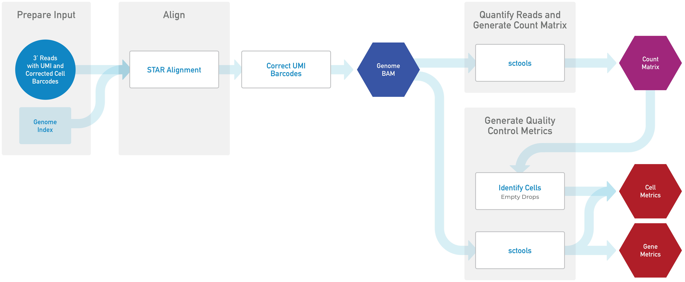

# Introduction to the Optimus Workflow

The long-term goal of the Optimus workflow is to support any 3 prime single cell transcriptomics assay selected by the HCA project. Using the correct modularity, we hope to grow a generic pipeline that has specific modules to address differences in assays, while leveraging common code where steps of the assays are the same. We offer this as a community resource for community development and improvement. The first assay this workflow supports is the [10x v2 and v3 gene expression assay](https://www.10xgenomics.com/solutions/single-cell/). Optimus has been validated for analyzing both [human](../../benchmarking/optimus/optimus_report.rst) and [mouse](https://docs.google.com/document/d/1_3oO0ZQSrwEoe6D3GgKdSmAQ9qkzH_7wrE7x6_deL10/edit) data sets. 

## Commonalities Among Sequencing Assays

The introduction of droplet-based technologies such as inDrop ([Klein, et al., 2015](https://www.ncbi.nlm.nih.gov/pmc/articles/PMC4441768/)) and Drop-seq ([Macosko, et al., 2015](https://www.sciencedirect.com/science/article/pii/S0092867415005498)) moved the throughput of a single-cell RNA sequencing experiment from hundreds to thousands of cells. Technology developed by [10x Genomics](https://www.10xgenomics.com) further increased throughput to hundreds of thousands of cells and has opened up the possibility of creating datasets for millions of cells. Common among many of the single cell transcriptomics high-throughput technologies is the use of:

* microfluidics, which captures individual cells in oil droplets containing barcoded beads and enzymes
* short read 3’ single-strand DNA sequencing 
* a unique molecular identifier (UMI) as well as a cell barcode to tag each transcript as a unique molecule from a particular cell 

The bead-specific barcodes and UMIs are encoded on sequencing primers that also contain polyT tracts to enable binding of the primers to polyA+ mRNA transcripts. After lysing cells, mRNA transcripts bind to the polyT tracts in the primer and transcripts are reverse transcribed to generate barcoded cDNA. Note that all cDNA molecules from a single cell have the same barcode, but they have different UMIs. Thus every transcript that is captured from an individual cell can be mapped to its cognate cell and also counted as a single transcript, correcting for PCR bias. cDNAs are pooled for amplification and construction of libraries to facilitate 3’ DNA sequencing.

## Quick Start Table

| Pipeline Features | Description | Source |
|-------------------|---------------------------------------------------------------|-----------------------|
|Assay Type | 10x Single Cell Expression (v2, v3) |[10x Genomics](https://www.10xgenomics.com)
| Overall Workflow  |Quality control module and transcriptome quantification module | Code available from [Github](https://github.com/HumanCellAtlas/skylab/blob/master/pipelines/optimus/Optimus.wdl) |
| Workflow Language |WDL          |[openWDL](https://github.com/openwdl/wdl)|
| Genomic Reference Sequence|GRCh38 human genome primary sequence|[GENCODE](https://www.gencodegenes.org/human/release_27.html)|
|Transcriptomic Reference Sequence |V27 GenCode human transcriptome |[GENCODE](https://www.gencodegenes.org/human/release_27.html)|
| Aligner           |STAR       |[Dobin, et al.,2013](https://www.ncbi.nlm.nih.gov/pmc/articles/PMC3530905/)|
| Transcript Quantification |Utilities for processing large-scale single cell datasets |[Sctools](https://github.com/HumanCellAtlas/sctools) |                      
|Data Input File Format |File format in which sequencing data is provided |[FASTQ](https://academic.oup.com/nar/article/38/6/1767/3112533) |                       
|Data Output File Format |File formats in which Optimus output is provided |[BAM](http://samtools.github.io/hts-specs/), [Zarr version 2](https://zarr.readthedocs.io/en/stable/spec/v2.html) |

## Optimus Modules Summary

Here we describe the modules of Optimus; [the code](https://github.com/HumanCellAtlas/skylab/blob/master/pipelines/optimus/Optimus.wdl) and [library of tasks](https://github.com/HumanCellAtlas/skylab/tree/master/library/tasks) are available through Github.

Overall, the workflow:
1. corrects cell barcodes and Unique Molecular Identifiers (UMIs)
2. aligns reads to the genome
3. generates an expression count matrix in a UMI-aware fashion
4. detects empty droplets
5. calculates summary statistics
6. returns output in BAM and Zarr file formats

Special care is taken to avoid the removal of reads that are not aligned or that do not contain recognizable barcodes. This design (which differs from many pipelines currently available) allows use of the entire dataset by those who may want to use alternative filtering or leverage the data for methodological development associated with the data processing.

A general overview of the pipeline is shown below, followed by more detailed descriptions of the steps.

## Input Data Preparation 

Each 10X v2 3’ sequencing experiment generates triplets of Fastq files:

1. forward reads (R1), containing the unique molecular identifier and cell barcode sequences
2. reverse reads (R2), which is the alignable genomic information from the mRNA transcript 
3. an index fastq file that contains the sample barcodes, when provided by the sequencing facility

Because the pipeline processing steps require a BAM file format, the first step of Optimus is to [convert](https://broadinstitute.github.io/picard/command-line-overview.html#FastqToSam) the R2 Fastq file, containing the alignable genomic information, to a BAM file. Next, the [Attach10xBarcodes](https://github.com/HumanCellAtlas/skylab/blob/master/library/tasks/Attach10xBarcodes.wdl) step appends the UMI and Cell Barcode sequences from R1 to the corresponding R2 sequence as tags, in order to properly label the genomic information for alignment.

### Cell Barcode Correction

Although the function of the cell barcodes is to identify unique cells, barcode errors can arise during sequencing (such as incorporation of the barcode into contaminating DNA or sequencing and PCR errors), making it difficult to distinguish unique cells from artifactual appearances of the barcode. Barcode errors are evaluated in the [Attach10xBarcodes](https://github.com/HumanCellAtlas/skylab/blob/master/library/tasks/Attach10xBarcodes.wdl) step mentioned above, which compares the sequences against a whitelist of known barcode sequences.

The output file contains the reads with correct barcodes, including barcodes that came within one edit distance ([Levenshtein distance](http://www.levenshtein.net/)) of matching the whitelist of barcode sequences and were corrected by this tool. Correct barcodes are assigned a “CB” tag. Uncorrected barcodes (with more than one error) are preserved and given a “CR” (Cell barcode Raw) tag. Cell barcode quality scores are also preserved in the file under the “CY” tag.

The various BAM files are then [merged, sorted](https://github.com/HumanCellAtlas/skylab/blob/master/library/tasks/MergeSortBam.wdl) and [split](https://github.com/HumanCellAtlas/skylab/blob/master/library/tasks/SplitBamByCellBarcode.wdl) into groups according to cell barcode to facilitate the following processing steps. 

## Alignment

The [STAR alignment](https://github.com/HumanCellAtlas/skylab/blob/master/library/tasks/StarAlignBamSingleEnd.wdl) software ([Dobin, et al., 2013](https://www.ncbi.nlm.nih.gov/pmc/articles/PMC3530905/) is used to map barcoded reads in the BAM file to the human genome primary assembly reference (see table above for version information). STAR (Spliced Transcripts Alignment to a Reference) is widely-used for RNA-seq alignment and identifies the best matching location(s) on the reference for each sequencing read.

## Gene Annotation

The [TagGeneExon](https://github.com/HumanCellAtlas/skylab/blob/master/library/tasks/TagGeneExon.wdl) tool then annotates each read with the type of sequence to which it aligns. These annotations include INTERGENIC, INTRONIC, and EXONIC, and are stored using the XF BAM tag. In cases where the gene corresponds to an intron or exon, the name of the gene that overlaps the alignment is associated with the read and stored using the GE BAM tag.

## UMI Correction

UMIs are designed to distinguish unique transcripts present in the cell at lysis from those arising from PCR amplification of these same transcripts. But, like cell barcodes, UMIs can also be incorrectly sequenced or amplified. Optimus uses the [UMI-tools software package](https://github.com/CGATOxford/UMI-tools), which applies a network-based method to account for such errors ([Smith, et al., 2017](https://www.ncbi.nlm.nih.gov/pmc/articles/PMC5340976/)). Optimus uses the “directional” method.

## Metrics

A number of [quality control tools](https://github.com/HumanCellAtlas/sctools) are used to assess the quality of the data output each time this pipeline is run. For a list of the tools and information about each one please see our [QC Metrics](/pipelines/hca-pipelines/data-processing-pipelines/qc-metrics) page.

## Identification of Empty Droplets

In addition, the pipeline runs the EmptyDrops function from the [dropletUtils](http://bioconductor.org/packages/release/bioc/html/DropletUtils.html) R package to identify cell barcodes that correspond to empty droplets. Empty droplets are those that did not encapsulate a cell but instead acquired cell-free RNA from the solution in which the cells resided -- such as secreted RNA or RNA released when some cells lysed in solution ([Lun, et al., 2018](https://www.ncbi.nlm.nih.gov/pubmed/?term=30902100)). This ambient RNA can serve as a substrate for reverse transcription, leading to a small number of background reads. Cell barcodes that are not believed to represent cells are identified in the metrics and raw information from dropletUtils is provided to the user.

## Count Matrix Construction

The pipeline outputs a count matrix that contains, for each cell barcode and for each gene, the number of molecules that were observed. The script that generates this matrix evaluates every read. It discards any read that maps to more than one gene, and counts any remaining reads provided the triplet of cell barcode, molecule barcode, and gene name is unique, indicating the read originates from a single transcript present at the time of lysis of the cell represented by that respective barcode.

## Pipeline Output Files

Outputs of the pipeline include:
1. Raw count matrix
2. Unfiltered, sorted BAM file (BamTags are used to tag reads that could be filtered downstream)
3. Cell metadata, including cell metrics
4. Gene metadata, including gene metrics

