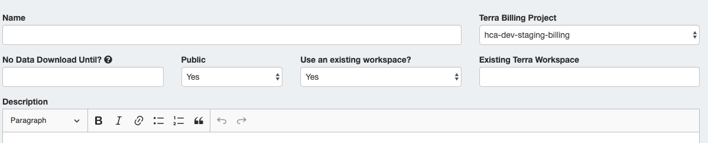

# Working with Release Files 

There are multiple tools to view and manipulate the March 2020 Release files. This guide focuses on importing release files into Python and R-supported software such as Pegasus, Seurat, and SCANPY, in addition to visualizing and annotating files in Single Cell Portal. When applicable, we use file names from the <link-to-browser relativelink="/projects/4d6f6c96-2a83-43d8-8fe1-0f53bffd4674/m/releases/2020-mar/datasets/2020-Mar-Landscape-Adult-Liver-10x/release-files">2020-Mar-Landscape-Adult-Liver-10x</link-to-browser> dataset as an example, but the following techniques will work for files from any Release dataset. 

**Note: The software used in this guide is only a subset of single-cell analysis tools; we encourage the community to explore these files using other portals and tools as they become available!**

If you would like to know more about how these release files were generated, please see the [March 2020 Release Methods](methods.md) or take the [analysis tutorial](replicating-the-release-analysis.md) which demonstrates how to replicate Release analyses using the 2020-Mar-Landscape-Adult-Liver-10x Release dataset. 

## What are the release files?
Descriptions of all the March 2020 Release files can be found in the table below. Each Release dataset has a unique Dataset ID which is listed on the March 2020 Release page in the “Dataset” column. This ID is used as a prefix for all Release dataset files. 

Some March 2020 Release files are used for interactive visualization in Single Cell Portal (any file with a .scp demarcation). These files are only available in [Single Cell Portal](https://singlecell.broadinstitute.org/single_cell?scpbr=human-cell-atlas-march-2020-release) (SCP) and not on the HCA [Data Coordination Platform](https://data.humancellatlas.org/) (DCP). 

| File name | File location: DCP and/or SCP | Description | Format | 
| --- | --- | --- | --- |
|  `Dataset_ID.loom` | DCP/SCP | Gene matrix file generated with DCP standardized pipelines (Optimus and Smart-seq2) and used as Cumulus input. | Loom |			
| `Dataset_ID.de.xlsx` | DCP/SCP | Cumulus output file containing differential expression with correction | XLSX |	
| `Dataset_ID.de.CSV.zip` | DCP/SCP | Zip of CSV files containing differential expression analyses | CSV |	
| `Dataset_ID.filt.xlsx` | DCP/SCP | Cumulus output file containing filtering information | XLSX |	
| `Dataset_ID_annoated_v1.loom` | DCP/SCP | Expression matrix generated by Cumulus and annotated using harmonized cell types; contains clustering information, cell annotations, and log-transformed gene expression | Loom |	
| `Dataset_ID.seurat_annotated_v1.h5ad` | DCP/SCP | Seurat compatible expression matrix generated by Cumulus and annotated using harmonized cell types; contains clustering information, cell annotations, and log-transformed gene expression | h5ad |
| `Dataset_ID.scp.X_diffmap_pca.coords.txt` | SCP | Diffusion map coordinates for Single Cell Portal | TXT |		
| `Dataset_ID.scp.X_fitsne.coords.txt` | SCP | FIt-SNE coordinates for Single Cell Portal | TXT |	
| `Dataset_ID.scp.X_fle.coords.txt` | SCP | fle cluster coordinates for Single Cell Portal |  TXT |
| `Dataset_ID.scp.X_umap.coords.txt` | SCP | UMAP cluster coordinates for Single Cel Portal| TXT |	
| `Dataset_ID.scp.barcodes.tsv` | SCP | 10x compatible barcodes file for Single Cell Portal | TSV |	
| `Dataset_ID.scp.features.tsv` | SCP | 10x compatible features (genes) file for Single Cell Portal | TSV |	
| `Dataset_ID.scp.matrix.mtx` | SCP | 10x compatible mtx expression file for Single Cell Portal | mtx |
| `Dataset_ID.scp.metadata.txt` | SCP | Metadata matrix for Single Cell Portal | TXT | 
`Dataset_ID_annotated_v1.scp.metadata.txt` | SCP | Annotated metadata matrix file for Single Cell Portal | TXT |\

*DCP = Data Coordination Platform; SCP = Single Cell Portal*


## Importing annotated March 2020 Release files into R and Python visualization resources

Each Release dataset has gene expression matrices containing cell clustering information and annotated cell types. This annotated expression matrix is provided in two file formats: a loom and a h5ad. Both file types are named with an `“_annotated_v1”` suffix and can be found under Release Files on the <link-to-browser relativelink="/releases/2020-mar">March 2020 Release</link-to-browser> page. The normalized matrices were generated using the Cumulus workflow and annotated using published cell types (see more details in the [Methods](methods.md)). 

Use the suggested code below to view annotated loom and h5ad files in [Pegasus](https://pegasus.readthedocs.io/en/latest/), [Seurat](https://satijalab.org/seurat/), and [SCANPY](https://github.com/theislab/scanpy). You can view the [Cumulus documentation](https://cumulus.readthedocs.io/en/latest/cumulus.html#load-cumulus-results-into-pegasus) to learn more about importing the annotated expression matrices into these Python and R resources. For the examples below, we use files from the <link-to-browser relativelink="/explore/projects/4d6f6c96-2a83-43d8-8fe1-0f53bffd4674/m/releases/2020-mar/datasets/2020-Mar-Landscape-Adult-Liver-10x/release-files">2020-Mar-Landscape-Adult-Liver-10x</link-to-browser> dataset.

### Pegasus 
[Pegasus](https://pegasus.readthedocs.io/en/latest/) is a Python package used by Cumulus for analyzing very large single-cell transcriptomes. The following example files were tested using Python v3.7.5 and Pegasus v0.16.11. 

In Python, load the annotated h5ad file using:

```Python
import pegasus as pg
adata = pg.read_input("2020-Mar-Landscape-Adult-Liver-10x_annotated_v1.h5ad")
```

Load the annotated loom file using:

```Python
import pegasus as pg
data = pg.read_input("2020-Mar-Landscape-Adult-Liver-10x_annotated_v1.loom", genome = "GRCh38")
```
### Seurat 
 [Seurat](https://satijalab.org/seurat/) is an R package used for single-cell data quality control, analysis, and exploration. The following example files were tested using R v3.6.3, Python v3.7.5, Seurat v3.1.2, and LoomR v0.2.1.  

To load the annotated h5ad file, you will need to have [anndata](https://anndata.readthedocs.io/en/latest/index.html) and [reticulate](https://cran.r-project.org/web/packages/reticulate/index.html) installed. Then use:

```R
source("https://raw.githubusercontent.com/klarman-cell-observatory/cumulus/master/workflows/cumulus/h5ad2seurat.R")
ad <- import("anndata", convert = FALSE)
test_ad <- ad$read_h5ad("2020-Mar-Landscape-Adult-Liver-10x_annotated_v1.seurat.h5ad")
result <- convert_h5ad_to_seurat(test_ad)
```
To load the annotated loom file, you must first install the LoomR package:

```R
install.package("devtools")
devtools::install_github("mojaveazure/loomR", ref = "develop")
```
Next, load the loom file using:

```R
source("https://raw.githubusercontent.com/klarman-cell-observatory/cumulus/master/workflows/cumulus/loom2seurat.R")
result <- convert_loom_to_seurat("2020-Mar-Landscape-Adult-Liver-10x_annotated_v1.loom")
```
### SCANPY
[SCANPY](https://github.com/theislab/scanpy) is a Python-based analysis toolkit for single-cell expression data built with [anndata](https://anndata.readthedocs.io/en/stable/). The following example files were tested using Python v3.7.5, SCANPY v1.4.5.1, and LoomPy v3.0.6. 

Load the annotated h5ad output file using:

```Python
import scanpy as sc
adata = sc.read_h5ad("2020-Mar-Landscape-Adult-Liver-10x_annotated_v1.seurat.h5ad")’
```
Load the annotated loom file using:

```Python
import scanpy as sc
adata = sc.read_loom("2020-Mar-Landscape-Adult-Liver-10x_annotated_v1.loom")
```

## Loading differential expression results in R or Python
Differential expression analyses were performed on the louvain cell clusters identified with the Cumulus workflow (see the [Methods page](methods.md)). For each Release dataset, there are two files containing differential expression results:
-  a .de.xlsx 
-  a .CSV.zip

Each louvain cluster in the .de.xlsx file has one excel sheet for upregulated genes and one for downregulated genes. To make viewing these results easier in R and Python, we converted all excel sheets into a zip of individual CSV files. You can download the zip file from the Release Files column on the <link-to-browser relativelink="/releases/2020-mar">March 2020 Release</link-to-browser> page, unzip it into your directory of choice, and view the CSVs in R or Python using the instructions below. 

For both R and Python instructions, you will need to list the name of the directory containing the CSV files (specified below with `“DIRECTORY_NAME”`).

### Instructions for R

```R
setwd("/path/to/folder/with/directory/")
input_dir <- 'DIRECTORY_NAME'
files_to_load <- list.files(input_dir, full.names=TRUE)
names(files_to_load) <- unlist(lapply(strsplit(basename(files_to_load),'.',fixed=T),'[',1))
de <- lapply(files_to_load, read.csv)
```
### Instructions for Python
These instructions use [pandas software](https://pandas.pydata.org/) to read the CSV files. You will need to have pandas installed. To begin these steps, use Terminal to navigate to the directory containing your output folder (`DIRECTORY_NAME`). The output folder should contain all CSV files. 

```Python
import os
import pandas as pd
input_directory = "DIRECTORY_NAME"
file_list = os.listdir(input_directory, )
data = dict()
for f in file_list:
	data[f] = pd.read_csv(input_directory + '/' + f)
data[f]
```

## Creating a Single Cell Portal study page and importing Cumulus results from Terra
You can visualize or annotate DCP Release files by either using the existing March 2020 Release studies in [Single Cell Portal](https://singlecell.broadinstitute.org/single_cell?scpbr=human-cell-atlas-march-2020-release) or by creating a new Single Cell Portal study. Detailed instructions for getting started with Single Cell Portal can be found on the [Single Cell Portal wiki]( https://github.com/broadinstitute/single_cell_portal/wiki/Synchronizing-Study-Data). You will need a Google compatible email account to login. You may also use your institutional account if it is backed by Google.

**The following instructions are a continuation from the [replicating release analyses tutorial](replicating-the-release-analysis.md) and focus on importing Cumulus output files from an existing Terra workspace. These steps use the 2020-Mar-Landscape-Adult-Liver-10x example files derived using the tutorial techniques.**

### Creating a Single Cell Portal study

#### 1. Navigate to [Single Cell Portal](https://singlecell.broadinstitute.org/single_cell) and login.

#### 2. Go to the profile drop-down menu and select Add Study.


#### 3. Select a unique name for the study page and billing information. 
If you want to import files from an existing Terra workspace, the billing information must match the billing information used on Terra. 



#### 4. If you wish to import Terra workspace files, Select Yes for using an existing Terra workspace.

#### 5. Enter the Terra workspace name in the “Existing Terra Workspace” field. 
For the 2020-Mar-Landscape-Adult-Liver-10x example dataset used in the [analysis tutorial](replicating-the-release-analysis.md), you would type the name “2020-Mar-Landscape-Adult-Liver-10x”.

#### 6. Scroll to the bottom of the page and select Create Study.


#### 7. If using an existing Terra workspace, you will be prompted to select the files you would like to import. 

The following table describes the recommended Cumulus output files (using the 2020-Mar-Landscape-Adult-Liver-10x dataset files as examples) to import into a Single Cell Portal study. Note that some files are necessary to interactively visualize cells in Single Cell Portal (all files marked with a .scp). When importing from Terra, the order of import can be important. When applicable, we have noted this order in the table “Notes” column, along with additional import specifications.

| File Name | Description | File type to specify | Notes |
|---|---|---|---|
| `2020-Mar-Landscape-Adult-Liver-10x.loom` | Gene matrix file generated with DCP standardized pipelines (Optimus and Smart-seq2) and used as Cumulus input. | Other | --- |
| `output/2020-Mar-Landscape-Adult-Liver-10x.de.xlsx` | Cumulus output file containing differential expression with correction | Other  | --- |
| `output/2020-Mar-Landscape-Adult-Liver-10x.filt.xlsx` | File describing cumulus filtering information | Other | ---  |
| `output/2020-Mar-Landscape-Adult-Liver-10x.loom` | Expression matrix generated by Cumulus; contains clustering information and log-transformed gene expression (Pegasus, SCANPY, and Seurat compatible) | Other | This is file does not contain cell type annotations  |
| `output/2020-Mar-Landscape-Adult-Liver-10x.seurat.h5ad` | Seurat-compatible, normalized expression matrix generated by Cumulus; contains clustering information and log-transformed gene expression  | Other  | This file does not contain cell type annotations  |
| `output/2020-Mar-Landscape-Adult-Liver-10x.scp.X_diffmap_pca.coords.txt` | Diffusion map coordinates | Cluster | This file is necessary Single Cell Portal visualization; Specify 3 axis labels as “Diffmap n” where n=1,2,3 |
| `output/2020-Mar-Landscape-Adult-Liver-10x.scp.X_fitsne.coords.txt` | FIt-SNE coordinates | Cluster | This file is necessary for Single Cell Portal visualization; Specify 2 axis labels as “FIt-SNE n”, where n=1,2 |
| `output/2020-Mar-Landscape-Adult-Liver-10x.scp.X_fle.coords.txt` | fle cluster coordinates | Cluster | This file is necessary for Single Cell Portal visualization; Specify 2 axis labels as ”Fle n”, where n=1,2 |
| `output/2020-Mar-Landscape-Adult-Liver-10x.scp.X_umap.coords.txt` | UMAP cluster coordinates | Cluster | This file is necessary for Single Cell Portal visualization; Specify 2 axis labels as “UMAP  n” where n=1,2 |
| `output/2020-Mar-Landscape-Adult-Liver-10x.scp.matrix.mtx` | 10x compatible mtx expression file | MM Coordinate Matrix | This file is necessary for Single Cell Portal. Must import before the two 10x compatible import files (Taxon is Human) |
| `output/2020-Mar-Landscape-Adult-Liver-10x.scp.barcodes.tsv` | 10x compatible barcodes file | 10x compatible barcodes file | This file is necessary for Single Cell Portal; Must import after .matrix.mtx file |
| `output/2020-Mar-Landscape-Adult-Liver-10x.scp.features.tsv` | 10x compatible features (genes) file | 10x Genes Files | This file is necessary for Single Cell Portal; Must import after .matrix.mtx file |
| `output/2020-Mar-Landscape-Adult-Liver-10x.scp.metadata.txt` | Metadata matrix | Metadata |  --- |

Any Cumulus files generated using the techniques outlined in the Replicating Release Analyses tutorial do not yet contain cell type annotations. After importing these files from Terra to a Single Cell Portal study, you can create your own annotations using the guide suggested in the next section.

## Annotating cell types in Single Cell Portal
The March 2020 Release used publications and project contributor feedback for cell type annotations. However, we encourage researchers to explore and create new annotations. Get started by viewing this Single Cell Portal [cell annotation guide](https://github.com/broadinstitute/single_cell_portal/wiki/Annotations). 

## Viewing and interacting with annotated cells in Single Cell Portal
Each March 2020 Release dataset has a Single Cell Portal study page where you can view annotated cells. You can find a link to these pages on the DCP <link-to-browser relativelink="/releases/2020-mar">March 2020 Release</link-to-browser> or on the [Single Cell Portal HCA Release page ](https://singlecell.broadinstitute.org/single_cell?scpbr=human-cell-atlas-march-2020-release).

To visualize the annotated cells for a Release dataset, go to the Explore tab of the Single Cell Portal study and follow the instructions below:

#### 1. Select the View Options gear icon in the upper right corner.


#### 2. Open the Select Annotations drop-down menu.


#### 3. Choose either `annotated_cell_identity.text` or `annotated_cell_identity.ontology_label`. 
.

The `annotated_cell_identity.text` option will list the cell types defined by the project contributors. The `annotated_cell_identity.ontology_label` will list cell types that have been harmonized using ontology services.

## Searching for genes across March 2020 Release datasets using Global Gene Search
The March 2020 Release offers a Global Gene Search option using Single Cell Portal.
#### 1. Go to the [Single Cell Portal HCA Release](https://singlecell.broadinstitute.org/single_cell?scpbr=human-cell-atlas-march-2020-release) page.
When you enter the page, you will be defaulted to the Search Studies tab of the landing page. 
#### 2. Select the Search Genes tab.

#### 3. Type in the gene of interest. 

At the top of the search, the number of datasets that have a positive match for the gene will appear. Below the search, a graphical display of cell clusters containing the gene of interest will display for all datasets containing the gene. 

## Next steps
You can replicate the release analyses using your own files by [taking this tutorial](replicating-the-release-analysis.md). 

If you have any suggestions for the Working with Release Files guide or questions, please see the [Community Feedback page](feedback.md).


