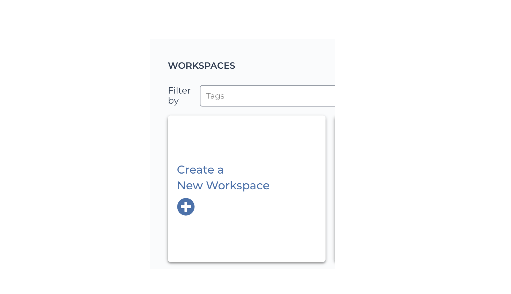
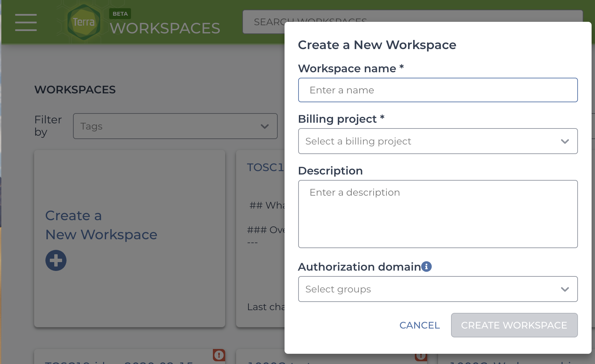
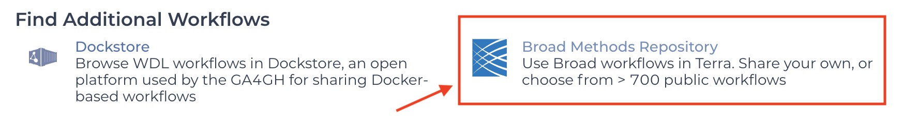
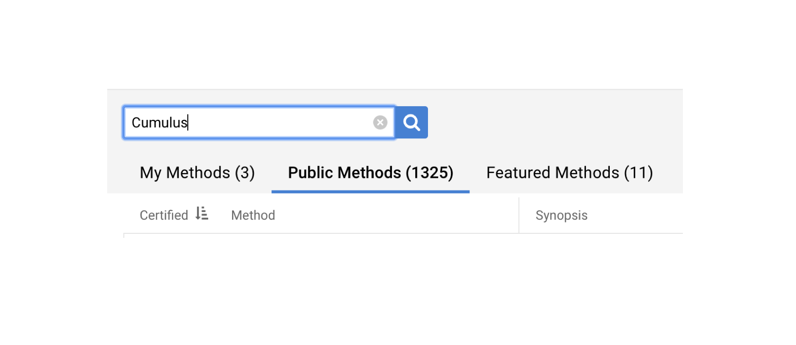
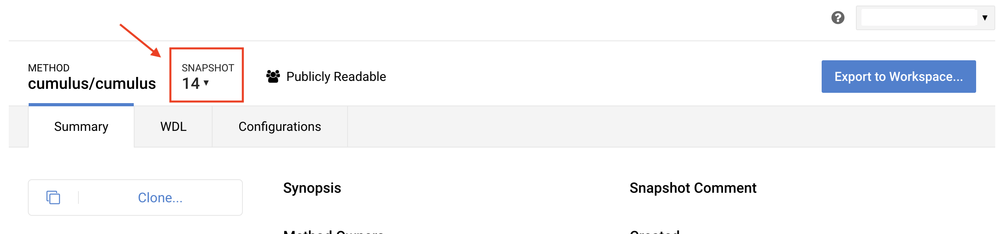
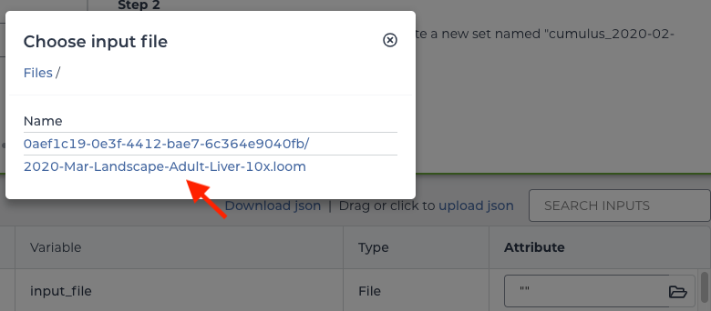
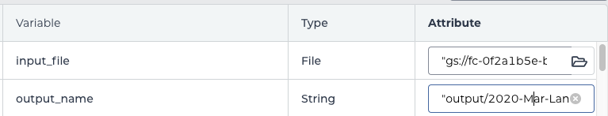
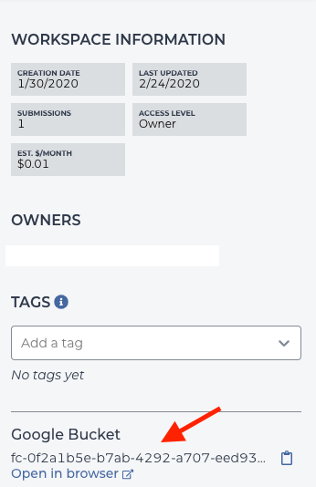
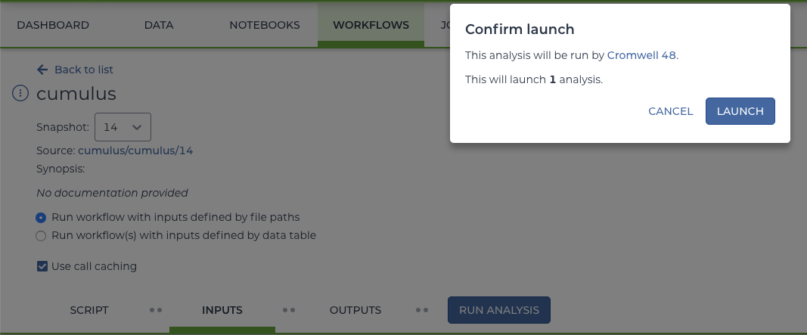
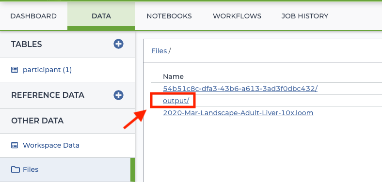

#  Replicating the March 2020 Release Analyses
This tutorial covers how to process a gene matrix (in loom format) for clustering, differential expression, and visualization using the Cumulus workflow in a Terra workspace. It uses the same [methods](methods.md) outlined for the DCP March 2020 Release. 

All projects for the release were divided into individual datasets which are listed on the DCP <link-to-browser relativelink="/releases/2020-mar">March 2020 Release</link-to-browser> page. For this tutorial, we use the sample dataset 2020-Mar-Landscape-Adult-Liver-10x derived from the project <link-to-browser relativelink="/projects/4d6f6c96-2a83-43d8-8fe1-0f53bffd4674">"Dissecting the human liver cellular landscape by single cell RNA-seq reveals novel intrahepatic monocyte/ macrophage populations"</link-to-browser>. You can explore other datasets and repeat these analyses on additional matrix files.

## Downloading the gene matrix (loom format) for the example dataset
To start your analyses, you will need to download the gene matrix from the DCP. For each dataset, this matrix was generated using a standardized DCP pipeline (Optimus or Smart-seq2). The matrix contains either gene counts (10x samples) or RSEM TPMS (Smart-seq2 datasets), in addition to important metadata, such as specimen and sample processing information. This file will be used as input for the Cumulus workflow.

#### 1. Navigate to the DCP <link-to-browser relativelink="/releases/2020-mar">March 2020 Release</link-to-browser>.
#### 2. Find the sample dataset 2020-Mar-Landscape-Adult-Liver-10x in the Liver section.
#### 3. Select “View Files”.
#### 4. Download the gene matrix (2020-Mar-Landscape-Adult-Liver-10x.loom file).

## Creating a Terra workspace
[Terra](https://app.terra.bio/) is a cloud-based platform for bioinformatic analyses. To use Terra, you will need to set up a Google account and Billing project. If you are new to working with Terra, we recommend the following relevant links for getting started:
- [Navigating in Terra](https://support.terra.bio/hc/en-us/articles/360022704371)
- [Importing a workflow from Dockstore](https://support.terra.bio/hc/en-us/articles/360039827191) (Coming Soon!)
- [Billing](https://support.terra.bio/hc/en-us/articles/360026182251)

If you already have a Terra account, follow these step-by-step instructions for setting up a workspace:

#### 1. Go to app.terra.bio and select the View Workspaces card.
#### 2. Select the Create a New Workspace card.

#### 3. Fill out a unique workspace name and billing information. 
You can optionally add a description of the workspace purpose. You can also optionally fill out the authorization domain. If you are unsure about the authorization domain field, you can read more information in [this article](https://support.terra.bio/hc/en-us/articles/360026775691).

 
#### 4. Upload the gene matrix (2020-Mar-Landscape-Adult-Liver-10x.loom file) to the workspace Google bucket.
Each Terra workspace you create comes with its own Google bucket. 
- 4.1 Go to the Data tab.
- 4.2 In the “Other Data” section, select the Files option.

- 4.3 Click the plus icon to upload the gene matrix file (2020-Mar-Landscape-Adult-Liver-10x.loom file) to the workspace Google bucket.
If you are already familiar with Terra and cloud computing, you can also transfer files to the workspace Google Bucket using gsutils (see description [here](https://support.terra.bio/hc/en-us/articles/360024056512)).

## Uploading the Cumulus workflow to a Terra workspace
#### 1. Go to the Workflows tab of the Terra workspace.
#### 2. Select the Find a Workflow card.
#### 3. Under “Find Additional Workflows”, select the Broad Methods Repository.

 
This will redirect you to the Broad Methods (you will no longer be in Terra).
#### 4. In the search bar, type “Cumulus” to search for the Cumulus workflow.

#### 5. Select the “cumulus/cumulus” option.
#### 6. Change the Snapshot to 14.

  
#### 7. Select Export to Workspace.
#### 8. Select Use Blank Configuration.
A new page will appear with a Destination Workspace drop-down menu. 
#### 9. Select your destination workspace from this menu. 
An option will appear to go to your workspace. You will be redirected back into the Terra workflow configuration page. 

## Importing a workflow configuration file (JSON format)
The sequencing data for all March 2020 Release datasets were generated using either 10x or Smart-seq2 technology. There are two Cumulus workflow configuration files available for Terra import depending on which sequencing technology (10x or Smart-seq2) was used for the dataset of interest. The technology will be specified next to the dataset on the <link-to-browser relativelink="/releases/2020-mar">March 2020 Release</link-to-browser> page. 
The 2020-Mar-Landscape-Adult-Liver-10x dataset uses the 10x configuration. For all datasets, you can download the 10x configuration (JSON) [here](_downloads/10x_json.JSON) or the Smart-seq2 configuration [here](_downloads/SS2_json.JSON). 

After downloading the 10x_json.JSON (to be used with the 2020-Mar-Landscape-Adult-Liver-10x dataset), do the following:

#### 1. Select the “upload json” link on the Workflow configuration page and choose the appropriate configuration file.

 

#### 2. Click Save.

| Note about the Cumulus workflow configuration |
| :-- |
| The configuration files list the Cumulus workflow parameters, which are detailed in the March 2020 Release [Methods](methods.md). Using these two configuration files, Cumulus will produce clustered loom and h5ad files, as well as differential expression files. |

## Specifying workflow input and output files

#### 1. Examine the `input_file` attribute of the workflow configuration page. 
Notice the field requires a “File” input. Specify the Google bucket location for the gene matrix (loom) file. To do this, select the folder icon in the `input_file` attribute box. Choose the 2020-Mar-Landscape-Adult-Liver-10x.loom. 

 

##### 2. Examine the `output_name` attribute. 
This attribute requires a “String” input. Specify a string in quotes that includes the workspace Google bucket location, an output folder, and a prefix you would like to give all analysis output files. 
- The Google bucket location can be found on the right side of the workspace Dashboard tab .
- The output folder can have any name, but for this example, we choose “output”. 
- The filename prefix can also be any name to identify the dataset, but we used the dataset ID 2020-Mar-Landscape-Adult-Liver-10x. 
The final string should look similar to: `“gs://GOOGLE_BUCKET/output/2020-Mar-Landscape-Adult-Liver-10x”.`

#### 3. Select Save on the configuration page.

## Running the workflow

#### 1. On the Workflows configuration page, select the radial button next to “Run workflow with inputs defined by file paths”.
#### 2. Select Save.
#### 3. Select Run Analysis and then Launch.

#### 4. You can check the status of your run in the workspace Job History tab.

## What you should see after running Cumulus
#### 1. Return to the Terra workspace Data tab.
#### 2. In the Files section, select the “output” folder.

 
#### 3. You should now see the processed data files. 

The processed files include the normalized expression matrices (in loom and h5ad formats), differential expression analyses, (xlsx), and Single Cell portal outputs. These are each described in the [Methods](methods.md) documentation. 

**Note:** Although the normalized expression files (loom and h5ad) contain cell clustering, they do not yet contain cell type annotations.

## Annotating Release files
The March2020 Release includes normalized expression matrices that have been annotated with the guidance of project contributors. This tutorial does not cover how to add these annotations to expression matrices, but there are multiple tools you can use to add annotations, including [LoomPy](http://loompy.org/) and [SCANPY](https://icb-scanpy.readthedocs-hosted.com/en/stable/). Additionally, you can add annotations using [Single Cell Portal](https://singlecell.broadinstitute.org/single_cell?scpbr=human-cell-atlas-march-2020-release). See the [Working with Release Files](working-with-release-files.md) guide for details about creating your own Single Cell Portal study. 

## Next steps
You can export Cumulus workflow output files from the Terra workspace to a Single Cell Portal study. There, you can visualize cell clusters and make annotations. Please see the [Working with Release Files](working-with-release-files.md) documentation for available tools (including Single Cell Portal) you can use to interact with Release data. 

If you have any suggestions for this tutorial or questions, please see the [Community Feedback page](feedback.md).

